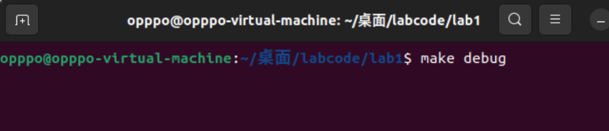
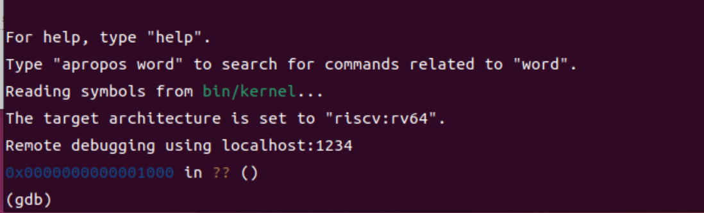
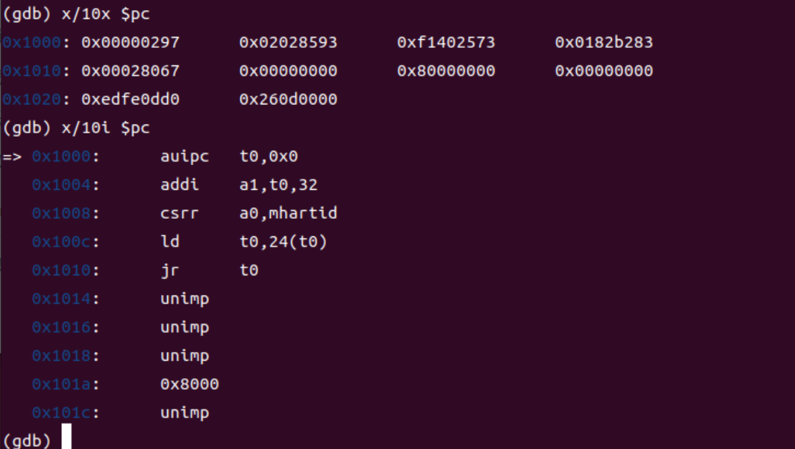
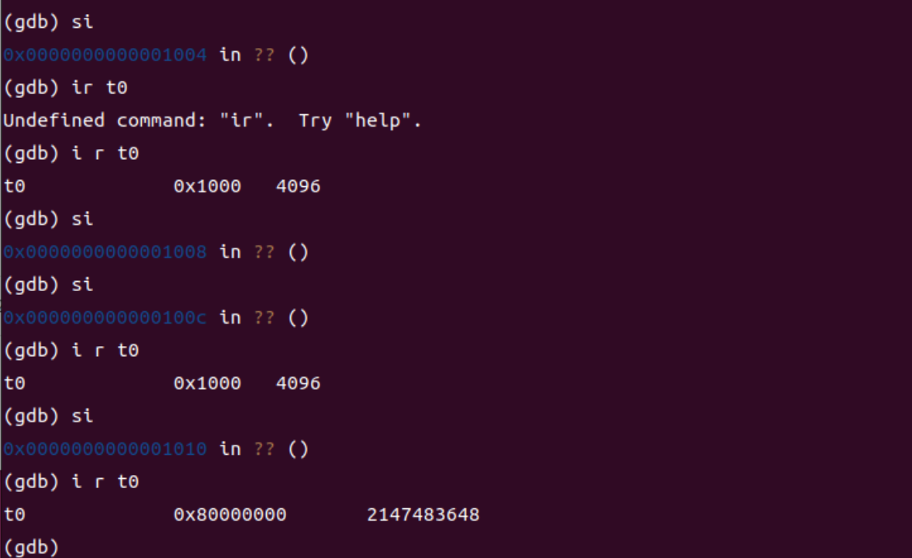
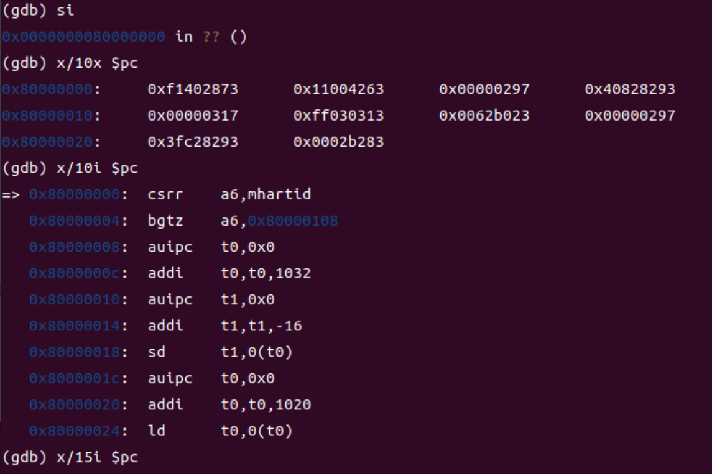
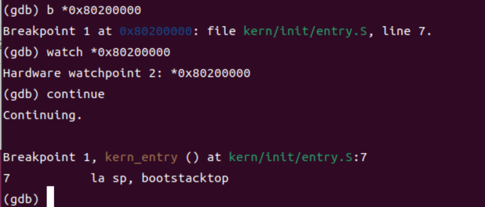
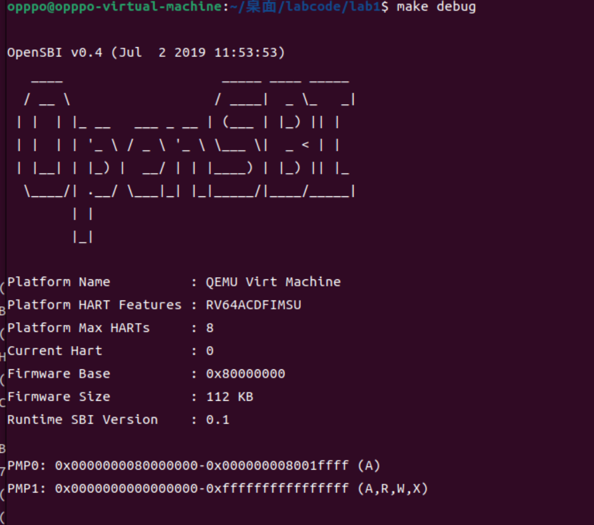

# Lab1

姓名：欧广元			学号：2313180

## 练习一

首先我觉得有必要把entry.S代码中的部分重要内容贴出，才能更好的分析这两条指令的作用：

```
    .globl kern_entry
kern_entry:
    la sp, bootstacktop

    tail kern_init

.section .data
    # .align 2^12
    .align PGSHIFT
    .global bootstack
bootstack:
    .space KSTACKSIZE
    .global bootstacktop
bootstacktop:
```

### `la sp, bootstacktop`

​	entry.S代码被先于操作系统的内核程序调用，它负责启动操作系统内核的初始化函数，因此该程序必须为kern_init程序的运行准备正确的环境。kern_init本质上是具有一个main函数的C语言程序，我们说它的运行需要依赖一个提供函数运行的栈区。

​	了解这些之后，回到该行汇编代码的分析。la是一个在RISC-V中的伪指令，用于将某个标签的地址加载到一个寄存器中，这里其实就是将标签bootstacktop的地址加载到了sp中，sp不是一个简单的寄存器，它是栈指针寄存器，也就是指向栈顶的寄存器，现在我们要解释的点是为什么要将bootstacktop加载到sp中。其实观察汇编代码不难发现，在bootstacktop标签之前有一个bootstack标签，由于汇编代码自从上下执行，所以代码会先运行到bootstack代码块，然后.space KSTACKSIZE开辟出一块固定大小的空间，然后才轮到bootstacktop，也就是说，内存上，标签：

bootstack --> bootstacktop

低地址       -->     高地址

因此bootstacktop的地址实际上是被构建出来的一个程序的栈区的栈顶位置（而bootstack 则是栈底），sp装载这个位置后，后续程序才能完好，正确地执行自己（高地址向低地址扩展）。


### `tail kern_init`

​	tail是RISC-V中的一个伪指令，意思是调用函数，但是不返回，也就是将PC设置为kern_init的地址之后，不设回来了，目的是永久的将CPU控制权交给kern_init函数以启动操作系统的内核初始化。我们提到上一条指令已经将kern_init函数的运行栈区准备完毕，所以这里可以直接运行，执行初始化。


## 练习二

​	想要使用GDB进行调试，首先要将我们的内核运载到qemu上运行，所以在实验给出的Lab1下打开命令行输入：make debug得到


​	这里命令行会先暂时卡住，那是因为qemu在等待GDB的链接，接下来在相同的目录再打开一个命令行，输入make gdb进行链接：



​	能获取到如上的输出就说明链接成功了，可以看到用于连接的端口是1234，还有qemu模拟CPU加电时给PC寄存器设置的初值为0x1000，RISC-V本身对加电初始的复位地址并没有什么要求，只是这一版本的qemu把它设置在了这里（蓝色显示的部分）。

​	这里即是加电后的初始地址了，这里执行的是OpenSBI的硬件初始化代码。这里我们不使用实验指导中说到的**`x/10x $pc`**指令，我们使用**`x/10i $pc`**指令来查看OpenSBI的前10条代码，后者对比前者的区别就是能够直接方便的显示出一个反汇编的结果，便于我们进行调试，结果如下：


​	首先**`auipc t0, 0x0`**实际上是将当前代码的基地址与0x0结合(那事实上还是基地址值)赋给了t0，这个准备后续使用。然后将这个基地址的值加上32传入a1，猜测可能是出于一些硬件初始化的目的，同样的目的还有使用**`csrr a0, mhartid`**获得当前核心线程ID。最为重要的就是**`ld t0, 24(t0)`**，它将t0地址处偏移24处的值赋给了t0，然后跳转去该地。

​	如果只看反汇编代码的话会有误解，例如t0偏移24不是0x1018吗从而拿不到地址，另外跳转到的目标地址不应该是Bootloader所在的0x80000000吗而不是它显示的0x8000.但是这其实是一个反汇编显示的误区(受大小端地址，显示位数等影响)。正如我使用**`x/10i $pc`**之前还是使用了一次**`x/10x $pc`**打印出了原始的机器码，一个16进制机器码4个字节，那么轮到0x80000000时刚好就是0x1018，数字和地址都正确，并没有出错。

​	我们可以选择交替使用**`si`**和**`i r t0`**来验证这一点:



​	现在是轮到openSBI执行了，si单步执行，然后输出接下来10条指令，那我们发现指令是很多的输出不完(本人尝试了发现指令非常多，毕竟它的核心任务之一是将内核加载到 `0x80200000`，但并非只有这个任务)：



​	所以直接使用**`watch *0x80200000`**观察内核加载瞬间，在此之前需要使用**`b *0x80200000`**避免执行过快，然后continue去执行到即可：



​	终于执行到了我们熟悉的kern_entry入口处，地址为0x80200000。此时debug界面也提示OpenSBI执行完毕



​	当然现在还没有打印出**(THU.CST) os is loading ...**，这是因为内核启动程序还没有执行完毕，但这里就不赘述了（想执行直接continue即可）。
