<h1 align="center"> Lab1: 比麻雀更小的麻雀 </h1>

## 实验目的

实验1主要讲解最小可执行内核和启动流程。我们的内核主要在 Qemu 模拟器上运行，它可以模拟一台 64 位 RISC-V 计算机。为了让我们的内核能够正确对接到 Qemu 模拟器上，需要了解 Qemu 模拟器的启动流程，还需要一些程序内存布局和编译流程（特别是链接）相关知识。

本章你将学到：

使用 链接脚本 描述内存布局。

进行 交叉编译 生成可执行文件，进而生成内核镜像。

使用 OpenSBI 作为 bootloader 加载内核镜像，并使用 Qemu 进行模拟。

使用 OpenSBI 提供的服务，在屏幕上格式化打印字符串用于以后调试。

## 实验内容：

实验1主要讲解最小可执行内核和启动流程。我们的内核主要在 Qemu 模拟器上运行，它可以模拟一台 64 位 RISC-V 计算机。为了让我们的内核能够正确对接到 Qemu 模拟器上，需要了解 Qemu 模拟器的启动流程，还需要一些程序内存布局和编译流程（特别是链接）相关知识,以及通过opensbi固件来通过服务。

## 练习1：理解内核启动中的程序入口操作

### 实验要求
阅读 kern/init/entry.S内容代码，结合操作系统内核启动流程，说明指令 la sp, bootstacktop 完成了什么操作，目的是什么？ tail kern_init 完成了什么操作，目的是什么？

### 实验过程
kern/init/entry.S是一段RISC-V汇编代码，如下为对其代码的阅读分析：

    #include <mmu.h>
    #include <memlayout.h>
以上代码用于包含头文件。mmu.h定义了与内存管理单元（MMU）相关的常量，例如页表项的标志位、页大小等，memlayout.h头文件通常定义了内存布局的常量，例如内核起始地址、设备地址、栈地址等。

        .section .text,"ax",%progbits
.section是指令，告诉汇编器接下来的内容属于哪个段。

.text段表明是只读的可执行代码段。

"ax"是个标志，"a"代表该段在程序加载时需要被分配到内存中,"x"表示该段包含可执行指令。

%progbits 是段类型，即“程序定义内容”，即这个段中存放的是程序自己定义的代码或数据。

        .globl kern_entry
声明符号kern_entry为全局符号，使链接器与其它目标文件可见，并可作为 ELF 的入口点。

    kern_entry:
标签kern_entry，表示内核入口的地址。系统启动后会把控制权交到这里。

        la sp, bootstacktop
la = "load address"，顾名思义，用于加载地址。它把标签 bootstacktop 代表的地址加载到栈指针sp里，sp寄存器指向当前函数调用栈的顶部。

这句话的效果就是将堆栈指针初始化为 bootstacktop，也就是把栈指向预分配栈区域的最高地址。后继的代码会按照调用约定使用 sp，所以需要先建立一个安全可用的内核栈。

        tail kern_init
tail 是一个尾调用的伪指令：它会把控制权转移到 kern_init，并且不会保存返回地址，也就是不会再返回到 kern_entry。它会实现直接无返回地跳到kern_init，把 kern_entry 的栈帧“替换”为 kern_init 的执行环境。

    .section .data
切换到 .data 段，后面定义的数据会被放在可写数据段中。

        # .align 2^12
这是个注释，写明是按 2^12 对齐（4096 字节，即一页）。
        .align PGSHIFT
.align PGSHIFT 使用宏 PGSHIFT（通常定义为 12）来做对齐；.align N 一般按 2^N 字节对齐，因此 .align 12就是按照4096字节对齐）。

        .global bootstack
声明全局符号bootstack，表示栈底。

    bootstack:
        .space KSTACKSIZE

在汇编输出中预留 KSTACKSIZE个 字节（全为零），用于作为内核的初始栈空间。KSTACKSIZE 源自 memlayout.h 的宏定义，我查看后发现是2*4096个字节，即2个页。

        .global bootstacktop
    bootstacktop:

定义 bootstacktop 标签，通常放在栈空间的末尾（高地址）。la sp, bootstacktop 正是把 sp 设置为这里。

bootstacktop 没有紧随数据后面的空间指令，因为它就是栈空间的结束位置标签。

### 解答
内核启动的总体流程大体如下：

BIOS/Bootloader → 加载内核 → 跳转到内核入口（kern_entry） → 初始化栈 → 跳入 C 语言内核初始化 → 内核开始工作。

BIOS是主板上的一段固化程序（在 ROM 里）。当计算机上电后，CPU 的程序计数器（PC）被设置为一个固定的地址，这时执行的第一条指令就在 BIOS 中。

我们都知道c/c++代码运行中栈的重要性，所以，内核启动必须实现给 CPU 一个安全的栈，让 C 函数能正常执行。

指令 la sp, bootstacktop 实现了初始化内核的栈指针寄存器，目的是为后续的函数调用和局部变量分配提供合法的栈空间。结合上边的代码阅读，我可以知道系统为这个栈分配了两个页的空间大小，所以这个代码实现了让 CPU 从这块 8KB 的内存最高处开始作为栈，逐渐向下使用。

tail kern_init实现了无条件跳转到函数kern_init，并且不再返回。也就是永久的把cpu控制权转移给kern_init。在启动汇编（kern_entry）阶段，我们只能执行非常简单的汇编指令，做少量硬件初始化。复杂的操作（比如内存检测、页表建立、中断初始化、设备注册等）都必须用C来完成。这个代码的目的就是结束kern_entry阶段，把控制权交给 C 语言内核。而 kern_init() 就是整个 C 内核的入口函数。

总而言之， kern/init/entry.S的作用就是为CPU分配安全的栈空间，然后跳转到用C语言实现的内核里。

## 练习2: 使用GDB验证启动流程

### 实验要求

为了熟悉使用 QEMU 和 GDB 的调试方法，请使用 GDB 跟踪 QEMU 模拟的 RISC-V 从加电开始，直到执行内核第一条指令（跳转到 0x80200000）的整个过程。通过调试，请思考并回答：RISC-V 硬件加电后最初执行的几条指令位于什么地址？它们主要完成了哪些功能？请在报告中简要记录你的调试过程、观察结果和问题的答案。

tips:

启动流程可以分为以下几个阶段：

1) CPU 从复位地址（0x1000）开始执行初始化固件（OpenSBI）的汇编代码，进行最基础的硬件初始化。

2) SBI 固件进行主初始化，其核心任务之一是将内核加载到 0x80200000。可以使用watch *0x80200000观察内核加载瞬间，避免单步跟踪大量代码。

3) SBI 最后跳转到 0x80200000，将控制权移交内核。使用 b *0x80200000 可在此中断，验证内核开始执行

### 实验过程
通常，RISC-V硬件加电后，会从某个特定的地址开始执行指令。这个地址通常是0x1000或0x80000000，具体取决于硬件设计。在QEMU模拟发设备上，是从0x1000开始的。

我们首先需要启动QEMU，并让它暂停在初始状态，等待GDB连接。这样我们就可以通过GDB来跟踪CPU从加电开始执行的每一条指令。

我们首先在一个终端中用make debug启动QEMU等待GDB连接。

  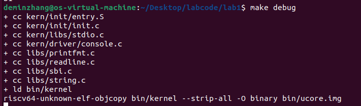

然后在另一个窗口输入make gdb，这个命令其实是一系列操作的集合：

file bin/kernel：让GDB加载我们编译好的内核文件，这个文件里包含宝贵的调试符号（函数名、变量名等）。

set arch riscv:rv64：告诉GDB，我们要调试的是RISC-V 64位的程序。

target remote localhost:1234：让GDB去连接本机（localhost）的1234端口，也就是QEMU正在等待我们的地方。

如下图，GDB 已成功连接到 QEMU，CPU 停在 0x1000 地址，现在可以开始单步调试系统启动过程。

  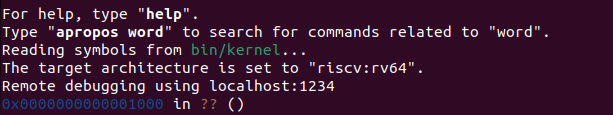

根据任务要求，我们可以使用GDB命令x/10i $pc来查看当前程序计数器（PC）指向的地址以及后续的10条指令，得到结果如下(因为在0x1010处实现了跳转，所以只展示执行的5条指令)：

    0x1000:	auipc	t0,0x0 //将当前PC的高20位与0x0左移12位相加，然后存入t0。所以t0 = PC + 0 = 0x1000。
    0x1004:	addi	a1,t0,32//将t0加上32（0x20）存入a1，所以a1 = 0x1000 + 32 = 0x1020。
    0x1008:	csrr	a0,mhartid//读取当前硬件线程ID（mhartid）到a0。
    0x100c:	ld	t0,24(t0)//从内存地址t0+24（0x1018）处加载一个双字（64位）到t0。我们需要查看0x1018地址处存储的值是什么，因为这里将根据这个值进行跳转。
    0x1010:	jr	t0//跳转到t0寄存器指定的地址。
接下来使用si进行单步调试，并查看相关寄存器的内容：

  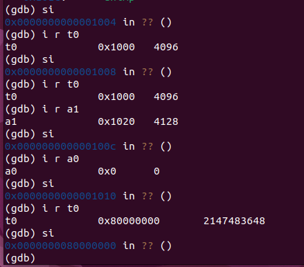

可以看见，0x1000处的代码执行后，t0处存入0x1000，其目的是获取当前代码位置的基地址。0x1004处的代码执行后，a1处存入0x1020，0x1008处的代码执行后，a0处存入0x0，说明当前执行的硬件线程 ID 为 0。0x100c处的代码执行后，t0处存了0x80000000，0x1010处的代码执行后，可以看见，pc跳转到了0x80000000。

接下来继续使用GDB命令x/30i $pc来查看0x80000000地址以及后续的30条指令。

  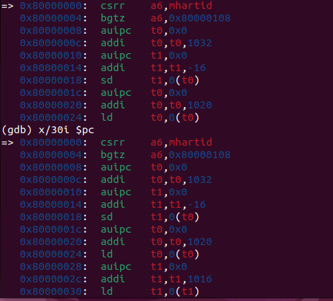

可以看见大量的汇编代码，这里不进行一一解释了。

关于内核的加载，我注意到，makefile里直接把内核加载到了 0x80200000，这绕过了SBI的加载过程。如下图，可以看见，程序停在 0x1000（SBI 启动代码）时，内核代码就已经加载到内存里，SBI 启动后直接跳转到内核。

  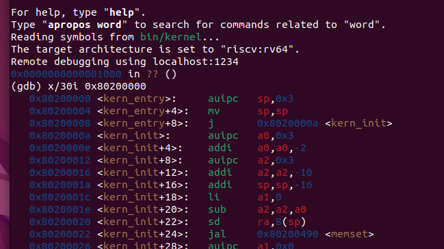

链接脚本指定了内核的入口地址。我们可以直接在这个地址上打断点，但更简单的方法是使用函数名。因为编译器帮我们把函数名和地址对应了起来（调试符号），所以我们可以直接对kern_entry函数下断点，随后执行continue(缩写为c)开始执行程序，内核会在运行到我们设置好的断点处停止：

  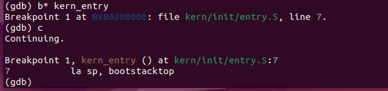

可以看见，程序运行到0x80200000处停下了，这也是内核的入口，对应的指令是之前解释过的 la sp, bootstacktop，开始分配栈空间。

  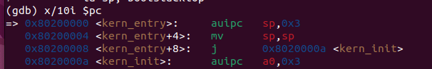

查看后续指令，和我们分析的一样，分配完栈后，就把cpu控制权转移给了c语言写的kern_init。

然后看左边窗口的debug输出，说明SBI已经成功初始化：

  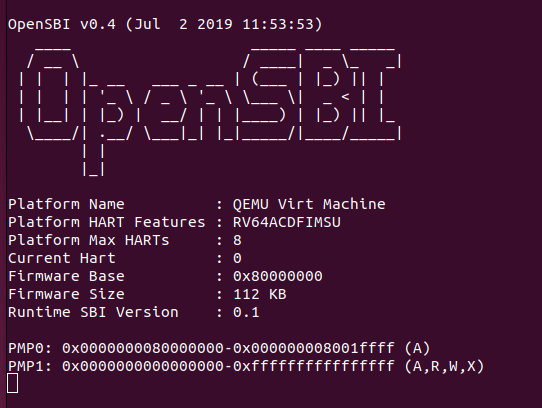

然后我们可以用disassemble kern_init 查看kern_init的反汇编代码，可以看见它的最后一个指令是跳转到自己本身，所以最后无限循环了。

  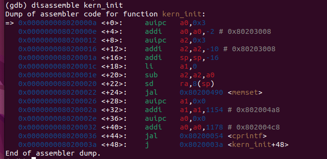

我们使用c指令，继续执行，可以看见左边的debug输出了(THU.CST) os is loading ...，右边调试器进入死循环，和我们分析的一致。

  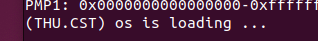

  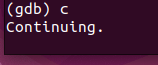

### 解答
1.RISC-V 硬件加电后最初执行的几条指令位于0x1000到0x1010。

2.具体作用如下：

0x1000:	auipc	t0,0x0 //将当前PC的高20位与0x0左移12位相加，然后存入t0。所以t0 = PC + 0 = 0x1000。

0x1004:	addi	a1,t0,32//将t0加上32（0x20）存入a1，所以a1 = 0x1000 + 32 = 0x1020。

0x1008:	csrr	a0,mhartid//读取当前硬件线程ID（mhartid）到a0。

0x100c:	ld	t0,24(t0)//从内存地址t0+24（0x1018）处加载一个双字（64位）到t0。我们需要查看0x1018地址处存储的值是什么，因为这里将根据这个值进行跳转。

0x1010:	jr	t0//跳转到t0寄存器指定的地址。

## 重要知识点对应
1.内核启动流程（加电复位 → CPU从0x1000进入MROM → 跳转到0x80000000(OpenSBI) → OpenSBI 加载内核→跳转至内核入口→初始化栈→进入 C 语言内核）
  实验中具体展示了 RISC-V 架构下，通过 OpenSBI 作为 bootloader 加载内核的流程，是 OS 启动过程的具体实现；
对应知识点：OS 原理中的启动过程是通用概念，包括硬件加电自检、bootloader 加载内核等抽象步骤。
- 关系：实验流程是 OS 原理中启动过程在RISC-V和环境Qemu下的实例化。
- 差异：一个是原理一个是具体的实例
2.链接脚本与内存布局、内存管理	
  实验中通过链接脚本指定内核各段（.text、.data）的内存地址，定义栈空间大小和位置，是内存布局的具体设置；
  对应知识点：OS 原理中的物理内存布局指操作系统对物理内存的划分（如内核区、用户区等）。
- 关系：实验的内存布局是原理中物理内存布局在 kernel 初始化阶段的具体体现，为后续内存管理奠定基础。
- 差异：实验聚焦于内核自身加载和运行所需的内存布局；原理则涵盖整个系统的内存划分，包括进程内存空间等更广泛内容。
3.OpenSBI 提供的服务	操作系统与硬件的交互接口
  实验中利用 OpenSBI 的服务实现调试信息打印，是内核与底层硬件交互的中间层；
  对应知识点：原理中 OS 通过系统调用或直接使用特权指令与硬件交互。
- 关系：OpenSBI 相当于简化的硬件抽象层，实验中其服务是原理中硬件交互接口的简化实现。
- 差异：OpenSBI 是 RISC-V 架构下的特定固件，实验依赖其提供的接口；原理中的交互接口更通用，不局限于特定固件。
4.GDB 调试内核启动过程（断点设置、单步跟踪）	操作系统调试技术	
  实验中通过 GDB 跟踪指令执行、查看寄存器和内存，是调试 OS 内核的具体方法；
  对应知识点：原理中 OS 调试技术包括断点调试、日志输出等抽象方法。
- 关系：实验的 GDB 调试是原理中调试技术的具体工具应用。
- 差异：实验聚焦于特定工具GDB在内核启动的使用；原理更侧重调试的通用策略和思想。

## 未涉及到的知识点
1.进程管理：包括进程的创建、调度、同步与互斥等核心内容。实验仅涉及内核启动流程，未涉及多进程环境的构建和管理。
2.文件系统：文件的组织、存储、读写等操作。实验中未涉及任何文件相关的功能。
3.中断与异常处理：原理中中断和异常是 OS 响应外部事件和处理错误的关键，但实验未深入涉及中断向量表设置、异常处理流程等内容。
4.系统调用：用户态程序与内核态交互的接口，实验中未构建用户态环境，因此不涉及系统调用机制。