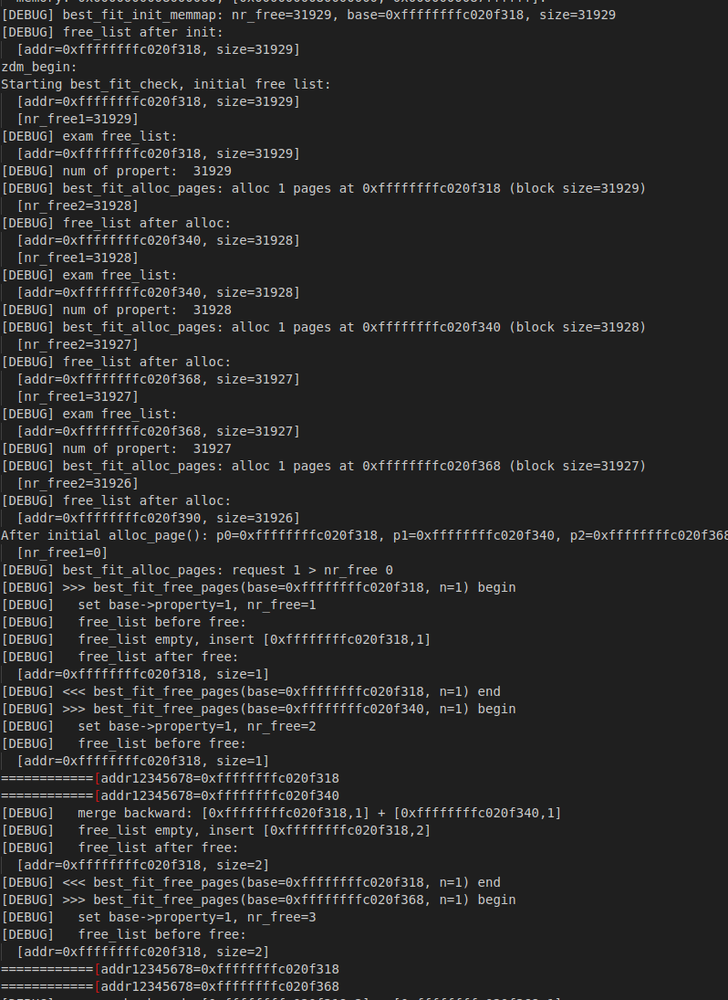
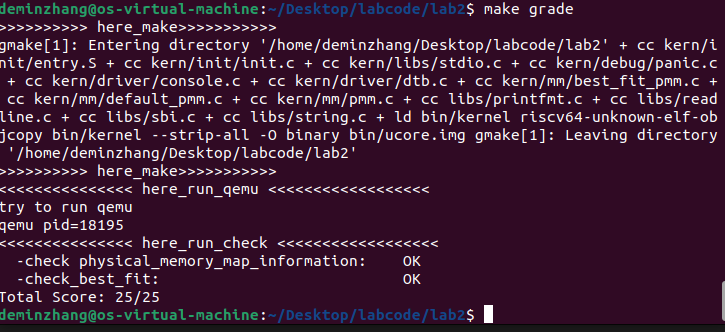
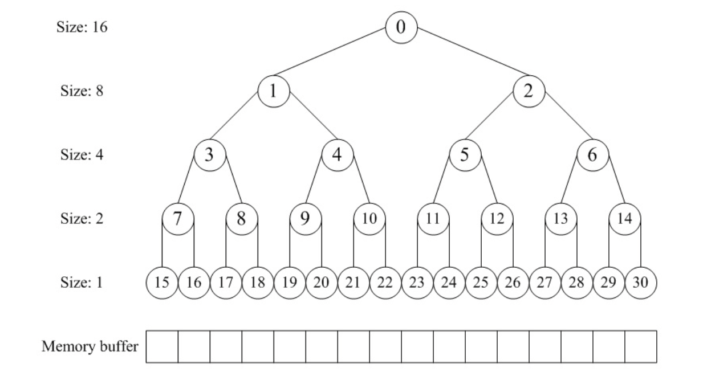
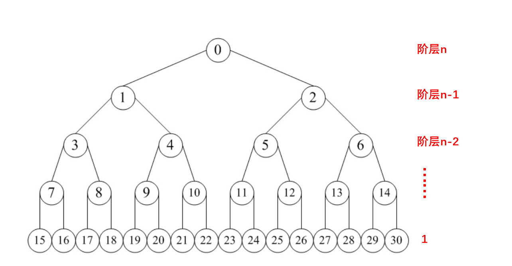
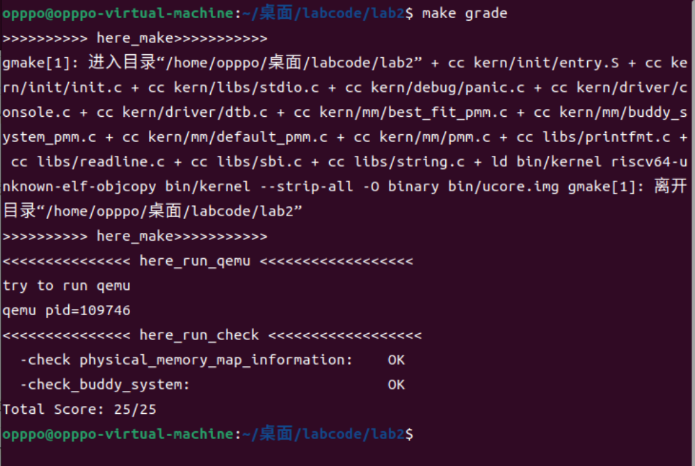
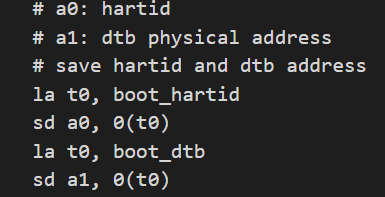
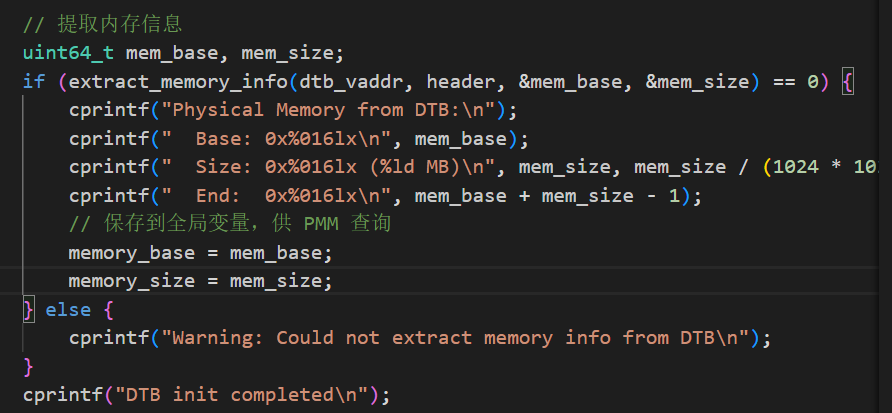
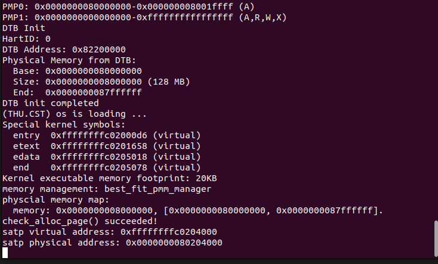

 <h1 align="center"> Lab2:物理内存和页表 </h1>

 <div align="center">

张德民 刘越帅 欧广元

</div>

## 实验目的
理解页表的建立和使用方法。

理解物理内存的管理方法。

理解页面分配算法。

## 实验内容
实验一过后大家做出来了一个可以启动的系统，实验二主要涉及操作系统的物理内存管理。操作系统为了使用内存，还需高效地管理内存资源。本次实验我们会了解如何发现系统中的物理内存，然后学习如何建立对物理内存的初步管理，即了解连续物理内存管理，最后掌握页表相关的操作，即如何建立页表来实现虚拟内存到物理内存之间的映射，帮助我们对段页式内存管理机制有一个比较全面的了解。本次的实验主要是在实验一的基础上完成物理内存管理，并建立一个最简单的页表映射。

## 实验过程

### 练习1：理解first-fit 连续物理内存分配算法（思考题）
first-fit 连续物理内存分配算法作为物理内存分配一个很基础的方法，需要同学们理解它的实现过程。请大家仔细阅读实验手册的教程并结合kern/mm/default_pmm.c中的相关代码，认真分析default_init，default_init_memmap，default_alloc_pages， default_free_pages等相关函数，并描述程序在进行物理内存分配的过程以及各个函数的作用。 请在实验报告中简要说明你的设计实现过程。请回答如下问题：

你的first fit算法是否有进一步的改进空间？

首先,我们要理解first_fit这个算法，first-fit是一种基础的连续物理内存分配策略，其分配策略是遍历 free_list，找到第一个 property >= n 的块，如果块大于请求则拆分，返回首地址（首页指针）。
释放策略：把释放的连续页作为一个块按物理地址升序插入 free_list，并尝试与前后相邻块合并（coalesce）。
下面两个是两个关键的数据结构：
1. free_area_t：管理空闲内存块，包含两个关键成员：
- free_list：双向链表，存储所有空闲内存块（每个节点对应一个空闲块的起始页）。
- nr_free：记录系统中所有空闲页的总数。
2. struct Page：内存页的元数据结构，关键字段包括：
- page_link：用于将页链接到free_list的链表节点。
- property：若为空闲块的起始页，记录该块包含的页数量；非起始页则为 0。
- flags：标志位（如PG_property表示是否为空闲块的**起始页**，PG_reserved表示是否为**保留页**）

接下来具体解释每个函数的作用
（1）**default_init**
```c
static void default_init(void) {
    list_init(&free_list); 
    nr_free = 0;            
}
```
这个函数很简单，就是初始化了一个存放空闲块的链表free_list（这是一个双向链表，list_init函数定义如下），然后定义nr_free为0，表示空闲块的个数。
```c
static inline void
list_init(list_entry_t *elm) {
    elm->prev = elm->next = elm;
}
```
看以看到list_init定义一个双向链表。

（2）**default_init_memmap**
```c
static void
default_init_memmap(struct Page *base, size_t n) {
    assert(n > 0);
    struct Page *p = base;
    for (; p != base + n; p ++) {
        assert(PageReserved(p));
        p->flags = p->property = 0;
        set_page_ref(p, 0);
    }
    base->property = n;
    SetPageProperty(base);
    nr_free += n;
    if (list_empty(&free_list)) {
        list_add(&free_list, &(base->page_link));
    } else {
        list_entry_t* le = &free_list;
        while ((le = list_next(le)) != &free_list) {
            struct Page* page = le2page(le, page_link);
            if (base < page) {
                list_add_before(le, &(base->page_link));
                break;
            } else if (list_next(le) == &free_list) {
                list_add(le, &(base->page_link));
            }
        }
    }
}
```
这个函数的主要作用为将一段连续的物理内存（从base开始的n个页）初始化为空闲块，加入空闲链表。
首先，assert(n > 0)确保输入的n是大于0合法的，第一个for循环会初始化块内所有页的元数据：
- `assert(PageReserved(p))` 这里是确保这些页当前不是 reserved 且不是已经作为 property 的 free 首页（即防止 double free）
- `p->flags = 0; set_page_ref(p, 0);` 这两行是清零标志与引用计数。

然后，在base写入块的信息:    
```c
  base->property = n;
  SetPageProperty(base);
  nr_free += n; //空闲块数量加n
```
最后，把base 插入 free_list，按地址升序，跟 default_init_memmap 使用的插入逻辑一致：将 base->page_link 插入 free_list 中，按**物理地址**升序。实现用的是遍历链表，找到第一个 page 使 base < page，然后 list_add_before，若无则加到尾部；如果链表空则直接 list_add。

那么插入后 free_list 中每个节点都代表一段连续空闲页，其 PageProperty 为真，且 property 字段是该块大小。nr_free 是系统空闲页总和。

（3）**default_alloc_pages**
```c
static struct Page *
default_alloc_pages(size_t n) {
    assert(n > 0);
    if (n > nr_free) {
        return NULL;
    }
    struct Page *page = NULL;
    list_entry_t *le = &free_list;
    while ((le = list_next(le)) != &free_list) {
        struct Page *p = le2page(le, page_link);
        if (p->property >= n) {
            page = p;
            break;
        }
    }
    if (page != NULL) {
        list_entry_t* prev = list_prev(&(page->page_link));
        list_del(&(page->page_link));
        if (page->property > n) {
            struct Page *p = page + n;
            p->property = page->property - n;
            SetPageProperty(p);
            list_add(prev, &(p->page_link));
        }
        nr_free -= n;
        ClearPageProperty(page);
    }
    return page;
}
```
这个函数是按 First-Fit 策略在空闲链表中搜索找到第一个空闲块（块大小 >= n）若块更大则拆分剩余部分并把剩余部分当作新空闲块插回链表；返回分配区的首页 struct Page *，失败返回 NULL。
首先，依旧检查输入合法性,n要大于0而且肯定要小于等于nr_free，这是系统空闲块的总和。
```c
assert(n > 0);
if (n > nr_free) {
    return NULL;
}
```
然后，遍历 free_list（从低地址到高地址）找到第一个满足大小的块（即First-Fit）。
```c
    while ((le = list_next(le)) != &free_list) {
        struct Page *p = le2page(le, page_link);
        if (p->property >= n) {
            page = p;
            break;
        }
    }
```
若找到 page = p：
记录 prev = list_prev(&(page->page_link));（以便在拆分后把剩余块插回到正确位置）。
从链表删除整块 list_del(&(page->page_link));
如果 page->property > n（块更大），则计算剩余部分的首页 struct Page *r = page + n;，写 r->property = page->property - n; SetPageProperty(r); 并用 list_add(prev, &(r->page_link)); 把剩余块插回到原来块的前驱之后（保持地址顺序）。
nr_free -= n;。空闲块大小减n。
最后返回page说明成功
ClearPageProperty(page);（分配出去的块头不再是 free-block 的首页）
（4）**default_free_pages**
```c
static void
default_free_pages(struct Page *base, size_t n) {
    assert(n > 0);
    struct Page *p = base;
    for (; p != base + n; p ++) {
        assert(!PageReserved(p) && !PageProperty(p));
        p->flags = 0;
        set_page_ref(p, 0);
    }
    base->property = n;
    SetPageProperty(base);
    nr_free += n;

    if (list_empty(&free_list)) {
        list_add(&free_list, &(base->page_link));
    } else {
        list_entry_t* le = &free_list;
        while ((le = list_next(le)) != &free_list) {
            struct Page* page = le2page(le, page_link);
            if (base < page) {
                list_add_before(le, &(base->page_link));
                break;
            } else if (list_next(le) == &free_list) {
                list_add(le, &(base->page_link));
            }
        }
    }

    list_entry_t* le = list_prev(&(base->page_link));
    if (le != &free_list) {
        p = le2page(le, page_link);
        if (p + p->property == base) {
            p->property += base->property;
            ClearPageProperty(base);
            list_del(&(base->page_link));
            base = p;
        }
    }

    le = list_next(&(base->page_link));
    if (le != &free_list) {
        p = le2page(le, page_link);
        if (base + base->property == p) {
            base->property += p->property;
            ClearPageProperty(p);
            list_del(&(p->page_link));
        }
    }
}
```
这个函数把一段连续的页 [base, base + n) 释放回物理页管理器，把它作为一个新的空闲块插入 free_list，并尝试与前后相邻的 free block 合并。同时保持 nr_free 与链表的不变式一致。
首先， assert(n > 0)还是确保n要合法。
然后，对[base, base+n) 的每一页，assert(!PageReserved(p) && !PageProperty(p));确保释放的页本来不是“保留/占用”的（防止误释放内核区等），且这段页当前不是 free-list 上的块头，防止 double-free，把已经 free 的块又释放一次。
```c
    struct Page *p = base;
    for (; p != base + n; p ++) {
        assert(!PageReserved(p) && !PageProperty(p));
        p->flags = 0;
        set_page_ref(p, 0);
    }
```
然后，把 base 设为 free-block 的首页并更新空闲页总数。再按物理地址升序把 base 插入 free_list，这里if else情况分叉，若 free_list 为空，直接 list_add 插入，成为唯一节点。否则遍历链表从头到尾，找到第一个 page 使 base < page，并在其前面插入（list_add_before），从而保持升序。如果没有找到（即 base 大于链表中所有节点），当到达最后元素且 list_next(le) == &free_list 时，用 list_add(le, &(base->page_link)); 将 base 插到尾部。
到这一步这里只插入了 base（作为一个块头），并**没有立即尝试合并**合并在后面单独处理。插入后 base 已经在链表中（且 PG_property 已设置），便于使用 list_prev/list_next 做相邻检测。
```c
  base->property = n;
  SetPageProperty(base);
  nr_free += n;
  if (list_empty(&free_list)) {
        list_add(&free_list, &(base->page_link));
    } else {
        list_entry_t* le = &free_list;
        while ((le = list_next(le)) != &free_list) {
            struct Page* page = le2page(le, page_link);
            if (base < page) {
                list_add_before(le, &(base->page_link));
                break;`
            } else if (list_next(le) == &free_list) {
                list_add(le, &(base->page_link));
            }
        }
    }
```
然后，与前驱（低地址块）合并，找到 base 在链表中的前驱节点 le,如果存在,令 p 指向前驱代表的块头；判断是否物理相邻：p + p->property == base。这里 p + p->property 用到 struct Page * 的指针算术：p + k 表示地址上向后移动 k 页（后继第一个页的地址）。如果成立，则说明前驱块的末尾恰好与 base 开头相接，可以合并。
`p->property += base->property;` 把 base 的页数并入前驱的 property。
`ClearPageProperty(base);` 把 base 这个被合并掉的块头的 PG_property 清除，它已不再是块头。
`list_del(&(base->page_link));`把 base 的链表节点移除（此时整块的代表仍为 p）。
`base = p;`更新 base 指向合并后的块头（用于后续可能与后继继续合并）。
```c
    list_entry_t* le = list_prev(&(base->page_link));
    if (le != &free_list) {
        p = le2page(le, page_link);
        if (p + p->property == base) {
            p->property += base->property;
            ClearPageProperty(base);
            list_del(&(base->page_link));
            base = p;
        }
    }
```
最后，与后继（高地址块）合并，找到 base 当前的后继节点 le（注意：如果前一步发生了合并并将 base 更新为 p，这里的后继是相对于合并后的头）。
若后继存在并且与 base 相邻（base + base->property == p），则把后继合并到 base。
`base->property += p->property;` 扩大块大小。
`ClearPageProperty(p);` 清除被合并掉的后继块头位。
`list_del(&(p->page_link));` 从链表删除被吞并的后继节点。
如果前面有前驱合并，base 已被指向前驱的头（更低地址），此步骤能够实现 前后双向合并（把原先的三块合成一块），因为我们先合并前驱再合并后继。
```c
    le = list_next(&(base->page_link));
    if (le != &free_list) {
        p = le2page(le, page_link);
        if (base + base->property == p) {
            base->property += p->property;
            ClearPageProperty(p);
            list_del(&(p->page_link));
        }
    }
```

first-fit算法的改进空间：
虽然这个算法实现简单，并且比best-fit算法要快，但是还有以下几个缺点：
- 外部碎片问题
内存被反复分配和释放后，空闲区被切得七零八落——虽然总的空闲空间够用，但没有足够连续的块满足请求。
- 搜索效率随时间恶化
随着碎片增多，free_list 上空闲块数量越来越多，每次分配都要遍历更多节点（线性时间）。
- 不适合高频小内存分配
比如频繁 alloc/free 小块内存的情况，会导致碎片迅速增加，性能暴跌。
- 没有缓存局部性优化
分配器总是从链表头开始找，不考虑数据访问的空间局部性。
改进：
1. 可以使用next-fit（循环首次适应）在 First-Fit 的基础上记录上一次搜索停止的位置，下次从那里继续，而不是每次从链表头开始。这样避免每次都从头遍历，可以让分配更“均匀”，减少前部碎片。
2. 或者使用best-fit遍历整个链表，选出“刚好够用”的最小空闲块，可以减少碎片，但是也会让搜索速度变慢。

### 练习2：实现 Best-Fit 连续物理内存分配算法（需要编程）
在完成练习一后，参考kern/mm/default_pmm.c对First Fit算法的实现，编程实现Best Fit页面分配算法，算法的时空复杂度不做要求，能通过测试即可。 请在实验报告中简要说明你的设计实现过程，阐述代码是如何对物理内存进行分配和释放，并回答如下问题：

你的 Best-Fit 算法是否有进一步的改进空间？

对于Best-Fit 连续物理内存分配算法，我们组经过查阅后发现，真实的代码实现和理论上的不太一样，理论上要求是按照空闲区块大小去维护链表，但是实际代码实现(包括助教提供的注释)都是按照地址大小去排列的，只是在分配的时候算法不一样，按照空闲区块大小去维护链表只需要找到第一个满足的就一定是最小的，但是按照地址大小去排列需要全部遍历一遍，但是它们在回收的时候算法也不一致，按照空闲区块大小去维护链表需要把全部区块都扫一遍，而按照地址大小去排列只需要测试前后两个就可以了。在下面我们组将两种算法都实现了：

#### 第一种，按照地址大小维护链表

以下是我们编写的关于Best Fit页面分配算法的实现，我将基于所有有注释"YOUR CODE"的地方依次解释实现过程：

**①best_fit_init_memmap 函数部分代码：**

``````
    for (; p != base + n; p ++) {
        assert(PageReserved(p));
        /*LAB2 EXERCISE 2: 2313180*/ 
        // 清空当前页框的标志和属性信息，并将页框的引用计数设置为0
        p->flags = 0;
        p->property = 0;
        set_page_ref(p, 0);

    }
``````

​	这个函数意在初始化这个页面分配算法，base是当前空闲页块链表的基址，算法for循环遍历每个页，此时当前页指针为p，然后通过给结构体属性flags和property赋值为0的方式，清空了当前页框的标志位和属性信息。

​	仿照之前first fit的算法，这里照样也使用**set_page_ref**函数设置该页引用计数，我们只需要传入当前页指针p，和数字0，以达到清零的作用。


**②best_fit_init_memmap 函数第二处代码：**

``````
while ((le = list_next(le)) != &free_list) {
            struct Page* page = le2page(le, page_link);
            /*LAB2 EXERCISE 2: 2313180*/ 
            // 编写代码
            // 1、当base < page时，找到第一个大于base的页，将base插入到它前面，并退出循环
            // 2、当list_next(le) == &free_list时，若已经到达链表结尾，将base插入到链表尾部
            if (base < page) {
                list_add_before(le, &(base->page_link));
                break;
            }
            else if(list_next(le) == &free_list){
                list_add(le,&(base->page_link));
            }

        }
``````

​	这里的任务是要在链表中插入base指向的那个空闲块。请注意我们为什么要寻找第一个大于base的页，这是因为我们要维护的就是一个块地址递增的链表。

​	这里需要清楚的是page本身指向的就是下一个页框的首地址(同base)，因此比较直接只用base<page即可，如果成立，那么就找到了第一个地址比base大的页框，所以我们需要将base指向的页框插在le指向的块之前（也就是当前这个块之前），所以使用前插入函数：

`list_add_before(le,&(base->page_link));`

例外情况就是当遍历到链表尾的时候，还没有找到这个符合条件的块，那我们直接把base插入到链表尾即可。还有一个问题，这里是调用list_add函数还是list_add_after函数呢，答案是两个都可以，因为list.h中说明了list_add函数的实现就是调用了list_add_after：

``````
static inline void
list_add(list_entry_t *listelm, list_entry_t *elm) {
    list_add_after(listelm, elm);
}
``````

我这里直接使用了list_add。但如果使用list_add_after，可能会更加直观。


**③best_fit_alloc_pages函数部分代码：**

``````
    /*LAB2 EXERCISE 2: 2313180*/ 
    // 下面的代码是first-fit的部分代码，请修改下面的代码改为best-fit
    // 遍历空闲链表，查找满足需求的空闲页框
    // 如果找到满足需求的页面，记录该页面以及当前找到的最小连续空闲页框数量

    //不同于first-fit，这里需要遍历整个空闲链表，找到最小的连续空闲块，并返回该块的首页指针
    unsigned int min = 0xffffffff;
    while((le = list_next(le)) != &free_list){
        struct Page *p = le2page(le, page_link);
        if(p -> property >= n && p -> property < min){
            min = p -> property;
            page = p;
        }
    }
``````

​	如同注释所说，best fit 要求找到一个符合取用大小但尽量可能小的块，这里可以先设置一个变量min，初始值直接赋一个极大值(方便后面匹配到第一个符合取用大小的块的时候就变为那个块的大小)。

改变逻辑判断条件为：

`if(p -> property >= n && p -> property < min)`

​	前一个要求符合取用条件，后一个要求这个块要比上一个符合条件的块更小，都满足的话才能执行里面的语句，分别是记录当前符合条件块的最小值，和赋值page。

​	与first fit不同的是，这里不需要break，因此要尽可能找到最小的块，因此时间复杂度上不可避免要比first_fit更大一些。如果从头到尾都没有找到符合条件的块，那么page保持NULL返回。

**④best_fit_free_pages函数部分代码：**

``````
    /*LAB2 EXERCISE 2: 2313180*/ 
    // 编写代码
    // 具体来说就是设置当前页块的属性为释放的页块数、并将当前页块标记为已分配状态、最后增加nr_free的值

    base->property = n;
    SetPageProperty(base);
    nr_free += n;
``````

n是调用方传来的释放的内存大小，因此base的property属性理所应当被设置为n，同时别忘了给nr_free加上n（nr_free表示这个链表中的所有块的大小）。由SetPageProperty函数的代码：

`SetPageProperty(page) ((page)->flags |= (1UL << PG_property))`

利用该函数可以把这个页的flags设置为1，这表示空闲状态。这是添加入链表的前提。

**⑤best_fit_free_pages函数第二部分代码：**

``````
    list_entry_t* le = list_prev(&(base->page_link));
    if (le != &free_list) {
        p = le2page(le, page_link);
        /*LAB2 EXERCISE 2: 2313180*/ 
        // 编写代码
        // 1、判断前面的空闲页块是否与当前页块是连续的，如果是连续的，则将当前页块合并到前面的空闲页块中
        if(p+p->property == base){
            // 2、首先更新前一个空闲页块的大小，加上当前页块的大小
            p->property += base->property;
            // 3、清除当前页块的属性标记，表示不再是空闲页块
            ClearPageProperty(base);
            // 4、从链表中删除当前页块
            list_del(&(base->page_link));
            // 5、将指针指向前一个空闲页块，以便继续检查合并后的连续空闲页块
            base = p;
        }
    }
``````

这段代码意在将释放回来的块与可能的前块合并，总体上和first fit中的过程是一致的，这里不赘述了。


最后赋上算法测试结果（通过25个测试点）：

<p align="center">
  
</p>

#### 第二种，按照区块大小维护链表

对于这个实现，有些部分没办法按照助教提供的注释写，所以并没有保留这些注释。

**best_fit_init_memmap 函数**

    static void
    best_fit_init_memmap(struct Page *base, size_t n) {
        assert(n > 0);
        struct Page *p = base;
    
        for (; p != base + n; p ++) {
            assert(PageReserved(p));
            /*LAB2 EXERCISE 2: 2312141*/ 
            // 清空当前页框的标志和属性信息，并将页框的引用计数设置为0
            p->flags = p->property = 0; // 清除标志位和属性
            set_page_ref(p, 0);         // 将引用计数设置为0
        }
    
        base->property = n;
        SetPageProperty(base);
        nr_free += n;
    
        if (list_empty(&free_list)) {
            list_add(&free_list, &(base->page_link));
        } else {
            list_entry_t* le = &free_list;
            while ((le = list_next(le)) != &free_list) {
                struct Page* page = le2page(le, page_link);
                /*LAB2 EXERCISE 2: 2312141*/ 
                // 编写代码
                if (base->property <= page->property) {
                    list_add_before(le, &(base->page_link));
                    break;
                } else if (list_next(le) == &free_list) {
                    list_add(le, &(base->page_link));
                    break;
                }
            }
        }
    }

如上边代码，清空当前页框的标志和属性信息，并将页框的引用计数设置为0这一部分和first-fit算法是一样的，主要是后边的插入算法与first-fit不同，区别在于判断条件是`base->property <= page->property`,比较当前区块的大小，从而实现维护一个按照内存大小排列的链表，其余保持一致。

**best_fit_alloc_pages 函数**

下边只解释不同的地方：

    // 遍历空闲链表寻找最小适配块
      /*LAB2 EXERCISE 2: 2312141*/ 
      // 下面的代码是first-fit的部分代码，请修改下面的代码改为best-fit
      // 遍历空闲链表，查找满足需求的空闲页框
      // 如果找到满足需求的页面，记录该页面以及当前找到的最小连续空闲页框数量
    
      while ((le = list_next(le)) != &free_list) {
          struct Page *p = le2page(le, page_link);     
          if (p->property >= n) {
              page = p;
              min_size = p->property;
              break;
          }
      }

如上边代码，是在寻找合适的区块进行分配，这里的实现和first-fit基本一样，但是和我们的第一种方法不同，不需要遍历所有的区块，因为是按照大小排列的，所以找到的第一个满足条件的就一定是最小的，此时直接break退出循环即可。

    // 插入剩余部分
            list_entry_t *le_2 = &free_list;
            while ((le_2 = list_next(le_2)) != &free_list) {
                struct Page* page_2 = le2page(le_2, page_link);
                if (p->property <= page_2->property) {
                    list_add_before(le_2, &(p->page_link));
                    break;
                } else if (list_next(le_2) == &free_list) {
                    list_add(le_2, &(p->page_link));
                    break;
                }
        }

分配完以后，对于剩余部分的重新插入也不同，我们需要重新遍历一遍这个链表，找到第一个比剩余区块大的节点，然后插入到它的前边就行。如果没有找到，就插入到链表最后即可。

注意这一部分是不需要进行合并的，因为剩余部分不可能和任何的其余区块合并，它前边的区块被分配走了，后边的因为最初在链表里就没有合并，重新插入当然也不可能合并了。

**best_fit_free_pages 函数**

这个部分和第一种方法就完全不一样了，第一种需要先按照地址大小插入，然后再和前后两个块尝试合并，但是这个第二种方法需要先去遍历链表，进行合并，然后再重新插入。

    list_entry_t *le = &free_list;
        // 尝试与前面的块合并
        while ((le = list_next(le)) != &free_list) {
            struct Page *page = le2page(le, page_link);
            if (base > page) {
                if (page + page->property == base) {
                    page->property += base->property;
                    ClearPageProperty(base);
                    list_del(&(page->page_link));
                    base = page;
                    break;
                }
            }
        }
如上边代码，释放的块首先尝试去找地址在它前边的块合并，因为我是按照内存大小排列的，所以需要把链表全部扫一遍，只要是地址低于释放区块的，都尝试进行合并，如果成功，把匹配成功的块从链表里删除，并更新指针，然后break。

      // 尝试与后面的块合并
      le = &free_list;
      while ((le = list_next(le)) != &free_list) {
          struct Page *page = le2page(le, page_link);
          if (base < page) {
              if (base + base->property == page) {
                  base->property += page->property;
                  ClearPageProperty(page);
                  list_del(&(page->page_link));
                  break;
              }
          }
      }

如上边代码，是和后边的块进行合并，逻辑和上边的基本一样，只不过改为只要是地址高于释区块的，都尝试进行合并。

事实上这俩遍历是可以合并一起处理的，不过我在实现的时候为了讲解方便，还有代码的可读性，就先把这个遍历拆开了。

    // 插入base到链表中（保持按大小排序）
        if (list_empty(&free_list)) {
            list_add(&free_list, &(base->page_link));
        } else {
            list_entry_t *le_2 = &free_list;
            bool inserted = 0;
            while ((le_2 = list_next(le_2)) != &free_list) {
                struct Page *page_2 = le2page(le_2, page_link);
                if (base->property <= page_2->property) {
                    list_add_before(le_2, &(base->page_link));
                    inserted = 1;
                    break;
                } else if (list_next(le_2) == &free_list) {
                    list_add(le_2, &(base->page_link));
                    inserted = 1;
                    break;
                }
            }
        }
最后一部分就是将合并好的区块重新插入到链表里边，这里依旧是按照大小去比较，找到第一个大于要插入区块的区块，然后插入到前边就行，否则插到最后。

在实现这个代码的过程里遇见了很多问题，事实上我在写完后发现这个代码逻辑其实并不难，但是在具体自己写的时候出了很多小问题，只能一点一点去改，这里展示一个我遇见的最具有代表性的问题：

在实验指导书中展示过一个`make qemu`结果，显示Kernel executable memory footprint: 20KB，即内核可执行代码是20KB，satp virtual address: 0xffffffffc0204000，satp physical address: 0x0000000080204000还有satp寄存器的地址，但是在我具体测试的时候发现，satp寄存器的地址总是不正确，一直是satp virtual address: 0xffffffffc0205000，satp physical address: 0x0000000080205000，即偏了4KB，所以我就去分析了我的打印结果，最后发现显示Kernel executable memory footprint: 24KB，即内核可执行代码变成了24KB，我个人分析这是因为第二种方法的代码比较长，逻辑也复杂，导致占用内存变多，而且刚好多了一页（4KB），所以导致最后satp寄存器的位置也向后推了4KB。以下附一张调试代码的时候的调试输出图(上边的代码为了讲解，把调试部分删除了)：


<p align="center">
  
</p>

最后，附上测试通过图片：

<p align="center">
  
</p>


对于算法的优化，刚才说到Best-Fit算法需要遍历来找到目标块，这是一个线性的时间复杂度，但如果我们不维护一个链表，转而维护的是一个二叉树，对于任意一个非叶子节点来说，内存大小小的是左孩子，大的是右孩子，通过这种方式可以更快的找到目标块，将时间复杂度降到对数级。

此外第二种实现方法里我们也提到了，可以把两遍遍历合并为一遍。

所以当然是有改进空间的了！

### 扩展练习Challenge：buddy system（伙伴系统）分配算法（需要编程）
Buddy System算法把系统中的可用存储空间划分为存储块(Block)来进行管理, 每个存储块的大小必须是2的n次幂(Pow(2, n)), 即1, 2, 4, 8, 16, 32, 64, 128...

参考伙伴分配器的一个极简实现， 在ucore中实现buddy system分配算法，要求有比较充分的测试用例说明实现的正确性，需要有设计文档。

## buddy system分配算法的实现

### 简介

​	在Best Fit能否进一步优化的问题中，我们提到可以使用二叉树这么一个数据结构来优化寻找最小合适块的算法。实际上，进一步的，如果我们一开始开辟的内存大小就是2的幂次方，那么我们就可以很顺利的一直二分内存，直到1个单位内存。也就是说，这个时候不仅可以分配上达到O(log n)的best fit，释放上也能通过递归溯源的形式，达到O(log n)的时间复杂度。这就是buddy system实现前的大致思考。

更具体一点，如下图：



假设一开始的内存是16个单位大小，那么根节点0此时代表整块内存。下一步一分为二，分成两块大小为8的内存，分别用index 1，2 来表示节点。以此类推，我们能够定义：

**2*页数 -1**

个节点，每个节点只包含自己的Node_size大小，我们因此可以维护一个二叉树来实现内存分配和释放的功能。

**但是**再仔细想想，这样的实现，如果照搬到ucore中，是不是能在时空效率上都达到较优呢，正如OS lab中提供的的简易源码实现中[wuwenbin/buddy2: buddy内存分配器实现](https://github.com/wuwenbin/buddy2)

我们要维护一个大小为2*size-1的线性表，这无疑是非常大的。因为经过前面的实验我们了解到，系统一开始一共会给我们16384个物理页表让我们维护，就算每个节点只有4B大小，也需要至少 2_16 次方大小的空间，这相当于64KB的内存都用来存一个线性表。

所以为了在ucore上更好的实现buddy system，我们可以充分利用系统已经实现好的Page数据结构和双向链表数据结构，先展示我们的数据结构：

``````
typedef struct{
    unsigned int max;
    list_entry_t array[15]; // 代表了阶数最多到14
    unsigned int free;
    // max用于存储最大页数；
    // array[i]维护的是第i阶所有空闲(还能分配出去)的块
    // free用于存储当前空闲页框的个数
}Buddy_system;
``````

实际上，在我们实现的数据结构中，若设初始化的size = 2_n 次方，那么二叉树实际变成了这样：



每个阶层都使用一个双向链表来维护，只不过这次我们不显式维护所有节点，而是只维护已经被切分出来并且还是空闲的节点，使用array[i]即可O(1)的访问到第一个空闲的大小为2_i 次方个物理页的块。也就是说，一开始时，根节点就代表整个内存块了。

至于为什么只用初始化array大小为15？当然是因为16384 = 2_14。所以max最大只能是14，因此array[15]是完全够的。

数据结构介绍完毕，接下来具体的介绍该怎么实现初始化，分配和释放。

#### ① buddy system初始化函数

```c
static void // 初始化伙伴内存分配系统
buddy_system_init(void)
{
    for (int i = 0; i < MAX_ORDER + 1; i++)
    {
        list_init(&buddy.array[i]);
    }
    buddy.free = 0;
    buddy.max = 0;
    // 调用list_init函数初始化每一个阶层的链表，并且把free和max值都设为0
}
```

C没有面向对象，因此需要单独写一个函数来初始化buddy_system。只需要调用list_init初始化每一层的双向链表即可，这里的MAX_ORDER是一个定义为14的宏。并且max和free都要初始化为0。


#### ② 内存初始化函数

```c
static void
buddy_system_init_memmap(struct Page *base, size_t n)
{
    // 确保输入合法性
    assert(base != NULL && n > 0);
    // 伙伴系统只能接受2的幂次方个物理页，因此要对n进行第一步处理
    size_t pageNumber = correct_n(n);
    // 得到我们要管理的物理页的数量pageNumber，然后要获得它的阶数
    unsigned int order = getOrderOfTwo(pageNumber);

    // 然后要初始化传入的这块内存中的所有物理页
    for (struct Page *p = base; p != base + pageNumber; p++)
    {
        assert(PageReserved(p));
        // 清除所有flag标记
        p->flags = 0;
        // 全部初始化为非头页
        p->property = -1;
        // 将当前页的引用计数设置为0
        set_page_ref(p, 0);
    }
    // 赋值buddy system
    list_add(&buddy.array[order], &(base->page_link));
    buddy.free = pageNumber;
    buddy.max = pageNumber;

    // 现在开始，Page的property属性代表当前物理页的阶数
    base->property = order;
    SetPageProperty(base); // 设置对应的属性
    return;
}
```

correct_n是一个辅助函数，意在获取最接近n但小于n的一个2的幂次方数，这是因为buddy_system只能接受2的幂次方大小物理页内存的初始化。

getOrderOfTwo函数用于获取一个数是2的几次方，这一点是为了确定根节点要存放的位置，毕竟获取到的order是多少，根节点就在第几个阶层。

确定这些之后，就可以使用list_add函数将根节点插入正确位置的链表，并且free和max都初始化为最大页数。

值得注意的是，Page的property属性，在我们的维护下，不再表示

```the num of free block
 // the num of free block
```

而是表示你这个页在第几阶层。


#### ③ 分配函数

```c
static struct Page *
buddy_system_alloc_pages(size_t n)
{
    // 输入合法性检测
    if (n > buddy.free || n <= 0)
    {
        // 如果请求的页数超出剩余的页数，直接返回NULL
        return NULL;
    }
    struct Page *ret = NULL; // 初始化返回值
    // 与初始化的时候不一样，此时我们需要找到一个最接近但大于等于n的2的幂数
    size_t pageNumber = correct_n(n);
    if (pageNumber != n)
    {
        pageNumber *= 2;
    }
    // 获取分配页数对应的阶数
    unsigned int order = getOrderOfTwo(pageNumber);
    int canFind = 1;
    // 现在开始分配正确的块
    while (canFind)
    {
        if (!list_empty(&buddy.array[order]))
        {
            // 如果当前阶数对应的链表非空，则进行分配
            ret = le2page(list_next(&buddy.array[order]), page_link);
            // 删除被分配出去的页
            list_del(list_next(&buddy.array[order]));
            // 别忘了重置属性，但不包括property，因为后面还要用到
            ClearPageProperty(ret);
            break;
        }
        else
        {
            // 这种情况就是该阶层已经没有空闲的块可以分配了
            // 此时需要不断循环到上一层继续查找
            size_t tmp = pageNumber;
            for (int i = order + 1; i <= buddy.max; i++)
            {
                if (!list_empty(&buddy.array[i]))
                {
                    // 此时相当于在上层找到了空闲的块
                    // 但是需要做二分块的操作,首先获取该块首页指针
                    list_entry_t *le = list_next(&(buddy.array[i]));
                    struct Page *left = le2page(le, page_link);
                    // tmp 是当前阶数对应的页数的一半，因此可以获得另一半的首页指针
                    struct Page *right = left + tmp;
                    // 维护新的阶数和属性
                    left->property = i - 1;
                    right->property = i - 1;
                    SetPageProperty(left);
                    SetPageProperty(right);

                    // 删除原来的大块，但是添加新的小块
                    list_del(le);
                    list_add(&(buddy.array[i - 1]), &(left->page_link));
                    list_add(&(left->page_link), &(right->page_link));

                    break;
                }
                if (i > buddy.max)
                {
                    // 出现这种情况就意味着无法找到合适的块来分配,所以让外层循环退出
                    canFind = 0;
                    break;
                }
                tmp *= 2;
            }
        }
    }

    // 当分配成功时，别忘了要维护剩余的空闲块的数量
    if (ret != NULL)
    {
        buddy.free -= pageNumber;
    }
    return ret;
}
```

**第一**：我们要找到一个需要被正确分配的目标页数，这个数字是大于n的，最接近n的那个2的幂数。注意，correct_n函数找到的数一定是<=n的2幂数，因此再加上一个条件判断即可把目标页数求出来，为pageNumber。顺便把阶数也求出来，为order。

**第二**：直接进入一个递归循环，直到找到要分配的那个块或者无法找到合适的块分配，再退出循环。
请注意，当产生如下的情况的时候，我们无法分配出适合的块：


也就是如果前3个大小为2的块被分配，但第二个快首先被释放的时候，此时虽然free = 4，但是我们也无法再分配出一个4大小的块了，因为此时的内存是支离破碎的。

**第三**：循环内，如果当前目标阶层是空的，就意味着需要依靠上层来“二分”出子块了。

二分算法是一个循环，要求要找到第一个能够二分的块，并且将其二分到下一层去。

这里讲一下二分地址该怎么计算，首先该块地址(简记为base)就是左孩子的地址，右孩子的地址则可以用base+该块包含的页数量的一半来计算。

然后break，继续外层循环，直到目标阶层不为空，找到了能够被分配的块，此时break跳出循环。

**第四**：返回前别忘了维护新的free值，这等于减去pageNumber，最后返回ret。


#### ⑤释放函数

```c
static void
buddy_system_free_pages(struct Page *base, size_t n)
{
    // 输入的合法性检测
    assert(base != NULL && n > 0);
    // 直接用地址加入对应的阶层
    list_add(&(buddy.array[base->property]), &(base->page_link));
    SetPageProperty(base);
    // 现在需要回溯，合并地址相邻的空闲块
    // 首先获取此次释放的块的相邻块
    struct Page *buddy_block1 = base;
    struct Page *buddy_block2 = getBuddy(base,base->property);
    // 开始递归
    while(PageProperty(buddy_block2) && buddy_block1->property < buddy.max){
        // block1和block2，要先求出地址在前的那个块
        if(buddy_block1 > buddy_block2){
            // 说明block1地址在block2之后，进行交换
            struct Page *tmp = buddy_block1;
            buddy_block1 = buddy_block2;
            buddy_block2 = tmp;
            // 将在后面的那个块的阶数属性设置为-1，表示被合并你了
            buddy_block2->property = -1;
        }
        // 删除小块，添加大块
        list_del(&(buddy_block2->page_link));
        list_del(&(buddy_block1->page_link));
        buddy_block1->property++;
        list_add(&(buddy.array[buddy_block1->property]), &(buddy_block1->page_link));

        // 求出新的伙伴块
        buddy_block2 = getBuddy(buddy_block1,buddy_block1->property);
    }
    SetPageProperty(buddy_block1);
    // 操作完成后，不要忘记更新剩余空闲块的数量
    size_t pageNumber = correct_n(n);
    if (pageNumber != n)
    {
        pageNumber *= 2;
    }
    buddy.free += pageNumber;
    return ;
}
```

难点在于递归的回溯合并相邻的空闲块，这里辅助函数getBuddy用于寻找传入块的伙伴块。其代码为：
```c
static struct Page *
getBuddy(struct Page *base, unsigned int property)
{
    // 先计算该块包含了多少物理页
    unsigned int temp = 1;
    for(int i = 0; i < property; i++){
        temp = temp * 2;
    }
    size_t real_block_size = temp;

    //计算自己的相对偏移量 
    size_t relative_base = (size_t)base - 0xffffffffc020f318;
    //计算块的大小，0x28是一个page结构体的大小
    size_t sizeOfPage = real_block_size * 0x28;           
    size_t buddy_relative_addr = (size_t)relative_base ^ sizeOfPage;      //计算出字节偏移量
    struct Page *buddy = (struct Page *)(buddy_relative_addr + 0xffffffffc020f318); //计算伙伴块的真实地址
    return buddy;
}
```

首先需要知道一个规律，就是相邻的两个大小相同的块，他们的：

相对于内存起始地址的相对地址的异或 = 块的大小

因此伙伴块的虚拟地址 = 内存块起始地址 + 伙伴块的相对虚拟地址

= 内存块起始地址 +（自己的相对虚拟地址 ^ 块的大小）

在前面的实验中，我们发现内存的虚拟起始地址是0xffffffffc020f318，我们还知道

块的大小 = 物理页数 * 页结构大小(0x28)

知道这些之后，我们能够计算出最后的伙伴块的地址，并将其返回。


**（续，释放函数）**

递归需要使用一个while，而出口就是到达根节点，无法再合并，或者伙伴块不再空闲

假设block1表示刚被释放的块，block2表示一开始的伙伴块，那么我们要先求出谁在前谁在后，使用在前的那个block的地址表示合并后的大块的地址。别忘了每次循环的最后，都要根据新的大块，求出它的伙伴块，以进行下一次合并。

最后的最后，还是不要忘记更新剩余空闲块的数量。


#### ⑥ 补充一个打印函数

```c
static void
show_buddy_array(int left, int right)
{
    cprintf("------------------ Buddy System Free Lists ------------------\n");
    for (int i = left; i <= right; i++)
    {
        if (list_empty(&buddy.array[i]))
        {
            cprintf("Order %d: Empty\n", i);
        }
        else
        {
            cprintf("Order %d: ", i);
            list_entry_t *le = &buddy.array[i];
            while ((le = list_next(le)) != &buddy.array[i])
            {
                struct Page *page = le2page(le, page_link);
                cprintf("[%p, size=%d] ", page, 1 << page->property);
            }
            cprintf("\n");
        }
    }
    cprintf("Total free pages: %d\n", buddy.free);
    cprintf("-------------------------------------------------------------\n");
}
```

这个打印函数能帮我们了解每一层都包含了哪几个空闲块，他们的起始地址是多少，以便于之后的测试。


## 测试 buddy system

共分为五个模块，来对我们写的buddy system算法进行测试：

**①基本分配和释放  ②最小分配测试  ③最大分配测试  ④复杂分配释放  ⑤边界情况测试**

使用make grade命令，会在lab2目录中创建出一个.qemu.out文件，通过这个文件可以观察到调试的结果。

#### ①基本分配和释放

```c
// 基本分配和释放测试
static void
buddy_system_check_basic(void)
{
    cprintf("=== Basic Allocation and Free Test ===\n");
    cprintf("Initial free pages: %d\n", buddy.free);
    
    struct Page *p0, *p1, *p2;
    p0 = p1 = p2 = NULL;

    // 分配三个10页的块
    cprintf("Allocating 10 pages for p0...\n");
    p0 = buddy_system_alloc_pages(10);
    assert(p0 != NULL);
    show_buddy_array(0, MAX_ORDER);

    cprintf("Allocating 10 pages for p1...\n");
    p1 = buddy_system_alloc_pages(10);
    assert(p1 != NULL);
    show_buddy_array(0, MAX_ORDER);

    cprintf("Allocating 10 pages for p2...\n");
    p2 = buddy_system_alloc_pages(10);
    assert(p2 != NULL);
    show_buddy_array(0, MAX_ORDER);

    // 验证分配结果
    assert(p0 != p1 && p0 != p2 && p1 != p2);
    assert(page_ref(p0) == 0 && page_ref(p1) == 0 && page_ref(p2) == 0);
    assert(page2pa(p0) < npage * PGSIZE);
    assert(page2pa(p1) < npage * PGSIZE);
    assert(page2pa(p2) < npage * PGSIZE);

    cprintf("p0 address: 0x%016lx\n", p0);
    cprintf("p1 address: 0x%016lx\n", p1);
    cprintf("p2 address: 0x%016lx\n", p2);

    // 释放内存
    cprintf("Freeing p0...\n");
    buddy_system_free_pages(p0, 10);
    show_buddy_array(0, MAX_ORDER);

    cprintf("Freeing p1...\n");
    buddy_system_free_pages(p1, 10);
    show_buddy_array(0, MAX_ORDER);

    cprintf("Freeing p2...\n");
    buddy_system_free_pages(p2, 10);
    show_buddy_array(0, MAX_ORDER);

    cprintf("Basic test completed successfully!\n\n");
}
```

连续分配3个10页大小的块和连续释放他们。结果如下（讲解以注释呈现）：
```
=== Basic Allocation and Free Test ===
Initial free pages: 16384
Allocating 10 pages for p0...
------------------ Buddy System Free Lists ------------------
Order 0: Empty
Order 1: Empty
Order 2: Empty
Order 3: Empty
Order 4: [0xffffffffc020f598, size=16]     // 分配了一个16大小的块，还剩一个
Order 5: [0xffffffffc020f818, size=32] 	   // 下面每层同理
Order 6: [0xffffffffc020fd18, size=64] 
Order 7: [0xffffffffc0210718, size=128] 
Order 8: [0xffffffffc0211b18, size=256] 
Order 9: [0xffffffffc0214318, size=512] 
Order 10: [0xffffffffc0219318, size=1024] 
Order 11: [0xffffffffc0223318, size=2048] 
Order 12: [0xffffffffc0237318, size=4096] 
Order 13: [0xffffffffc025f318, size=8192] 
Order 14: Empty								// 根节点被“二分”了所以没有了
Total free pages: 16368						// 少了16
-------------------------------------------------------------
Allocating 10 pages for p1...
------------------ Buddy System Free Lists ------------------
Order 0: Empty
Order 1: Empty
Order 2: Empty
Order 3: Empty
Order 4: Empty								// 16大小的块被分完了
Order 5: [0xffffffffc020f818, size=32] 
Order 6: [0xffffffffc020fd18, size=64] 
Order 7: [0xffffffffc0210718, size=128] 
Order 8: [0xffffffffc0211b18, size=256] 
Order 9: [0xffffffffc0214318, size=512] 
Order 10: [0xffffffffc0219318, size=1024] 
Order 11: [0xffffffffc0223318, size=2048] 
Order 12: [0xffffffffc0237318, size=4096] 
Order 13: [0xffffffffc025f318, size=8192] 
Order 14: Empty
Total free pages: 16352						// 少了16
-------------------------------------------------------------
Allocating 10 pages for p2...
------------------ Buddy System Free Lists ------------------
Order 0: Empty
Order 1: Empty
Order 2: Empty
Order 3: Empty
Order 4: [0xffffffffc020fa98, size=16]		// 这里是第五层的块二分出了两个小
Order 5: Empty								// 块，其中一个被用于分配了，剩一
Order 6: [0xffffffffc020fd18, size=64] 		// 个，第五层变为空。
Order 7: [0xffffffffc0210718, size=128] 
Order 8: [0xffffffffc0211b18, size=256] 
Order 9: [0xffffffffc0214318, size=512] 
Order 10: [0xffffffffc0219318, size=1024] 
Order 11: [0xffffffffc0223318, size=2048] 
Order 12: [0xffffffffc0237318, size=4096] 
Order 13: [0xffffffffc025f318, size=8192] 
Order 14: Empty
Total free pages: 16336						// 少了16
-------------------------------------------------------------
p0 address: 0xffffffffc020f318				// 内存的起始地址，符合事实
p1 address: 0xffffffffc020f598				// 相差0x280，也就是16*0x28
p2 address: 0xffffffffc020f818				// 同理
Freeing p0...
------------------ Buddy System Free Lists ------------------
Order 0: Empty
Order 1: Empty
Order 2: Empty
Order 3: Empty
Order 4: [0xffffffffc020f318, size=16] [0xffffffffc020fa98, size=16] 
Order 5: Empty								// 一个16大小的块被释放回来了
Order 6: [0xffffffffc020fd18, size=64] 		// 但因为不是伙伴块，所以不合并
Order 7: [0xffffffffc0210718, size=128] 
Order 8: [0xffffffffc0211b18, size=256] 
Order 9: [0xffffffffc0214318, size=512] 
Order 10: [0xffffffffc0219318, size=1024] 
Order 11: [0xffffffffc0223318, size=2048] 
Order 12: [0xffffffffc0237318, size=4096] 
Order 13: [0xffffffffc025f318, size=8192] 
Order 14: Empty
Total free pages: 16352						// 加16
-------------------------------------------------------------
Freeing p1...
------------------ Buddy System Free Lists ------------------
Order 0: Empty
Order 1: Empty
Order 2: Empty
Order 3: Empty
Order 4: [0xffffffffc020fa98, size=16]       // 释放回来伙伴块，所以合并成了
Order 5: [0xffffffffc020f318, size=32] 		 // 一个32块，剩下一个16块
Order 6: [0xffffffffc020fd18, size=64] 
Order 7: [0xffffffffc0210718, size=128] 
Order 8: [0xffffffffc0211b18, size=256] 
Order 9: [0xffffffffc0214318, size=512] 
Order 10: [0xffffffffc0219318, size=1024] 
Order 11: [0xffffffffc0223318, size=2048] 
Order 12: [0xffffffffc0237318, size=4096] 
Order 13: [0xffffffffc025f318, size=8192] 
Order 14: Empty
Total free pages: 16368						// 加16
-------------------------------------------------------------
Freeing p2...
------------------ Buddy System Free Lists ------------------
Order 0: Empty
Order 1: Empty
Order 2: Empty
Order 3: Empty
Order 4: Empty
Order 5: Empty
Order 6: Empty
Order 7: Empty
Order 8: Empty
Order 9: Empty
Order 10: Empty
Order 11: Empty
Order 12: Empty
Order 13: Empty
Order 14: [0xffffffffc020f318, size=16384]	// 所有块被收回后，一路合并直到
Total free pages: 16384						// 只有根节点
-------------------------------------------------------------
Basic test completed successfully!
```


#### ②最小分配

```c
static void
buddy_system_check_min(void)
{
    cprintf("=== Minimum Allocation Test (1 page) ===\n");
    cprintf("Initial free pages: %d\n", buddy.free);
    
    struct Page *p = buddy_system_alloc_pages(1);
    assert(p != NULL);
    cprintf("Allocated 1 page at address: 0x%016lx\n", p);
    show_buddy_array(0, MAX_ORDER);
    
    buddy_system_free_pages(p, 1);
    cprintf("Freed 1 page\n");
    show_buddy_array(0, MAX_ORDER);
    
    cprintf("Minimum allocation test completed successfully!\n\n");
}
```

分配和释放一个大小为1的块，以下是测试结果：

```
=== Minimum Allocation Test (1 page) ===
Initial free pages: 16384
Allocated 1 page at address: 0xffffffffc020f318
------------------ Buddy System Free Lists ------------------
Order 0: [0xffffffffc020f340, size=1] 		// 一路二分到底分配出一个阶层
Order 1: [0xffffffffc020f368, size=2] 		// 数为0的块
Order 2: [0xffffffffc020f3b8, size=4] 
Order 3: [0xffffffffc020f458, size=8] 
Order 4: [0xffffffffc020f598, size=16] 
Order 5: [0xffffffffc020f818, size=32] 
Order 6: [0xffffffffc020fd18, size=64] 
Order 7: [0xffffffffc0210718, size=128] 
Order 8: [0xffffffffc0211b18, size=256] 
Order 9: [0xffffffffc0214318, size=512] 
Order 10: [0xffffffffc0219318, size=1024] 
Order 11: [0xffffffffc0223318, size=2048] 
Order 12: [0xffffffffc0237318, size=4096] 
Order 13: [0xffffffffc025f318, size=8192] 
Order 14: Empty
Total free pages: 16383
-------------------------------------------------------------
Freed 1 page
------------------ Buddy System Free Lists ------------------
Order 0: Empty
Order 1: Empty
Order 2: Empty
Order 3: Empty
Order 4: Empty
Order 5: Empty
Order 6: Empty
Order 7: Empty
Order 8: Empty
Order 9: Empty
Order 10: Empty
Order 11: Empty
Order 12: Empty
Order 13: Empty
Order 14: [0xffffffffc020f318, size=16384] 		// 然后又一路回归了
Total free pages: 16384
-------------------------------------------------------------
Minimum allocation test completed successfully!
```


#### ③最大分配测试

```c
static void
buddy_system_check_max(void)
{
    cprintf("=== Maximum Allocation Test (16384 pages) ===\n");
    cprintf("Initial free pages: %d\n", buddy.free);
    
    struct Page *p = buddy_system_alloc_pages(16384);
    if (p == NULL) {
        cprintf("Warning: Cannot allocate 16384 pages (might be expected)\n");
        return;
    }
    
    cprintf("Allocated 16384 pages at address: 0x%016lx\n", p);
    show_buddy_array(0, MAX_ORDER);
    
    buddy_system_free_pages(p, 16384);
    cprintf("Freed 16384 pages\n");
    show_buddy_array(0, MAX_ORDER);
    
    cprintf("Maximum allocation test completed successfully!\n\n");
}
```

也就是直接分配走最大的那个块（大小16384！），然后再释放，以下是测试结果：

```
=== Maximum Allocation Test (16384 pages) ===
Initial free pages: 16384
Allocated 16384 pages at address: 0xffffffffc020f318
------------------ Buddy System Free Lists ------------------
Order 0: Empty
Order 1: Empty
Order 2: Empty
Order 3: Empty
Order 4: Empty
Order 5: Empty
Order 6: Empty
Order 7: Empty
Order 8: Empty
Order 9: Empty
Order 10: Empty
Order 11: Empty
Order 12: Empty
Order 13: Empty
Order 14: Empty				// 全空，并且free pages也归零了
Total free pages: 0
-------------------------------------------------------------
Freed 16384 pages
------------------ Buddy System Free Lists ------------------
Order 0: Empty
Order 1: Empty
Order 2: Empty
Order 3: Empty
Order 4: Empty
Order 5: Empty
Order 6: Empty
Order 7: Empty
Order 8: Empty
Order 9: Empty
Order 10: Empty
Order 11: Empty
Order 12: Empty
Order 13: Empty
Order 14: [0xffffffffc020f318, size=16384] 		// 释放之后，根节点又回来了
Total free pages: 16384
-------------------------------------------------------------
Maximum allocation test completed successfully!
```


#### ④复杂分配释放测试

也就是针对分配和释放，测试一些数字不同情况不同的测试样例，由于篇幅有限，就不展示测试函数和最终的测试结果了，但相关函数存放在buddy_system_pmm.c中，测试结果在.qemu.out中，都是可以查看的到的


#### ⑤边界情况测试

```c
static void
buddy_system_check_edge_cases(void)
{
    cprintf("=== Edge Cases Test ===\n");
    cprintf("Initial free pages: %d\n", buddy.free);
    
    // 测试分配0页（应该失败）
    cprintf("Testing allocation of 0 pages...\n");
    struct Page *p0 = buddy_system_alloc_pages(0);
    assert(p0 == NULL);
    cprintf("Allocation of 0 pages correctly failed\n");
    
    // 测试分配超过最大可用页数
    cprintf("Testing allocation beyond available pages...\n");
    size_t too_many = buddy.free + 1;
    struct Page *p1 = buddy_system_alloc_pages(too_many);
    assert(p1 == NULL);
    cprintf("Allocation of %d pages correctly failed\n", too_many);
    
    cprintf("Edge cases test completed successfully!\n\n");
}
```

简单的测试一下算法对一些边界数据的处理能力（例如n=0或超过分配上限），测试结果如下：

```
=== Edge Cases Test ===
Initial free pages: 16384
Testing allocation of 0 pages...
Allocation of 0 pages correctly failed
Testing allocation beyond available pages...
Allocation of 16385 pages correctly failed
Edge cases test completed successfully!

Final free pages: 16384
Initial free pages: 16384
============================================
All Buddy System Tests Completed Successfully!
```


最后给出对外的接口以供调用：

```c
const struct pmm_manager buddy_system_pmm_manager = {
    .name = "buddy_system_pmm_manager",
    .init = buddy_system_init,
    .init_memmap = buddy_system_init_memmap,
    .alloc_pages = buddy_system_alloc_pages,
    .free_pages = buddy_system_free_pages,
    .nr_free_pages = buddy_system_nr_free_pages,
    .check = buddy_system_check,
};
```

通过ucore测试的结果图如下：




**至此，buddy system的实现和测试完毕！**


### 扩展练习Challenge：任意大小的内存单元slub分配算法（需要编程）
slub算法，实现两层架构的高效内存单元分配，第一层是基于页大小的内存分配，第二层是在第一层基础上实现基于任意大小的内存分配。可简化实现，能够体现其主体思想即可。

参考linux的slub分配算法/，在ucore中实现slub分配算法。要求有比较充分的测试用例说明实现的正确性，需要有设计文档。

SLUB是 Linux 内核中用于内存管理的分配器，旨在替代早期的 SLAB 分配器，以简化设计、提升性能并减少内存开销。主要思路是：通过预分配固定大小的内存块（slabs）来管理和分配内存。每个slab包含多个相同大小的对象，这些对象可以被快速分配和释放。

**设计文档：**
1. 目标
在 ucore 上实现简化的 SLUB 风格内存分配器（kmalloc / kfree），具有两层架构：
层 1（页层）：按页分配和回收内存（页大小 4096 bytes）。在 ucore 下使用内核页分配器；使用 malloc 模拟。
层 2（对象层）：实现多个 size-class（例如 8、16、32、64、128、256、512、1024 等），每个 size-class 用若干 slab（每 slab 为一页或多页）管理固定大小对象。

2. 数据结构
struct slab_cache：表示一个大小类（cache），含对象大小、每个 slab 可容纳的对象数、partial/full lists、统计信息、spinlock。
struct slab：表示一个 slab（对应若干页），包含指向页面起点、位图或自由链表 head、空闲对象计数、指向下一 slab 的指针等。
头字段放在 slab 的开头（即 slab 的第一页起始处），后面是对象存储区。
为简化，采用空闲链表而不是位图。每个空闲对象用对象内存自身存储 next 指针。

3. 算法
（1）kmalloc(size):
找到合适的 size-class（选择第一个 obj_size >= size）。
在 cache 的 partial slabs 中找一个 slab，有空闲对象则 pop 出一个对象返回。
若无 partial slab，则创建新的 slab（从页层申请若干页），初始化空闲链表，并分配一个对象返回。
（2）kfree(ptr):
获取 ptr 所属的 slab（通过 slab header 位于页对齐地址或通过页表映射；此实现将每 slab 的 header 放在 slab 起始页，且要求 slab 的地址按页对齐，释放时通过 slab = SLAB_FROM_PTR(ptr)）。
将对象 push 回 slab 的空闲链表，更新空闲计数。
若 slab 全为空（即所有对象都 free）且满足回收阈值，则将 slab 回收给页层（free pages），并从 cache list 中移除 slab。

4. 大对象处理
若请求的 size > MAX_SIZE_CLASS（设为 PAGE_SIZE/2 或其它），直接按页层分配整页（n 个页面），并在返回处记录为“大对象”（用特殊 slab header 标识），释放时直接按页回收。

5. 线程安全与锁
给每个 cache 一个简单自旋锁 lock（实现为关闭中断或简单互斥，实际 ucore 里应使用内核提供的 spinlock 实现）。实现中提供 slub_lock() / slub_unlock() 宏，移植时替换为 ucore 的锁 API。

6. 接口
int slub_init(void)：初始化 slub（创建所有 size classes）。
void *kmalloc(size_t size)：分配对象（内核使用）。
void kfree(void *ptr)：释放对象。
void *kmalloc_pages(int n) / void kfree_pages(void *p, int n)：直接访问页层（备用）。

7. 测试策略
单元测试：对每个 size class，分配 N 个对象并释放，检查无内存泄露与可重用性（分配后写特定 pattern，再释放，重分配验证 pattern 可被覆盖）。
随机压力测试：并发（如果可用）或串行大量随机大小分配/释放，检查地址对齐、无非法访问。
边界测试：请求 0 字节、请求比 MAX_SIZE_CLASS 大、频繁 allocate/free 同一对象等。
在 ucore 上：编译为 user/kernel 程序，调用并打印统计信息。

8. 文件说明：
- kern/mm/slub.h: slub算法头文件，进行了一些基本的参数配置
- kern/mm/slub.c: 实现slub算法的c程序
- kern/init/test_slub: 测试slub用的程序

下面详细说明每个文件的思路以及测试过程：

**slub.h**
```c
#ifndef SLUB_H
#define SLUB_H

#include <defs.h>

/* 配置参数 */
#ifndef PAGE_SIZE
#define PAGE_SIZE 4096
#endif

/* 大小分级都是2的次方 */
#define SLUB_MIN_SHIFT 3   /* 最小偏移量 8 bytes */
#define SLUB_MAX_SHIFT 10  /* 最大偏移量 1024 bytes */
#define SLUB_MIN_OBJECT (1 << SLUB_MIN_SHIFT)// 最小对象大小：8 字节
#define SLUB_MAX_OBJECT (1 << SLUB_MAX_SHIFT) // 最大对象大小：1024 字节

#define SLUB_MAX_CLASSES (SLUB_MAX_SHIFT - SLUB_MIN_SHIFT + 1)// 大小分级总数

int slub_init(void);

/* 内核分配 API */
void *kmalloc(size_t size);
void kfree(void *ptr);

/*用于测试 */
void *kmalloc_pages(int npages);
void kfree_pages(void *ptr, int npages);

/*诊断函数 */
void slub_print_stats(void);

#endif /* SLUB_H */
```
首先，定义页的大小PAGE_SIZE（上个实验的头文件里面也进行了定义，为了避免重复定义加了一句#ifndef PAGE_SIZE）。

然后，进行对象大小分级配置：SLUB 采用 “固定大小分级” 策略管理小内存对象，所有对象大小均为 2 的幂（便于对齐和快速计算）。
各参数含义：
- SLUB_MIN_SHIFT/SLUB_MAX_SHIFT：最小 / 最大对象大小的 2 的幂次（分别为 3 和 10）。
- SLUB_MIN_OBJECT/SLUB_MAX_OBJECT：计算得到的最小 / 最大对象大小（8 字节和 1024 字节）。
- SLUB_MAX_CLASSES：分级总数（10-3+1=8 级），对应 8 种固定大小的对象（8B、16B、32B、…、1024B）。
这样，通过预定义的大小分级，将用户请求的任意大小映射到最接近的 “2 的幂” 大小，简化内存块管理，减少碎片。

最后，是对外接口的声明：
slub_init(void) ：初始化函数，声明 SLUB 分配器的初始化函数，用于在系统启动时初始化所有缓存池（如设置对象大小、初始化链表和锁）
kmalloc：分配指定大小的内存块，返回内核虚拟地址（KVA）；若分配失败返回NULL。根据size映射到对应的大小分级，从该分级的缓存池中分配对象；若超过最大对象大小（1024B），则直接分配物理页。
kfree：释放由kmalloc分配的内存块（需传入kmalloc返回的指针）。通过指针反向定位所属的 slab 或物理页，将对象放回空闲链表或释放物理页。
slub_print_stats：声明统计信息打印函数，用于输出各缓存池的状态（如对象大小、slab 数量、分配 / 释放次数等），便于调试和性能分析。

**slub.c**
```c
#define _GNU_SOURCE
#include "slub.h"
#include "defs.h"
#include "pmm.h"
#include "memlayout.h"
#include "list.h"
#include "mmu.h"
#include "default_pmm.h"
#include "stdio.h" 
#include "string.h" 
#ifndef PAGE_SIZE
#define PAGE_SIZE PGSIZE
#endif
typedef int slub_lock_t;
static inline void slub_lock_init(slub_lock_t *l) { (void)l; }
static inline void slub_lock(slub_lock_t *l) { (void)l; } 
static inline void slub_unlock(slub_lock_t *l) { (void)l; }


static void *host_alloc_pages(int n)
{
    struct Page *pg = alloc_pages((size_t)n);
    if (!pg) return NULL;
    uintptr_t pa = page2pa(pg);
    void *kva = (void *)(pa + va_pa_offset);
    memset(kva, 0, (size_t)n * PAGE_SIZE);
    return kva;
}

static void host_free_pages(void *kva, int n)
{
    if (!kva) return;
    uintptr_t pa = (uintptr_t)kva - va_pa_offset;
    struct Page *pg = pa2page(pa);
    free_pages(pg, (size_t)n);
}

/* ---------- SLUB structures ---------- */
struct slab {
    struct slab *next;     
    unsigned free_count;    
    void *page;             
    void *free_list;        
    unsigned obj_size;      
    unsigned nr_objs;       
    int npages;             
};

struct slab_cache {
    unsigned obj_size;      
    struct slab *partial;   
    struct slab *full;      
    slub_lock_t lock;
    unsigned nr_slabs;
    unsigned nr_allocs;
    unsigned nr_frees;
};

#define SLUB_MIN_SHIFT 3   /* 8 bytes */
#define SLUB_MAX_SHIFT 10  /* 1024 bytes */
#define SLUB_MIN_OBJECT (1 << SLUB_MIN_SHIFT)
#define SLUB_MAX_OBJECT (1 << SLUB_MAX_SHIFT)
#define SLUB_MAX_CLASSES (SLUB_MAX_SHIFT - SLUB_MIN_SHIFT + 1)

static struct slab_cache caches[SLUB_MAX_CLASSES];

static inline unsigned size_to_index(size_t size)
{
    if (size == 0) return 0;
    unsigned s = SLUB_MIN_SHIFT;
    while ((1u << s) < size && s <= SLUB_MAX_SHIFT) s++;
    if (s > SLUB_MAX_SHIFT) return (unsigned)-1;
    return s - SLUB_MIN_SHIFT;
}

static inline size_t index_to_size(unsigned idx)
{
    return (size_t)1 << (idx + SLUB_MIN_SHIFT);
}

static inline void *page_align_down(void *p)
{
    uintptr_t v = (uintptr_t)p;
    return (void*)(v & ~(PAGE_SIZE - 1));
}

#define SLAB_HEADER(ptr) ((struct slab *)(ptr))

static struct slab *slab_create(struct slab_cache *cache, int npages)
{
    void *page = host_alloc_pages(npages);
    if (!page) return NULL;

    struct slab *s = SLAB_HEADER(page);
    size_t obj_size = cache->obj_size;
    size_t header_sz = sizeof(struct slab);

    uintptr_t base = (uintptr_t)page + ((header_sz + (uintptr_t)(obj_size - 1)) & ~((uintptr_t)(obj_size - 1)));
    size_t usable = (size_t)npages * PAGE_SIZE - (base - (uintptr_t)page);
    unsigned nr = (unsigned)(usable / obj_size);
    if (nr == 0) {
        host_free_pages(page, npages);
        return NULL;
    }

    s->next = NULL;
    s->free_count = nr;
    s->page = page;
    s->obj_size = (unsigned)obj_size;
    s->nr_objs = nr;
    s->npages = npages;

    for (unsigned i = 0; i < nr; i++) {
        void *obj = (void *)((uintptr_t)base + i * obj_size);
        void **slot = (void **)obj;
        if (i == nr - 1) *slot = NULL;
        else *slot = (void *)((uintptr_t)obj + obj_size);
    }
    s->free_list = (void *)base;
    return s;
}

static void *slab_alloc_obj(struct slab *s)
{
    if (!s->free_list) return NULL;
    void *obj = s->free_list;
    s->free_list = *(void **)obj;
    s->free_count--;
    return obj;
}

static void slab_free_obj(struct slab *s, void *obj)
{
    *(void **)obj = s->free_list;
    s->free_list = obj;
    s->free_count++;
}
static void slab_remove_from_list(struct slab **head, struct slab *s)
{
    struct slab *prev = NULL, *cur = *head;
    while (cur) {
        if (cur == s) {
            if (prev) prev->next = cur->next;
            else *head = cur->next;
            cur->next = NULL;
            return;
        }
        prev = cur;
        cur = cur->next;
    }
}

static void slab_add_head(struct slab **head, struct slab *s)
{
    s->next = *head;
    *head = s;
}

static struct slab *slab_from_ptr(void *ptr)
{
    void *page = page_align_down(ptr);
    struct slab *s = SLAB_HEADER(page);
    if (s->nr_objs == 0 || s->obj_size == 0) {
        return NULL;
    }
    return s;
}

int slub_init(void)
{
    for (unsigned i = 0; i < SLUB_MAX_CLASSES; i++) {
        caches[i].obj_size = (unsigned)index_to_size(i);
        caches[i].partial = NULL;
        caches[i].full = NULL;
        slub_lock_init(&caches[i].lock);
        caches[i].nr_slabs = 0;
        caches[i].nr_allocs = 0;
        caches[i].nr_frees = 0;
    }
    return 0;
}

void *kmalloc_pages(int npages)
{
    return host_alloc_pages(npages);
}
void kfree_pages(void *ptr, int npages)
{
    host_free_pages(ptr, npages);
}

void *kmalloc(size_t size)
{
    if (size == 0) size = 1;
    if (size > SLUB_MAX_OBJECT) {
        int npages = (int)((size + PAGE_SIZE - 1) / PAGE_SIZE);
        void *p = host_alloc_pages(npages);
        if (!p) return NULL;
        struct slab *s = SLAB_HEADER(p);
        s->page = p;
        s->npages = npages;
        s->nr_objs = 0xFFFFFFFF; 
        return (void *)((uintptr_t)p + sizeof(struct slab));
    }

    unsigned idx = size_to_index(size);
    if (idx == (unsigned)-1) return NULL;
    struct slab_cache *cache = &caches[idx];

    slub_lock(&cache->lock);

    struct slab *s = cache->partial;
    if (!s) {
        s = slab_create(cache, 1);
        if (!s) {
            slub_unlock(&cache->lock);
            return NULL;
        }
        cache->nr_slabs++;
        slab_add_head(&cache->partial, s);
    }

    void *obj = slab_alloc_obj(s);
    if (!obj) {
        slab_remove_from_list(&cache->partial, s);
        slab_add_head(&cache->full, s);
        slub_unlock(&cache->lock);
        return kmalloc(size);
    }

    cache->nr_allocs++;

    if (s->free_count == 0) {
        slab_remove_from_list(&cache->partial, s);
        slab_add_head(&cache->full, s);
    }

    slub_unlock(&cache->lock);

    return obj;
}

void kfree(void *ptr)
{
    if (!ptr) return;

    void *page = page_align_down(ptr);
    struct slab *s = SLAB_HEADER(page);

    if (s->nr_objs == 0xFFFFFFFFu) {
        int npages = s->npages;
        void *base = s->page;
        host_free_pages(base, npages);
        return;
    }

    unsigned obj_size = s->obj_size;
    if (obj_size == 0 || s->nr_objs == 0) {
        return;
    }

    unsigned idx = size_to_index(obj_size);
    if (idx == (unsigned)-1) return;
    struct slab_cache *cache = &caches[idx];

    slub_lock(&cache->lock);

    if (s->free_count == 0) {
        slab_remove_from_list(&cache->full, s);
        slab_add_head(&cache->partial, s);
    }

    slab_free_obj(s, ptr);
    cache->nr_frees++;
    if (s->free_count == s->nr_objs) {
        slab_remove_from_list(&cache->partial, s);
        cache->nr_slabs--;
        host_free_pages(s->page, s->npages);
    }

    slub_unlock(&cache->lock);
}

void slub_print_stats(void)
{
    cprintf("SLUB statistics:\n");
    for (unsigned i = 0; i < SLUB_MAX_CLASSES; i++) {
        struct slab_cache *c = &caches[i];
        if (c->nr_slabs == 0 && c->nr_allocs == 0 && c->nr_frees == 0) continue;
        cprintf(" size=%4u, slabs=%3u, allocs=%6u, frees=%6u\n",
               (unsigned)c->obj_size, c->nr_slabs, c->nr_allocs, c->nr_frees);
    }
}
```
这份代码实现了一个适配ucore内核的简化版SLUB分配器，采用两层结构（缓存池+slab）管理内存。以下按功能模块分段详细说明：
1. 头文件与宏定义
```c
#define _GNU_SOURCE
#include "slub.h"
#include "defs.h"
#include "pmm.h"
#include "memlayout.h"
#include "list.h"
#include "mmu.h"
#include "default_pmm.h"
#include "stdio.h" 
#include "string.h" 

#ifndef PAGE_SIZE
#define PAGE_SIZE PGSIZE  // 页大小适配ucore的PGSIZE
#endif
```
引入ucore内核的内存管理（pmm）、页表（mmu）等核心头文件，依赖ucore的物理内存管理接口（`alloc_pages`/`free_pages`）。然后定义`PAGE_SIZE`与ucore的`PGSIZE`对齐，确保内存操作按页粒度进行。


2. 锁机制
```c
typedef int slub_lock_t;
static inline void slub_lock_init(slub_lock_t *l) { (void)l; }
static inline void slub_lock(slub_lock_t *l) { (void)l; } /* no-op */
static inline void slub_unlock(slub_lock_t *l) { (void)l; }
```
为单核心环境设计的空锁实现（`no-op`）。

3. 物理内存适配层
```c
static void *host_alloc_pages(int n) {
    struct Page *pg = alloc_pages((size_t)n);  // 调用ucore的物理页分配器
    if (!pg) return NULL;
    uintptr_t pa = page2pa(pg);  // 转换为物理地址
    void *kva = (void *)(pa + va_pa_offset);  // 转换为内核虚拟地址（KVA）
    memset(kva, 0, (size_t)n * PAGE_SIZE);  // 清零页内存（调试/安全）
    return kva;
}

static void host_free_pages(void *kva, int n) {
    if (!kva) return;
    uintptr_t pa = (uintptr_t)kva - va_pa_offset;  // 虚拟地址转物理地址
    struct Page *pg = pa2page(pa);  // 物理地址转Page结构
    free_pages(pg, (size_t)n);  // 释放给ucore物理页分配器
}
```
封装ucore的物理内存接口，实现“物理页→内核虚拟地址”的转换，为SLUB提供内存分配/释放的底层支持。
分配后自动清零内存，避免残留数据导致的安全问题。


4. 核心数据结构
（1）`struct slab`（slab元数据）
```c
struct slab {
    struct slab *next;      // 链表指针（用于partial/full链表）
    unsigned free_count;    // 空闲对象数量
    void *page;             // slab的内核虚拟地址基址
    void *free_list;        // 空闲对象单链表（指向第一个空闲对象）
    unsigned obj_size;      // 该slab中对象的大小
    unsigned nr_objs;       // 该slab中总对象数量
    int npages;             // 该slab占用的物理页数
};
```
每个slab是连续物理页组成的内存块，包含多个相同大小的对象。free_list`通过单链表管理空闲对象（每个空闲对象的首地址存储下一个空闲对象的指针）。

（2）`struct slab_cache`（缓存池）
```c
struct slab_cache {
    unsigned obj_size;      // 该缓存池管理的对象大小
    struct slab *partial;   // 部分对象已分配的slab链表
    struct slab *full;      // 所有对象已分配的slab链表
    slub_lock_t lock;       // 保护缓存池操作的锁
    unsigned nr_slabs;      // 该缓存池中的slab总数
    unsigned nr_allocs;     // 分配次数统计
    unsigned nr_frees;      // 释放次数统计
};
```
- 每个缓存池对应一种固定大小的对象（如8字节、16字节等），通过两个链表管理slab：
  - `partial`：包含空闲对象的slab（可分配）。
  - `full`：无空闲对象的slab（暂不可分配）。

（3）全局缓存池数组
```c
#define SLUB_MIN_SHIFT 3   // 最小对象大小：2^3=8字节
#define SLUB_MAX_SHIFT 10  // 最大对象大小：2^10=1024字节
#define SLUB_MAX_CLASSES (SLUB_MAX_SHIFT - SLUB_MIN_SHIFT + 1)  // 缓存池数量：10-3+1=8个

static struct slab_cache caches[SLUB_MAX_CLASSES];  // 全局缓存池数组
```
预定义8种对象大小的缓存池（8B、16B、32B、…、1024B），覆盖常见的小内存分配需求，超过1024字节的大内存分配直接通过物理页分配器处理。
5. 辅助函数
（1）大小与缓存池索引转换
```c
static inline unsigned size_to_index(size_t size) {
    if (size == 0) return 0;
    unsigned s = SLUB_MIN_SHIFT;
    while ((1u << s) < size && s <= SLUB_MAX_SHIFT) s++;  // 向上取整到2的幂
    if (s > SLUB_MAX_SHIFT) return (unsigned)-1;  // 超过最大对象大小
    return s - SLUB_MIN_SHIFT;  // 转换为缓存池索引
}

static inline size_t index_to_size(unsigned idx) {
    return (size_t)1 << (idx + SLUB_MIN_SHIFT);  // 索引转对象大小（2的幂）
}
```
将用户请求的大小映射到最接近的“2的幂”大小，并对应到缓存池数组的索引（如10字节→16字节→索引1）。

（2）内存对齐与slab解析
```c
static inline void *page_align_down(void *p) {
    uintptr_t v = (uintptr_t)p;
    return (void*)(v & ~(PAGE_SIZE - 1));  // 向下对齐到页边界
}

#define SLAB_HEADER(ptr) ((struct slab *)(ptr))  // slab的元数据位于页首

static struct slab *slab_from_ptr(void *ptr) {
    void *page = page_align_down(ptr);  // 对象所在的页基址
    struct slab *s = SLAB_HEADER(page);
    if (s->nr_objs == 0 || s->obj_size == 0) return NULL;  // 验证slab有效性
    return s;
}
```
通过对象指针反向定位其所属的slab（对象地址→页基址→slab元数据），用于释放操作。

6. Slab管理函数
（1）创建新slab
```c
static struct slab *slab_create(struct slab_cache *cache, int npages) {
    void *page = host_alloc_pages(npages);  // 分配物理页（转换为KVA）
    if (!page) return NULL;

    struct slab *s = SLAB_HEADER(page);  // slab元数据位于页首
    size_t obj_size = cache->obj_size;
    size_t header_sz = sizeof(struct slab);

    // 计算对象区域的起始地址（跳过slab元数据，按对象大小对齐）
    uintptr_t base = (uintptr_t)page + ((header_sz + obj_size - 1) & ~(obj_size - 1));
    size_t usable = npages * PAGE_SIZE - (base - (uintptr_t)page);  // 可用内存大小
    unsigned nr = usable / obj_size;  // 计算可容纳的对象数量
    if (nr == 0) {  // 内存不足（无法容纳至少一个对象）
        host_free_pages(page, npages);
        return NULL;
    }

    // 初始化slab元数据
    s->next = NULL;
    s->free_count = nr;
    s->page = page;
    s->obj_size = obj_size;
    s->nr_objs = nr;
    s->npages = npages;

    // 初始化空闲对象链表（每个对象的首地址存储下一个对象的指针）
    for (unsigned i = 0; i < nr; i++) {
        void *obj = (void *)(base + i * obj_size);
        void **slot = (void **)obj;  // 利用对象的首地址作为链表指针
        *slot = (i == nr - 1) ? NULL : (void *)(base + (i + 1) * obj_size);
    }
    s->free_list = (void *)base;  // 空闲链表头指向第一个对象
    return s;
}
```
从物理页分配器申请连续页，在页首存储slab元数据，剩余空间划分为固定大小的对象，并构建空闲对象链表。

（2）从slab分配/释放对象
```c
static void *slab_alloc_obj(struct slab *s) {
    if (!s->free_list) return NULL;  // 无空闲对象
    void *obj = s->free_list;  // 取第一个空闲对象
    s->free_list = *(void **)obj;  // 更新空闲链表头（指向 next 空闲对象）
    s->free_count--;  // 空闲计数减1
    return obj;
}

static void slab_free_obj(struct slab *s, void *obj) {
    *(void **)obj = s->free_list;  // 新释放的对象指向原空闲链表头
    s->free_list = obj;  // 空闲链表头更新为新释放的对象
    s->free_count++;  // 空闲计数加1
}
```
- 分配：从slab的空闲链表头部取一个对象，更新链表和计数。
- 释放：将对象插回空闲链表头部，更新链表和计数。

（3）Slab链表操作
```c
static void slab_remove_from_list(struct slab **head, struct slab *s) {
    struct slab *prev = NULL, *cur = *head;
    while (cur) {
        if (cur == s) {  // 找到目标slab
            if (prev) prev->next = cur->next;  // 前序节点指向后序节点
            else *head = cur->next;  // 若为头节点，更新表头
            cur->next = NULL;
            return;
        }
        prev = cur;
        cur = cur->next;
    }
}

static void slab_add_head(struct slab **head, struct slab *s) {
    s->next = *head;  // 新slab指向原表头
    *head = s;  // 表头更新为新slab
}
```
- 维护slab在`partial`/`full`链表中的状态（如slab满时从`partial`移到`full`）。


7. 初始化与对外接口
（1）初始化缓存池
```c
int slub_init(void) {
    for (unsigned i = 0; i < SLUB_MAX_CLASSES; i++) {
        caches[i].obj_size = index_to_size(i);  // 设置对象大小
        caches[i].partial = NULL;
        caches[i].full = NULL;
        slub_lock_init(&caches[i].lock);  // 初始化锁
        caches[i].nr_slabs = 0;
        caches[i].nr_allocs = 0;
        caches[i].nr_frees = 0;
    }
    return 0;
}
```
- 初始化全局缓存池数组，为每个缓存池设置对应的对象大小并清零状态。

（2）大内存分配接口
```c
void *kmalloc_pages(int npages) {
    return host_alloc_pages(npages);  // 直接调用物理页分配器
}
void kfree_pages(void *ptr, int npages) {
    host_free_pages(ptr, npages);  // 直接调用物理页释放器
}
```
为超过1024字节的大内存分配提供接口，直接操作物理页（不经过slab缓存）。

（3）核心分配函数`kmalloc`
```c
void *kmalloc(size_t size) {
    if (size == 0) size = 1;
    if (size > SLUB_MAX_OBJECT) {  // 大内存分配（>1024B）
        int npages = (size + PAGE_SIZE - 1) / PAGE_SIZE;  // 计算所需页数
        void *p = host_alloc_pages(npages);
        if (!p) return NULL;
        struct slab *s = SLAB_HEADER(p);
        s->page = p;
        s->npages = npages;
        s->nr_objs = 0xFFFFFFFF;  // 标记为大内存分配（特殊值）
        return (void *)((uintptr_t)p + sizeof(struct slab));  // 返回跳过元数据的地址
    }

    // 小内存分配（<=1024B）
    unsigned idx = size_to_index(size);
    if (idx == (unsigned)-1) return NULL;
    struct slab_cache *cache = &caches[idx];

    slub_lock(&cache->lock);

    // 从partial链表取slab
    struct slab *s = cache->partial;
    if (!s) {  // 无可用slab，创建新slab（1页）
        s = slab_create(cache, 1);
        if (!s) {
            slub_unlock(&cache->lock);
            return NULL;
        }
        cache->nr_slabs++;
        slab_add_head(&cache->partial, s);
    }

    // 分配对象
    void *obj = slab_alloc_obj(s);
    if (!obj) {  // 异常处理（理论上不会发生）
        slab_remove_from_list(&cache->partial, s);
        slab_add_head(&cache->full, s);
        slub_unlock(&cache->lock);
        return kmalloc(size);  // 重试
    }

    cache->nr_allocs++;

    // 若slab已无空闲对象，移到full链表
    if (s->free_count == 0) {
        slab_remove_from_list(&cache->partial, s);
        slab_add_head(&cache->full, s);
    }

    slub_unlock(&cache->lock);
    return obj;
}
```
- 逻辑：
  1. 大内存（>1024B）：直接分配物理页，用slab元数据标记为特殊大对象。
  2. 小内存（≤1024B）：通过`size_to_index`找到对应缓存池，从`partial`链表的slab中分配对象；若无可分配slab，创建新slab并加入`partial`链表；若slab分配后无空闲对象，移到`full`链表。


（4）核心释放函数`kfree`
```c
void kfree(void *ptr) {
    if (!ptr) return;

    void *page = page_align_down(ptr);
    struct slab *s = SLAB_HEADER(page);

    // 释放大内存分配（特殊标记）
    if (s->nr_objs == 0xFFFFFFFFu) {
        int npages = s->npages;
        void *base = s->page;
        host_free_pages(base, npages);
        return;
    }

    // 验证对象有效性
    unsigned obj_size = s->obj_size;
    if (obj_size == 0 || s->nr_objs == 0) return;

    // 释放小内存对象
    unsigned idx = size_to_index(obj_size);
    if (idx == (unsigned)-1) return;
    struct slab_cache *cache = &caches[idx];

    slub_lock(&cache->lock);

    // 若slab之前是满的，先移到partial链表
    if (s->free_count == 0) {
        slab_remove_from_list(&cache->full, s);
        slab_add_head(&cache->partial, s);
    }

    // 释放对象到slab
    slab_free_obj(s, ptr);
    cache->nr_frees++;

    // 若slab所有对象均空闲，释放slab的物理页
    if (s->free_count == s->nr_objs) {
        slab_remove_from_list(&cache->partial, s);
        cache->nr_slabs--;
        host_free_pages(s->page, s->npages);
    }

    slub_unlock(&cache->lock);
}
```
- 逻辑：
  1. 大内存释放：识别特殊标记，直接释放物理页。
  2. 小内存释放：通过对象指针找到所属slab，将对象放回空闲链表；若slab从“满”变为“部分空闲”，移到`partial`链表；若slab所有对象均空闲，释放slab的物理页到物理内存分配器。


8. 统计信息打印
```c
void slub_print_stats(void) {
    cprintf("SLUB statistics:\n");
    for (unsigned i = 0; i < SLUB_MAX_CLASSES; i++) {
        struct slab_cache *c = &caches[i];
        if (c->nr_slabs == 0 && c->nr_allocs == 0 && c->nr_frees == 0) continue;
        cprintf(" size=%4u, slabs=%3u, allocs=%6u, frees=%6u\n",
               c->obj_size, c->nr_slabs, c->nr_allocs, c->nr_frees);
    }
}
```
- 打印各缓存池的对象大小、slab数量、分配/释放次数，用于调试和性能分析。

该简化版SLUB的体现出了核心特点：
1. **分级缓存**：通过8个固定大小的缓存池管理小内存，大内存直接分配物理页。
2. **Slab管理**：每个slab包含多个同大小对象，通过空闲链表快速分配/释放。
3. **链表分类**：slab按“部分空闲”（partial）和“完全分配”（full）分类，优化分配效率。
4. **适配ucore**：基于ucore的物理内存管理接口实现，仅依赖页分配/释放和地址转换。

相比Linux原生SLUB，简化了CPU本地缓存和NUMA节点管理，更适合单核心的ucore环境，核心思想一致但实现更轻量。

**test_slub**
```c
#include "defs.h"
#include "pmm.h"
#include "memlayout.h"
#include "slub.h"
#include "stdio.h"  
#include "list.h"

/* 测试 SLUB 分配器 */
void test_slub(void) {
    cprintf("===== SLUB TEST START =====\n");

    /* 初始化 SLUB 内存分配器 */
    slub_init();

    /* 分配不同大小的内存块 */
    void *p1 = kmalloc(16);
    void *p2 = kmalloc(32);
    void *p3 = kmalloc(64);

    cprintf("Allocated 16 bytes at %p\n", p1);
    cprintf("Allocated 32 bytes at %p\n", p2);
    cprintf("Allocated 64 bytes at %p\n", p3);

    /* 打印当前 SLUB 内存统计 */
    slub_print_stats();

    /* 释放内存 */
    kfree(p2);
    cprintf("Freed 32 bytes at %p\n", p2);
    kfree(p1);
    cprintf("Freed 16 bytes at %p\n", p1);
    kfree(p3);
    cprintf("Freed 64 bytes at %p\n", p3);

    /* 再次打印 SLUB 内存统计，验证释放是否正确 */
    slub_print_stats();

    cprintf("===== SLUB TEST END =====\n");
}
```
测试程序（test_slub）用于验证简化版 SLUB 内存分配器的基本功能，通过分配、释放不同大小的内存块，并打印统计信息来检查分配器的正确性,下面我们来详细说明一下思路：
我们的核心思路是通过 “初始化→分配→统计→释放→再统计” 的流程，验证 SLUB 分配器的内存管理功能是否正常。
（1）初始化 SLUB 分配器
`slub_init();`
调用slub_init函数初始化 SLUB 分配器的全局缓存池数组（caches）。
初始化操作包括：为每个缓存池设置对应的对象大小、清空partial/full链表、初始化锁、清零统计计数器（nr_slabs、nr_allocs等）。
这是使用 SLUB 分配器前的必要步骤，确保所有缓存池处于可用状态。
（2）分配不同大小的内存块
```c
void *p1 = kmalloc(16);   // 分配16字节
void *p2 = kmalloc(32);   // 分配32字节
void *p3 = kmalloc(64);   // 分配64字节
```
调用kmalloc分配 3 个不同大小的内存块，分别对应 SLUB 的不同缓存池：
16 字节：对应SLUB_MIN_SHIFT+1（3+1=4），即索引 1 的缓存池（对象大小 16B）。
32 字节：对应索引 2 的缓存池（对象大小 32B）。
64 字节：对应索引 3 的缓存池（对象大小 64B）。
分配过程（详见kmalloc实现）：
对于 16B、32B、64B（均≤1024B），从对应的缓存池的partial链表中分配对象。
若缓存池无可用 slab，会创建新 slab（1 页），并将其加入partial链表，再分配对象。
分配成功后，返回对象的内核虚拟地址（KVA）；失败则返回NULL。
（3）打印分配后的内存地址
```c
cprintf("Allocated 16 bytes at %p\n", p1);
cprintf("Allocated 32 bytes at %p\n", p2);
cprintf("Allocated 64 bytes at %p\n", p3);
```
输出分配到的内存块地址，用于直观验证分配操作的结果。
同一缓存池的对象地址通常连续或在同一 slab 内（因 slab 内对象按固定大小排列），不同缓存池的对象地址属于不同 slab，地址范围不同。
（4）打印 SLUB 统计信息（分配后）
```c
slub_print_stats();
```
调用slub_print_stats打印各缓存池的统计信息，包括：
size：缓存池管理的对象大小。
slabs：该缓存池中的 slab 数量。
allocs：该缓存池的分配次数。
frees：该缓存池的释放次数。
预期结果：
16B、32B、64B 对应的缓存池的slabs至少为 1（首次分配会创建新 slab）。
allocs分别为 1（各分配 1 次），frees为 0（尚未释放）。
（5）释放内存块
```c
kfree(p2);  // 释放32字节
kfree(p1);  // 释放16字节
kfree(p3);  // 释放64字节
```
调用kfree释放之前分配的内存块，释放过程：
通过对象地址反向定位所属的 slab（slab_from_ptr）。
将对象放回 slab 的空闲链表（slab_free_obj）。
若 slab 从 “满” 变为 “部分空闲”，将其从full链表移到partial链表。
若 slab 所有对象均被释放（free_count == nr_objs），则释放 slab 的物理页（归还给 ucore 的物理内存分配器）。
（6）打印 SLUB 统计信息（释放后）
`slub_print_stats();`
再次打印统计信息，验证释放操作是否正确。
预期结果：
16B、32B、64B 对应的缓存池的frees均为 1（各释放 1 次）。
若释放后 slab 的所有对象均空闲，slabs数量会减少（回归 0，因为 slab 被释放回物理内存）。
allocs保持不变（仅记录分配总次数）。


那么最后我们来说明一下测试的过程;
首先，要把写好的slub.h、slub.c放入 kern\mm\ 中，把测试程序test_slub.c放入kern\init\ 中。
然后，要在init.c程序中调用我们写好的测试程序：在头文件中包含sluhb.h，声明一下函数void test_slub(void);再在kern_init函数最后调用test_slub();
最后，在命令行中执行命令make test，我们可以看到实验结果如下 
<div align="center">
  
</div>
最下面用“SLUB TEST START”和“SLUB TEST END”标注了测试的输出内容，这里看以看到：

```
===== SLUB TEST START =====
Allocated 16 bytes at 0xffffffffc0347030
Allocated 32 bytes at 0xffffffffc0348040
Allocated 64 bytes at 0xffffffffc0349040
```
成功分配了 16、32、64 字节的小块内存。
返回的地址都在内核堆空间（0xffffffffc0xxxxxx），说明虚拟内存映射正常。
```
SLUB statistics:
 size=  16, slabs=  1, allocs=     1, frees=     0
 size=  32, slabs=  1, allocs=     1, frees=     0
 size=  64, slabs=  1, allocs=     1, frees=     0
```
slabs=1 表示每个大小的内存块都有一个 slab。
allocs/frees 统计正确。
```
Freed 32 bytes at 0xffffffffc0348040
Freed 16 bytes at 0xffffffffc0347030
Freed 64 bytes at 0xffffffffc0349040
SLUB statistics:
 size=  16, slabs=  0, allocs=     1, frees=     1
 size=  32, slabs=  0, allocs=     1, frees=     1
 size=  64, slabs=  0, allocs=     1, frees=     1
===== SLUB TEST END =====
```
内存释放后，slabs 回到 0。
allocs/frees 计数正确，说明 SLUB 分配器和释放函数工作正常。

这个简单的测试程序体现了 SLUB 两层架构：
1.页级分配/回收（slab_create() -> host_alloc_pages() 表现在 slab 的页分配与释放上。）
2.对象级分配/回收（kmalloc() / kfree() -> slab free list 表现在每个 slab 内的对象分配和释放上。）
### 扩展练习Challenge：硬件的可用物理内存范围的获取方法（思考题）
如果 OS 无法提前知道当前硬件的可用物理内存范围，请问你有何办法让 OS 获取可用物理内存范围？


OS 在启动阶段需要知道哪些物理地址可以使用,哪些是保留区域（比如设备寄存器、ROM、内核本身）,哪些是不可访问或未映射的空间等等。但如果OS启动时无法提前知道可用物理内存范围，那 OS 就必须通过某种机制来动态获取这些信息。

常见的几种获取物理内存范围的方式有：

#### 1.固件/引导程序传递，通过设备树 (DTB)传递内存布局

几乎所有现代 RISC-V 平台都通过 Device Tree Blob (DTB) 传递硬件拓扑信息。Bootloader（如 OpenSBI 或 U-Boot）会将 DTB 的物理地址传给 OS，OS 启动时解析 /memory 节点，即可获得所有可用物理内存段。本次实验我们就用了这个办法。

如下图，在本次实验中，我们把DTB的地址保存在了a0寄存器里边.

<p align="center">
  
</p>

然后在dtb.c文件的dtb_init函数里对dtb进行解析，获取内存可用物理地址的首地址及其大小。它们被读取到了全局变量memory_base和memory_size中，后续在物理内存管理初始化的时候用到这些信息。

<p align="center">
  
</p>

如下图，在make qemu运行代码以后，我们可以看见以下的调试信息，可用内存地址由0x80000000开始，大小是0x08000000。

<p align="center">
  
</p>

#### 2.固件调用接口,RISC-V可以通过OpenSBI扩展接口查询

要用SBI查询内存信息，通常需要两条路径之一：

1.由 bootloader把 DTB 传给内核，内核解析 DTB（也就是我们的方法1）

2.实现一个SBI扩展，内核通过ecall向OpenSBI请求内存信息。SBI标准本身提供了许多扩展（hart 管理、IPI、时间、console、固件管理等），但没有被广泛接受的、固定的通用内存信息系统调用标准，所以需要用户自己实现一个OpenSBI扩展。

#### 3.内存探测（试探法）

在早期裸机实验或无固件的最小RISC-V SoC中，有时可能会通过探测法来猜内存：即从假设的起始地址开始，每隔一段写入测试值再读回，试探法的核心思想是：从某个起始物理地址按步长访问（读/写/读回），通过判断读取结果是否正确或CPU是否发生访问故障来判断该地址是否真正映射到DRAM可用内存）。

例如，下图代码实现了从0x80000000开始，以页为单位，尝试向当前地址写入0xdeadbeef，从而探测可用物理内存：

    uintptr_t addr = 0x80000000; 
    while (addr < MAX_ADDR) { 
        volatile uint64_t *p = (uint64_t *)addr; 
        uint64_t old = *p; 
        *p = 0xdeadbeef; 
        if (*p != 0xdeadbeef) break; // 读写失败 
        *p = old; 
        addr += PAGE_SIZE; }

一般我们默认设置DRAM base = 0x80000000，以页为单位一页一页去测试。

但是这个方法有很大的缺点：

1.写入测试值可能破坏 MMIO 寄存器或外设状态。入测试值可能破坏 MMIO 寄存器或外设状态。MMIO是把硬件寄存器映射到CPU地址空间，让CPU通过普通内存访问控制硬件。MMIO 写操作可能改变设备状态，甚至造成系统不可预测行为，破坏硬件设备。

2.不一定能区分 RAM 与 MMIO。有些MMIO寄存器也可写且读回值可控，看起来像 RAM，有些可能返回固定值或状态字，这样会误判，把MMIO当作RAM。

3.性能低。逐页扫描非常慢，如果内存很大，耗时明显。

#### 4.硬件寄存器查询（SoC 特定）
在很多 SoC（System on Chip）或者嵌入式平台上，DRAM 的大小、起始地址、类型等信息并不是固定的，而是由 内存控制器管理。内存控制器通常集成在 SoC 内部。它负责初始化 DRAM，记录 DRAM 地址范围和配置参数。

内存控制器在启动时会有一些寄存器保存DRAM起始物理地址，DRAM大小，内存类型等等，为了让操作系统知道可用内存，需要读取内存控制器的寄存器。内存控制器寄存器通常映射在SoC的固定物理地址空间。


## 列出你认为本实验中重要的知识点，以及与对应的OS原理中的知识点，并简要说明你对二者的含义，关系，差异等方面的理解（也可能出现实验中的知识点没有对应的原理知识点）

### 动态分区分配算法
#### os理论知识
动态分区分配算法也可以称为可变分区分配，是指在进程装入内存时，根据进程的实际需要，动态的为之分配内存，使分区的大小刚好适合进程的需要。动态分区分配算法可以大致分为两类，基于顺序的动态分配算法和基于索引的动态分配算法。

##### 基于顺序的动态分配算法

顺序分配算法的核心思想是内核维护一个空闲内存块链表，记录每块空闲内存的起始地址和大小。当有内存请求时，按链表顺序查找合适的块分配。内存释放后，将块重新插入链表，并尝试与相邻空闲块合并。

顺序分配算法常见策略有四种：

1.First Fit

空闲分区按照地址大小递增排列，分配时从链表头开始遍历，找到第一个大小满足请求的块，分配该块，剩余部分作为新的空闲块。它查找速度快，实现简单，但链表头容易产生碎片，长期使用可能导致效率下降。

2.Best Fit
空闲分区按照内存大小递增排列，分配时遍历链表，找到最接近请求大小的块分配。其优点是最大程度减少浪费，但是查找慢，容易产生很多小碎片。

3.Worst Fit

空闲分区按照内存大小递减排列，分配时遍历链表找最大的空闲块分配，可以保留较大空闲块以备后续大请求，同时避免产生碎片，但是容易没有大内存可以用。

4.Next Fit

类似First Fit，但每次查找从上一次分配位置开始，遍历到链表尾后回到头部，优点是平均分配速度均衡，避免链表头过度碎片化，但缺点是对于减少小碎片没有明显优势，仍需遍历链表

##### 基于索引的动态分配算法

索引分配算法的核心思想是通过索引或分组快速找到合适空闲块，减少遍历时间。适用于内存请求大小多样或系统内存较大的场景。

常见方法包括 Quick Fit、Buddy System、哈希分配。

1.Quick Fit（快速适应）

这个方法维护多个链表，每个链表存放固定大小的空闲块，分配请求时，匹配链表大小满足的最小的空闲分区链表，直接分配第一块。优点是分配速度非常快，对常用大小块高效。但是维护多个链表增加复杂性。

2.Buddy System（伙伴系统）

把内存按 2 的幂划分（1KB, 2KB, 4KB, …），当需要一个2^i大小的块时，如果有，就分配，如果没有，就找2^(i+1)大小的块，如果存在，将其划分为两个2^i大小的块，一个分配，另一个接入链表。回收时如果伙伴块空闲，则合并成更大块。

3.Hash-based Allocation（哈希分配）

将空闲块按大小映射到哈希表，分配时直接通过哈希快速查找。

#### 实验知识点
在本次os实验中涉及到了两种动态分区分配算法，即first-fit算法和best-fit算法，在挑战题目里涉及到了伙伴系统分配算法，这三种算法都是动态分区分配算法，区别在于前两种是基于顺序搜索的，即依次遍历链表上的空闲区块，而伙伴系统分配算法是基于索引分配的。

具体理论知识在上边都说过了，此处主要讲一些代码的实际编程知识和理论知识的一些区别。首先我们知道，Best Fit算法规定空闲分区按照内存大小递增排列，分配时遍历链表，找到最接近请求大小的块分配。那么在具体实施的时候，实际上就有两种策略。

第一种，仍然按照地址大小排列，但是在寻找要分配的区块的时候把整个链表都找一遍，然后找到满足条件的最小的区别进行分配，合并算法了类似于first-fit,因为它是按照地址大小排列的。

第二种，就是按照内存大小进行排列，这样找的时候第一个满足条件的就是最小的，在合并的时候，类似于first-fit，去扫一遍那个链表，去找所有地址小于或大于这个块的，尝试合并，合并以后再扫一遍，进行插入。

### 分页存储机制


#### os知识点

分页存储机制是一种将内存管理按固定大小划分的技术，它把虚拟内存划分为页，物理内存划分为页框，每个页的大小通常为4KB或8KB。

每个进程拥有独立的虚拟地址空间，CPU访问内存时首先生成虚拟地址，虚拟地址被拆分为虚拟页号（VPN）和页内偏移（Offset），页号用于查页表以找到对应的物理页框，偏移用于定位页内具体字节。

页表项除了记录物理页框号外，还包含有效位、读写执行权限位、用户/内核模式位以及访问和脏位等信息，这些标志位帮助操作系统实现内存保护、按需分配和页面置换策略。

由于单级页表在大地址空间下会非常庞大，现代操作系统通常采用多级页表来节省内存并支持大地址空间。例如在RISC-V Sv39架构下，虚拟地址是39位，页大小为4KB，虚拟地址被拆分为三级索引加页内偏移：高9位用于顶级页表（L1），中间9位用于二级页表（L2），低9位用于三级页表（L3），最后12位为页内偏移（4kB）。CPU访问虚拟地址时，首先用顶级页表索引查找L1页表，找到L2页表物理地址，再用中间索引查找L2页表，得到L3页表物理地址，最终用低位索引在L3页表找到目标物理页框号，并加上页内偏移生成最终物理地址。多级页表只有在对应虚拟页实际使用时才分配，从而节省大量内存。

为了提高访问效率，系统中还使用了快表TLB。

TLB是CPU内部或旁路高速缓存，存储最近使用的虚拟页号到物理页框号的映射。每次CPU访问虚拟地址时，会先查询TLB，如果命中直接生成物理地址，无需访问多级页表，从而减少延迟。如果TLB未命中，则CPU按多级页表顺序查找页表，并将查到的映射写入TLB以供后续使用。当操作系统进行页面置换或修改页表时，需要刷新TLB以保持缓存的一致性。

分页机制还支持内存保护、共享内存和按需分配。通过页表项中的权限位，操作系统可以阻止用户态程序访问内核空间，或者禁止某些页被写入，从而保证安全性。同时，操作系统可以在需要时才分配物理页框，未使用的虚拟页可以不映射物理内存，这样实现按需分配和延迟分配。

satp 寄存器在RISC-V架构下用于管理页表基址。
#### 实验知识点

在本次实验代码里也实现了分页机制：

        t0 := 三级页表的虚拟地址
        lui     t0, %hi(boot_page_table_sv39)
        # t1 := 0xffffffff40000000 即虚实映射偏移量
        li      t1, 0xffffffffc0000000 - 0x80000000
        # t0 减去虚实映射偏移量 0xffffffff40000000，变为三级页表的物理地址
        sub     t0, t0, t1
        # t0 >>= 12，变为三级页表的物理页号
        srli    t0, t0, 12
    
        # t1 := 8 << 60，设置 satp 的 MODE 字段为 Sv39
        li      t1, 8 << 60
        # 将刚才计算出的预设三级页表物理页号附加到 satp 中
        or      t0, t0, t1
        # 将算出的 t0(即新的MODE|页表基址物理页号) 覆盖到 satp 中
        csrw    satp, t0
        # 使用 sfence.vma 指令刷新 TLB
        sfence.vma
以及

    .section .data
        # 由于我们要把这个页表放到一个页里面，因此必须 12 位对齐
        .align PGSHIFT
        .global boot_page_table_sv39
    # 分配 4KiB 内存给预设的三级页表
    boot_page_table_sv39:
        # 0xffffffff_c0000000 map to 0x80000000 (1G)
        # 前 511 个页表项均设置为 0 ，因此 V=0 ，意味着是空的(unmapped)
        .zero 8 * 511
        # 设置最后一个页表项，PPN=0x80000，标志位 VRWXAD 均为 1
        .quad (0x80000 << 10) | 0xcf # VRWXAD


​    
这段代码的功能是为内核建立一个Sv39三级页表映射，它首先计算页表的物理页号(减法)，并与Sv39模式标志组合写入 `satp` 寄存器，然后通过 `sfence.vma` 刷新页表缓存，从此内核的所有内存操作都在虚拟地址下进行，不再直接依赖物理地址。

这段代码的作用是在内核数据段中分配一个4KB的页表页，并初始化Sv39三级页表：前 511 个条目置为 0，表示这些虚拟页号未映射，最后一个条目设置物理页号PPN=0x80000，同时将标志位VRWXAD 全部置为 1，表示这一条页表项是叶子，从而实现将虚拟地址 0xffffffffc0000000 映射到物理地址 0x80000000的1GB超大页映射。

可以注意到，这里有一些新的知识，也就是三级页表我们不一定全部用完。

根据实验指导书的介绍，Sv39页表的根节点会占据一页4KiB的内存，存储512个页表项（一个页表项占据8字节），分别对应512个1GiB的大大页。虚拟地址27位页号中的高9位用来在根节点中索引页表项，找到对应的大大页（注意只有合法的页表项才是根节点的儿子，可以跳转到一个物理页号，对应树中一个“大大页”的节点）。

大大页同样是4KiB的内存存储512个页表项，对应512个2MiB的大页，虚拟地址27位页号中的中9位用来在大大页中索引页表项，找到对应的大页的物理页号（同样需要是合法的）。同理，大页的配置与根节点、大大页如出一辙，通过虚拟地址27位页号中的低9位索引大页，便可以找到虚拟地址对应的4KiB物理页，接着用12位页内偏移索引物理页来找到具体的内容。

三级和二级页表项不一定要指向下一级页表。我们知道每个一级页表项控制一个虚拟页号，即控制 4KiB 虚拟内存；每个二级页表项则控制 9 位虚拟页号，总计控制 4KiB×2^9 =2MiB 虚拟内存；每个三级页表项控制 18 位虚拟页号，总计控制 2MiB×2^9 =1GiB 虚拟内存。我们可以将二级页表项的 R,W,X 设置为不是全 0 的许可要求，那么它将与一级页表项类似，只不过可以映射一个 2MiB 的大页 (Mega Page) 。同理，也可以将三级页表项看作一个叶子，来映射一个 1GiB 的大大页(Giga Page)。


## 列出你认为OS原理中很重要，但在实验中没有对应上的知识点

### 程序的装入

之前我们一直在讲怎么给程序分配内存，但是我认为有必要了解一下程序是怎么装入内存的。装入是操作系统或引导程序将可执行文件映射到内存并准备执行的过程。对于裸机内核来说，引导程序（Bootloader）会把ELF文件解析，将.text段加载到内存的执行区，把.data段加载到内存数据区，并将.bss段清零。装入过程中还会处理符号重定位，确保指令中引用的地址是正确的物理或虚拟地址。在现代操作系统中，装入器还可能建立页表，设置虚拟地址映射，从而让程序可以在虚拟内存空间运行。

程序装入的方法主要有三种经典方式：`绝对装入` 、`重定位装入`和`动态装入`。详细解释如下：

绝对装入是最简单的一种方法，编译和链接时已经把程序段的虚拟地址或物理地址固定好。装入器直接将程序的各段按照链接器指定的地址拷贝到内存即可，不需要做地址修改。优点是实现简单、开销低；缺点是程序不能灵活加载到不同内存位置，也不利于共享代码段或实现虚拟内存机制。只适用于单道程序环境。

重定位装入则允许程序在内存中任意位置加载。编译和链接生成的可执行文件包含了重定位信息，装入器在将程序段拷贝到内存时，根据装入地址调整程序中符号的地址引用。例如某条指令要访问全局变量，装入器会把原本的固定地址修改为实际装入的内存地址。重定位装入的优点是灵活性高，可以在不同内存区域运行同一程序副本，也便于操作系统管理内存和实现共享库；缺点是装入时需要额外的地址计算和修改开销。

动态装入是现代操作系统广泛使用的方法，程序的代码段和数据段不需要一次性全部装入内存，而是在程序访问某页时由操作系统通过缺页异常加载对应页到内存。可执行文件和共享库仍然保留在磁盘上，操作系统通过页表和虚拟内存机制动态映射页面。动态装入的优点是节省内存空间、加快启动速度，同时可以实现程序和库的共享；缺点是第一次访问某页时会产生缺页异常开销，设计复杂。

### 链接方式
根据链接时间不同，程序也有三种不同的链接方式。`静态链接`、`装入时链接`和`动态链接`。

静态链接
静态链接是链接器在程序运行前就把所有目标文件和静态库链接，修改相对地址，并生成完整的可执行文件。

装入时链接
装入时链接是在程序被装入内存的时候边装入边链接。

动态链接
动态链接是在程序运行时需要某个模块的时候才去链接它。现代操作系统用户程序和共享库多采用这种方式，可以节省内存和磁盘空间，同时方便更新库文件而无需重新编译程序。缺点是首次调用未解析的函数时会产生额外开销，设计和实现复杂。

### 基本分段存储管理

我们在实验中详细了解了分页内存管理，但是却没有详细介绍分段内存管理,这也是很常用很重要的内存管理方式。分段存储管理是一种以程序的逻辑区域（代码段、数据段、堆、栈等）为单位来管理内存的方式。每个逻辑区域被视为一个可变长度的段，操作系统和硬件维护一张段表来记录每个段在物理内存中的起始地址和界限并用段号或段选择子在运行时做地址转换与保护。

分段的主要优势在于它契合程序的逻辑结构：编译器和程序天然以段为单位（例如把代码放在只读的代码段，把全局数据放在data段，把堆和栈当作独立段），这样便于实现按段保护（只读代码、只写数据）、按段共享（多个进程可以把同一个共享库段映射到各自地址空间）和段级的增长（动态扩展堆或栈只需调整该段的 limit 或 base）。分段还便于动态重定位：如果段的 base 由 loader 在装入时设定，则同一段可以放入不同的物理位置而不需修改段内地址（只需在段表中写入不同的 base），这样减轻了装入时重定位的压力。

但分段也有明显缺点，那就是产生外部碎片。

段是可变长的连续物理区块，频繁分配和释放会在物理内存中产生许多不连续小空洞，最终可能需要内存压缩来合并空闲区；第二个问题是硬件与管理复杂性，CPU 必须支持段寄存器、段界限检查和相应异常，OS 必须维护段表并在进程切换时保存/加载；第三个问题是细粒度共享和内存利用率在多进程环境下往往不如页式管理（paging）。因此在现代通用操作系统中，单纯分段管理被逐步页式管理补充或替代，常见做法是“段+页”的混合方案：先以段实现逻辑隔离与重定位，再把段内部按页划分由页表管理（即段提供基址/界限、页提供内存分配与换入换出）。

历史上 x86 提供了相当复杂的分段机制（段选择子、段描述符表、可扩展的属性位、段限长单位等），但现代 x86-64 多数操作系统将段功能简化为基址为 0、界限为最大值以依赖页式管理实现隔离。分段仍在某些嵌入式或特殊用途系统中有用，例如实现进程间共享、动态重定位或对大对象做粗粒度保护。总体来说，分段适用于按逻辑单位组织内存和实现按段权限，而页式管理则在内存利用率、碎片控制和换页管理上更优，现实系统通常将两者结合以取长补短。
