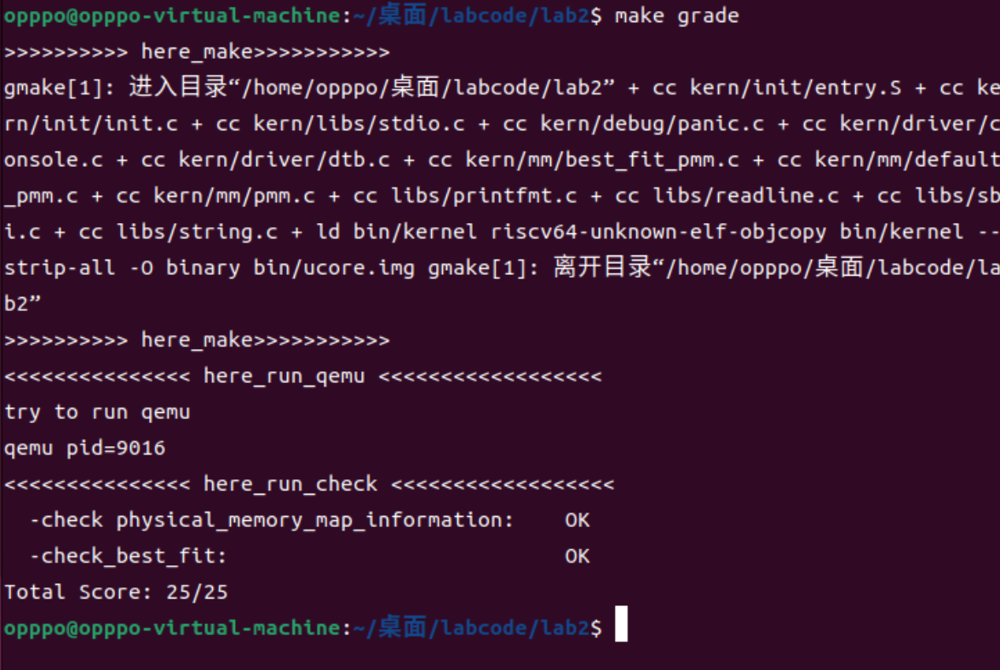

<<<<<<< HEAD
 <h1 align="center"> Lab2:物理内存和页表 </h1>

## 实验目的
理解页表的建立和使用方法。

理解物理内存的管理方法。

理解页面分配算法。

## 实验内容
实验一过后大家做出来了一个可以启动的系统，实验二主要涉及操作系统的物理内存管理。操作系统为了使用内存，还需高效地管理内存资源。本次实验我们会了解如何发现系统中的物理内存，然后学习如何建立对物理内存的初步管理，即了解连续物理内存管理，最后掌握页表相关的操作，即如何建立页表来实现虚拟内存到物理内存之间的映射，帮助我们对段页式内存管理机制有一个比较全面的了解。本次的实验主要是在实验一的基础上完成物理内存管理，并建立一个最简单的页表映射。

## 实验过程

### 练习1：理解first-fit 连续物理内存分配算法（思考题）
first-fit 连续物理内存分配算法作为物理内存分配一个很基础的方法，需要同学们理解它的实现过程。请大家仔细阅读实验手册的教程并结合kern/mm/default_pmm.c中的相关代码，认真分析default_init，default_init_memmap，default_alloc_pages， default_free_pages等相关函数，并描述程序在进行物理内存分配的过程以及各个函数的作用。 请在实验报告中简要说明你的设计实现过程。请回答如下问题：

你的first fit算法是否有进一步的改进空间？


### 练习2：实现 Best-Fit 连续物理内存分配算法（需要编程）
在完成练习一后，参考kern/mm/default_pmm.c对First Fit算法的实现，编程实现Best Fit页面分配算法，算法的时空复杂度不做要求，能通过测试即可。 请在实验报告中简要说明你的设计实现过程，阐述代码是如何对物理内存进行分配和释放，并回答如下问题：


以下是我们编写的关于Best Fit页面分配算法的实现，我将基于所有有注释"YOUR CODE"的地方依次解释实现过程：

**①best_fit_init_memmap 函数部分代码：**

``````
    for (; p != base + n; p ++) {
        assert(PageReserved(p));
        /*LAB2 EXERCISE 2: 2313180*/ 
        // 清空当前页框的标志和属性信息，并将页框的引用计数设置为0
        p->flags = 0;
        p->property = 0;
        set_page_ref(p, 0);

    }
``````

​	这个函数意在初始化这个页面分配算法，base是当前空闲页块链表的基址，算法for循环遍历每个页，此时当前页指针为p，然后通过给结构体属性flags和property赋值为0的方式，清空了当前页框的标志位和属性信息。

​	仿照之前first fit的算法，这里照样也使用**set_page_ref**函数设置该页引用计数，我们只需要传入当前页指针p，和数字0，以达到清零的作用。


**②best_fit_init_memmap 函数第二处代码：**

``````
while ((le = list_next(le)) != &free_list) {
            struct Page* page = le2page(le, page_link);
            /*LAB2 EXERCISE 2: 2313180*/ 
            // 编写代码
            // 1、当base < page时，找到第一个大于base的页，将base插入到它前面，并退出循环
            // 2、当list_next(le) == &free_list时，若已经到达链表结尾，将base插入到链表尾部
            if (base < page) {
                list_add_before(le, &(base->page_link));
                break;
            }
            else if(list_next(le) == &free_list){
                list_add(le,&(base->page_link));
            }

        }
``````

​	这里的任务是要在链表中插入base指向的那个空闲块。请注意我们为什么要寻找第一个大于base的页，这是因为我们要维护的就是一个块地址递增的链表。

​	这里需要清楚的是page本身指向的就是下一个页框的首地址(同base)，因此比较直接只用base<page即可，如果成立，那么就找到了第一个地址比base大的页框，所以我们需要将base指向的页框插在le指向的块之前（也就是当前这个块之前），所以使用前插入函数：

`list_add_before(le,&(base->page_link));`

例外情况就是当遍历到链表尾的时候，还没有找到这个符合条件的块，那我们直接把base插入到链表尾即可。还有一个问题，这里是调用list_add函数还是list_add_after函数呢，答案是两个都可以，因为list.h中说明了list_add函数的实现就是调用了list_add_after：

``````
static inline void
list_add(list_entry_t *listelm, list_entry_t *elm) {
    list_add_after(listelm, elm);
}
``````

我这里直接使用了list_add。但如果使用list_add_after，可能会更加直观。


**③best_fit_alloc_pages函数部分代码：**

``````
    /*LAB2 EXERCISE 2: 2313180*/ 
    // 下面的代码是first-fit的部分代码，请修改下面的代码改为best-fit
    // 遍历空闲链表，查找满足需求的空闲页框
    // 如果找到满足需求的页面，记录该页面以及当前找到的最小连续空闲页框数量

    //不同于first-fit，这里需要遍历整个空闲链表，找到最小的连续空闲块，并返回该块的首页指针
    unsigned int min = 0xffffffff;
    while((le = list_next(le)) != &free_list){
        struct Page *p = le2page(le, page_link);
        if(p -> property >= n && p -> property < min){
            min = p -> property;
            page = p;
        }
    }
``````

​	如同注释所说，best fit 要求找到一个符合取用大小但尽量可能小的块，这里可以先设置一个变量min，初始值直接赋一个极大值(方便后面匹配到第一个符合取用大小的块的时候就变为那个块的大小)。

改变逻辑判断条件为：

`if(p -> property >= n && p -> property < min)`

​	前一个要求符合取用条件，后一个要求这个块要比上一个符合条件的块更小，都满足的话才能执行里面的语句，分别是记录当前符合条件块的最小值，和赋值page。

​	与first fit不同的是，这里不需要break，因此要尽可能找到最小的块，因此时间复杂度上不可避免要比first_fit更大一些。如果从头到尾都没有找到符合条件的块，那么page保持NULL返回。

**④best_fit_free_pages函数部分代码：**

``````
    /*LAB2 EXERCISE 2: 2313180*/ 
    // 编写代码
    // 具体来说就是设置当前页块的属性为释放的页块数、并将当前页块标记为已分配状态、最后增加nr_free的值

    base->property = n;
    SetPageProperty(base);
    nr_free += n;
``````

n是调用方传来的释放的内存大小，因此base的property属性理所应当被设置为n，同时别忘了给nr_free加上n（nr_free表示这个链表中的所有块的大小）。由SetPageProperty函数的代码：

`SetPageProperty(page) ((page)->flags |= (1UL << PG_property))`

利用该函数可以把这个页的flags设置为1，这表示空闲状态。这是添加入链表的前提。

**⑤best_fit_free_pages函数第二部分代码：**

``````
    list_entry_t* le = list_prev(&(base->page_link));
    if (le != &free_list) {
        p = le2page(le, page_link);
        /*LAB2 EXERCISE 2: 2313180*/ 
        // 编写代码
        // 1、判断前面的空闲页块是否与当前页块是连续的，如果是连续的，则将当前页块合并到前面的空闲页块中
        if(p+p->property == base){
            // 2、首先更新前一个空闲页块的大小，加上当前页块的大小
            p->property += base->property;
            // 3、清除当前页块的属性标记，表示不再是空闲页块
            ClearPageProperty(base);
            // 4、从链表中删除当前页块
            list_del(&(base->page_link));
            // 5、将指针指向前一个空闲页块，以便继续检查合并后的连续空闲页块
            base = p;
        }
    }
``````

这段代码意在将释放回来的块与可能的前块合并，总体上和first fit中的过程是一致的，这里不赘述了。


最后赋上算法测试结果（通过25个测试点）：



你的 Best-Fit 算法是否有进一步的改进空间？

刚才说到Best-Fit算法需要遍历来找到目标块，这是一个线性的时间复杂度，但如果我们不维护一个链表，转而维护的是一个二叉树，对于任意一个非叶子节点来说，内存大小小的是左孩子，大的是右孩子，通过这种方式可以更快的找到目标块，将时间复杂度降到对数级。

所以当然是有改进空间的了！

### 扩展练习Challenge：buddy system（伙伴系统）分配算法（需要编程）
Buddy System算法把系统中的可用存储空间划分为存储块(Block)来进行管理, 每个存储块的大小必须是2的n次幂(Pow(2, n)), 即1, 2, 4, 8, 16, 32, 64, 128...

参考伙伴分配器的一个极简实现， 在ucore中实现buddy system分配算法，要求有比较充分的测试用例说明实现的正确性，需要有设计文档。

### 扩展练习Challenge：任意大小的内存单元slub分配算法（需要编程）
slub算法，实现两层架构的高效内存单元分配，第一层是基于页大小的内存分配，第二层是在第一层基础上实现基于任意大小的内存分配。可简化实现，能够体现其主体思想即可。

参考linux的slub分配算法/，在ucore中实现slub分配算法。要求有比较充分的测试用例说明实现的正确性，需要有设计文档。

### 扩展练习Challenge：硬件的可用物理内存范围的获取方法（思考题）
=======
 <h1 align="center"> Lab2:物理内存和页表 </h1>
 
## 实验目的
理解页表的建立和使用方法。

理解物理内存的管理方法。

理解页面分配算法。

## 实验内容
实验一过后大家做出来了一个可以启动的系统，实验二主要涉及操作系统的物理内存管理。操作系统为了使用内存，还需高效地管理内存资源。本次实验我们会了解如何发现系统中的物理内存，然后学习如何建立对物理内存的初步管理，即了解连续物理内存管理，最后掌握页表相关的操作，即如何建立页表来实现虚拟内存到物理内存之间的映射，帮助我们对段页式内存管理机制有一个比较全面的了解。本次的实验主要是在实验一的基础上完成物理内存管理，并建立一个最简单的页表映射。

## 实验过程

### 练习1：理解first-fit 连续物理内存分配算法（思考题）
first-fit 连续物理内存分配算法作为物理内存分配一个很基础的方法，需要同学们理解它的实现过程。请大家仔细阅读实验手册的教程并结合kern/mm/default_pmm.c中的相关代码，认真分析default_init，default_init_memmap，default_alloc_pages， default_free_pages等相关函数，并描述程序在进行物理内存分配的过程以及各个函数的作用。 请在实验报告中简要说明你的设计实现过程。请回答如下问题：

你的first fit算法是否有进一步的改进空间？


### 练习2：实现 Best-Fit 连续物理内存分配算法（需要编程）
在完成练习一后，参考kern/mm/default_pmm.c对First Fit算法的实现，编程实现Best Fit页面分配算法，算法的时空复杂度不做要求，能通过测试即可。 请在实验报告中简要说明你的设计实现过程，阐述代码是如何对物理内存进行分配和释放，并回答如下问题：

你的 Best-Fit 算法是否有进一步的改进空间？

### 扩展练习Challenge：buddy system（伙伴系统）分配算法（需要编程）
Buddy System算法把系统中的可用存储空间划分为存储块(Block)来进行管理, 每个存储块的大小必须是2的n次幂(Pow(2, n)), 即1, 2, 4, 8, 16, 32, 64, 128...

参考伙伴分配器的一个极简实现， 在ucore中实现buddy system分配算法，要求有比较充分的测试用例说明实现的正确性，需要有设计文档。

### 扩展练习Challenge：任意大小的内存单元slub分配算法（需要编程）
slub算法，实现两层架构的高效内存单元分配，第一层是基于页大小的内存分配，第二层是在第一层基础上实现基于任意大小的内存分配。可简化实现，能够体现其主体思想即可。

参考linux的slub分配算法/，在ucore中实现slub分配算法。要求有比较充分的测试用例说明实现的正确性，需要有设计文档。

### 扩展练习Challenge：硬件的可用物理内存范围的获取方法（思考题）
>>>>>>> 57902cf2d5a103a91c45cd38691e39603244962b
如果 OS 无法提前知道当前硬件的可用物理内存范围，请问你有何办法让 OS 获取可用物理内存范围？