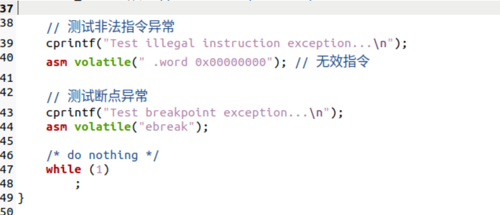
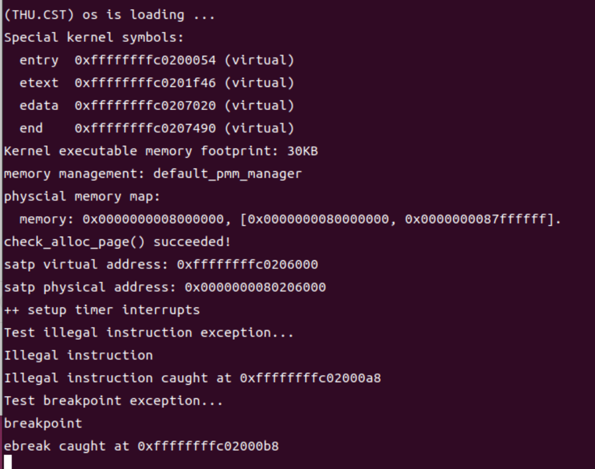

<h1 align="center"> lab3：断,都可以断 </h1>

 <div align="center">

张德民 刘越帅 欧广元

</div>

## 实验目的
实验3主要讲解的是中断处理机制。操作系统是计算机系统的监管者，必须能对计算机系统状态的突发变化做出反应，这些系统状态可能是程序执行出现异常，或者是突发的外设请求。当计算机系统遇到突发情况时，不得不停止当前的正常工作，应急响应一下，这是需要操作系统来接管，并跳转到对应处理函数进行处理，处理结束后再回到原来的地方继续执行指令。这个过程就是中断处理过程。

本章你将学到：

riscv 的中断相关知识。

中断前后如何进行上下文环境的保存与恢复。

处理最简单的断点中断和时钟中断。

## 实验内容
实验3主要讲解的是中断处理机制。通过本章的学习，我们了解了 riscv 的中断处理机制、相关寄存器与指令。我们知道在中断前后需要恢复上下文环境，用一个名为中断帧（TrapFrame）的结构体存储了要保存的各寄存器，并用了很大篇幅解释如何通过精巧的汇编代码实现上下文环境保存与恢复机制。最终，我们通过处理断点和时钟中断验证了我们正确实现了中断机制。

## 实验过程

### 练习1：完善中断处理 （需要编程）

请编程完善trap.c中的中断处理函数trap，在对时钟中断进行处理的部分填写kern/trap/trap.c函数中处理时钟中断的部分，使操作系统每遇到100次时钟中断后，调用print_ticks子程序，向屏幕上打印一行文字”100 ticks”，在打印完10行后调用sbi.h中的shut_down()函数关机。

要求完成问题1提出的相关函数实现，提交改进后的源代码包（可以编译执行），并在实验报告中简要说明实现过程和定时器中断中断处理的流程。实现要求的部分代码后，运行整个系统，大约每1秒会输出一次”100 ticks”，输出10行。

#### 解答

首先我开始完善trap.c中的中断处理函数，一共有三处需要完善的，但是两处关于异常的代码我们在挑战三部分进行讲解，这里只看第一处：

<p align="center">
  
</p>

首先我增加了一句`static int print_num = 0;`，定义了一个整形静态变量print_num，用来存储打印的次数。

然后看case 部分：

首先使用`clock_set_next_event();`设置下一次时钟中断。函数定义如下：

    void clock_set_next_event(void) 
    { 
        sbi_set_timer(get_cycles() + timebase); 
    }

这里又使用了一个函数sbi_set_timer(),可以找到其定义如下：

    void sbi_set_timer(unsigned long long stime_value) {
        sbi_call(SBI_SET_TIMER, stime_value, 0, 0);
    }

这个是RISC-V平台下操作定时器的底层封装函数。这个函数的作用是设置下一次定时器中断触发的时间。参数stime_value表示CPU计时器的目标周期数，当CPU的get_cycles()达到这个值时，会触发一次定时器中断（IRQ）。

函数内部调用了`sbi_call(SBI_SET_TIMER, stime_value, 0, 0);`,其中`sbi_call()`RISC-V 的SBI调用函数,即通过SBI请求硬件做一些底层操作，SBI_SET_TIMER这是一个宏，表示SBI功能号，告诉SBI固件要执行设置定时器的操作，这个值是5。

即我们想设置下一次定时器中断，于是调用`sbi_set_timer(stime_value)`，`sbi_set_timer`再调用底层的`sbi_call`，传递功能号`SBI_SET_TIMER`和目标时间`stime_value`。SBI固件接收到请求后，配置硬件定时器寄存器，在CPU的计时器到达stime_value时发中断给操作系统。

这时我们再看`clock_set_next_event()`就可以理解它的作用了，用get_cycles()获取当前的cpu周期，在加上timebase，即0.01秒的周期数100000，把这个时间设置为下一次触发时钟的时间。也就是1秒触发100次。

接下来是：

    if (++ticks % TICK_NUM == 0) {
                print_ticks();
                print_num++;
            }
            if(print_num==10){
                sbi_shutdown();
            }
这段代码的作用就是当ticks（时钟中断的次数）每满100次，就触发一次print_ticks(),其定义如下：

    tatic void print_ticks() {
    cprintf("%d ticks\n", TICK_NUM);
    }
打印TICK_NUM，即100。

然后统计打印的次数，满十次就调用SBI的函数`sbi_shutdown()`关闭程序。

运行结果如下：

<p align="center">
  
</p>

可以看见大约每1秒会输出一次”100 ticks”，输出10行，在打印完10行后调用sbi.h中的shut_down()函数关机。

##### 定时器中断处理流程

上边我介绍了代码的编程思路，这里主要解释定时器中断处理流程。

首先我先介绍一些会用到的函数`idt_init()`：

        void idt_init(void) {
            extern void __alltraps(void);
            write_csr(sscratch, 0);
            write_csr(stvec, &__alltraps);
        }

首先外部声明中断异常入口函数__alltraps，然后往sscratch寄存器中写入0，sscratch是一个特殊寄存器，通常用于保存用户态或内核态切换时的临时数据。这里写0表示当前在内核态运行，之后就可以通过sscratch的数值判断是内核态产生的中断还是用户态产生的中断。

`write_csr(stvec, &__alltraps);`中stvec是即异常和中断向量入口寄存器，当CPU检测到中断或异常时，它会自动跳转到stvec所指向的地址执行。这里把stvec设置为 __alltraps的地址，也就是告诉CPU如果发生任何异常或中断，都从__alltraps 开始执行。

__alltraps的具体实现如下：

     .globl __alltraps
    .align(2)
    __alltraps:
    SAVE_ALL
    
    move  a0, sp
    jal trap
    # sp should be the same as before "jal trap"

即先调用宏SAVE_ALL，保存36个寄存器的值，然后保存sp的值，然后跳入trap中断异常处理函数里。

然后是`clock_init()`,即定时器初始化函数。

    void clock_init(void) {
    set_csr(sie, MIP_STIP);
    clock_set_next_event();
    ticks = 0;
    cprintf("++ setup timer interrupts\n");
            }

`set_csr(sie, MIP_STIP)`这一句的作用是开启时钟中断,在RISC-V中，sie寄存器控制哪类中断可以被响应。MIP_STIP 是一个宏，代表 “Supervisor Timer Interrupt Pending” 的标志位。

然后使用clock_set_next_event()设置下一次时钟中断，用ticks记录中断次数。

最后是`void intr_enable()`函数:

    void intr_enable(void) { 
        set_csr(sstatus, SSTATUS_SIE); 
        }

set_csr(sstatus, SSTATUS_SIE) 的意思是把sstatus的第1位设为1，也就是打开中断开关,当外部设备、定时器或软件触发中断时，CPU被允许打断当前程序，跳到中断处理程序执行。

那么接下来我就可以开始分析定时器中断中断处理的流程了，直接看内核初始化代码：

    int kern_init(void) {
    extern char edata[], end[];
    // 先清零 BSS，再读取并保存 DTB 的内存信息，避免被清零覆盖（为了解释变化 正式上传时我觉得应该删去这句话）
    memset(edata, 0, end - edata);
    dtb_init();
    cons_init();  // init the console
    const char *message = "(THU.CST) os is loading ...\0";
    //cprintf("%s\n\n", message);
    cputs(message);
    
    print_kerninfo();
    
    // grade_backtrace();
    idt_init();  // init interrupt descriptor table
    
    pmm_init();  // init physical memory management
    
    idt_init();  // init interrupt descriptor table
    
    clock_init();   // init clock interrupt
    intr_enable();  // enable irq interrupt
    
    /* do nothing */
    while (1)
        ;
}
从第一个`idt_init();`开始，在这里的作用是初始化中断异常入口（刚刚我介绍过了是设置 stvec 指向统一的入口 __alltraps。

然后调用`pmm_init()`对物理内存管理器进行初始化入口。

然后代码再次调用`idt_init()`，主要是为了避免初始物理内存的时候修改了什么值。

接下来调用`clock_init()`，实现定时器系统的初始化。如之前介绍的，它会开启时钟中断,然后使用clock_set_next_event()设置下一次时钟中断，用ticks记录中断次数。

注意，此时已经设置好了中断的代码。

然后调用`intr_enable()`; 通过设置sstatus寄存器的SIE位打开CPU的全局中断使能位。

到此为止，时钟中断系统已经就绪，硬件定时器到期时CPU会跳转到事先设置的中断入口并执行中断处理流程。

最后是一个无限循环 `while (1)`，内核进入空循环等待中断发生。

当时钟中断发生时，cpu就开始执行__alltraps处的代码，先保存寄存器的值，然后开始执行trap处的代码：

        void trap(struct trapframe *tf) {
        trap_dispatch(tf);
        }
    
        static inline void trap_dispatch(struct trapframe *tf) {
        if ((intptr_t)tf->cause < 0) {
            // interrupts
            interrupt_handler(tf);
        } else {
            // exceptions
            exception_handler(tf);
        }
    }

trap()接收一个参数tf（类型为 struct trapframe *），表示陷入时CPU的寄存器状态(即我们传入的sp寄存器，里边存的是sstatus寄存器的值)。它直接调用trap_dispatch()，由后者判断这是一个中断还是异常，并转发到相应的处理函数。scause的最高位是1，说明trap是由中断引起的，否则是异常引起的。

这里我们的是时钟中断，所以执行中断执行函数：

    void interrupt_handler(struct trapframe *tf) {
    intptr_t cause = (tf->cause << 1) >> 1;
    ...
    case IRQ_S_TIMER:
    lock_set_next_event();
            if (++ticks % TICK_NUM == 0) {
                print_ticks();
                print_num++;
            }
            if(print_num==10){
                sbi_shutdown();
            }
    
            break;
    ... 
    }


首先抹掉scause最高位代表“这是中断不是异常”的1，存入cause里，然后根据之前定义的宏，判断是哪一种中断，这里我们的是IRQ_S_TIMER，然后就开始执行相应的函数。

执行完以后跳出，开始执行：

    __trapret:
    RESTORE_ALL
    # return from supervisor call
    sret

即回复之前的寄存器的值，然后寄存器sepc中读取返回地址，sepc在trap中断异常发生时被硬件自动保存，保存陷入时的下一条指令地址。即继续执行while(1)。

就这样一直循环执行，最后当打印次数到达10次的时候，就执行SBI的函数sbi_shutdown()关闭程序。

综上，定时器中断中断处理的流程就完成了。

### 扩展练习 Challenge1：描述与理解中断流程
回答：描述ucore中处理中断异常的流程（从异常的产生开始），其中mov a0，sp的目的是什么？SAVE_ALL中寄寄存器保存在栈中的位置是什么确定的？对于任何中断，__alltraps 中都需要保存所有寄存器吗？请说明理由。

#### ucore中处理中断异常的流程

这里我参考在练习中对于定时器中断处理流程的分析来回答这个问题。

首先是当异常产生的时候，由于已经调用了函数`idt_init()`，所以sscratch寄存器中写入了0，告诉cpu是内核态产生的中断。（在用户态就是保存内核栈指针，本次实验里用到的是内核态0）然后向stvec是即异常和中断向量入口寄存器写入 __alltraps的地址，当CPU检测到中断或异常时，它会自动跳转到stvec所指向的地址执行。也就是告诉CPU如果发生任何异常或中断，都从__alltraps 开始执行。此外还要注意的是sepc寄存器在中断异常发生时被硬件自动保存，保存陷入时的下一条指令地址。

然后，当异常发生的时候，cpu读取stvec寄存器内的__alltraps的地址，并跳转到这里去执行：

    __alltraps:
        SAVE_ALL
    
        move  a0, sp
        jal trap
        # sp should be the same as before "jal trap"

首先调用了宏SAVE_ALL：

    .macro SAVE_ALL
    
        csrw sscratch, sp
    
        addi sp, sp, -36 * REGBYTES
        # save x registers
        STORE x0, 0*REGBYTES(sp)
        STORE x1, 1*REGBYTES(sp)
        STORE x3, 3*REGBYTES(sp)
        ....
        csrr s1, sstatus
        csrr s2, sepc
        csrr s3, sbadaddr
        csrr s4, scause
    
        STORE s0, 2*REGBYTES(sp)
        STORE s1, 32*REGBYTES(sp)
        STORE s2, 33*REGBYTES(sp)
        STORE s3, 34*REGBYTES(sp)
        STORE s4, 35*REGBYTES(sp)
        .endm
这个宏的作用就是保存32个通用寄存器 (x0–x31)和4个特殊寄存器（sstatus、sepc、sbadaddr、scause）到栈上。

`sstatus`是特权状态寄存器，用于记录陷入时CPU的控制状态位。重要位有SIE，是否允许中断（1=开），SPP，保存陷入前的特权级（0=用户态，1=内核态）。

当trap发生时，CPU自动把当前中断状态SIE保存到SPIE，把当前特权级保存到 SPP，清除SIE，切换到S模式。当执行sret返回时，CPU会根据SPP恢复原来的特权级，把SPIE的值恢复到SIE。

`sepc`保存陷入前的指令地址。当异常或中断发生时,硬件自动将当时的指令地址写入sepc,对于异常，通常是当前指令地址,对于中断，通常是下一条指令地址（因为中断在指令执行后发生）。

返回时执行sret,CPU会把PC设置为sepc的值，从而回到用户态继续执行。

`sbadaddr`（新版 stval）会保存异常相关的地址或额外信息。当发生某些异常时，sbadaddr会被硬件写入导致错误的地址，对于中断一般为0。

`scause`存储指出触发 trap 的原因类型。scause是一个64位寄存器，结构如下：

    位段	名称	含义
    Bit [XLEN-1]	Interrupt	是否是中断（1=中断，0=异常）
    Bits [XLEN-2:0]	Exception Code	异常或中断号

调用完宏以后，执行`move  a0, sp `,把寄存器sp的值复制到a0。也就是把当前的栈指针当作第一个函数参数传给后续的C函数（RISC-V 的第1个整型参数放在 a0）。在 trap 场景下，sp指向刚刚在栈上构造好的 struct trapframe（即我刚刚保存的所有寄存器的值），所以这里是在传 struct trapframe *tf。

然后就开始调用C函数了：

    void trap(struct trapframe *tf) {
        trap_dispatch(tf);
    }
    
    static inline void trap_dispatch(struct trapframe *tf) {
    if ((intptr_t)tf->cause < 0) {
        // interrupts
        interrupt_handler(tf);
    } else {
        // exceptions
        exception_handler(tf);
    }
    }

首先要判断是中断还是异常，tf->cause对应scause寄存器的值，也就是trap原因，(intptr_t) 强制转换为有符号整数。之前解释过，最高位为1是中断，0为异常。对于有符号整数，最高位为1就是负数，所以和0比较，然后跳入不同的处理函数里。

目前的interrupt_handler()和exception_handler()的实现还比较简单，只是简单地根据scause的数值更仔细地分了下类，做了一些输出就直接返回了。switch里的各种case, 如IRQ_U_SOFT,CAUSE_USER_ECALL,是riscv ISA标准里规定的。在riscv.h里定义了这些常量。所以这里就不多解释具体的处理函数了。

当陷入处理函数结束以后，就又跳回了汇编代码部分，继续向后执行：

    __trapret:
        RESTORE_ALL
        # return from supervisor call
        sret

首先调用一个宏RESTORE_ALL：

    .macro RESTORE_ALL
    
    LOAD s1, 32*REGBYTES(sp)
    LOAD s2, 33*REGBYTES(sp)
    
    csrw sstatus, s1
    csrw sepc, s2
    
    # restore x registers
    LOAD x1, 1*REGBYTES(sp)
    LOAD x3, 3*REGBYTES(sp)
    .....
    LOAD x29, 29*REGBYTES(sp)
    LOAD x30, 30*REGBYTES(sp)
    LOAD x31, 31*REGBYTES(sp)
    # restore sp last
    LOAD x2, 2*REGBYTES(sp)
    .endm

很容易看出来，它的作用就是把trapframe中保存的寄存器和CSR值恢复到CPU中。

然后执行`sret`，CPU会根据SPP恢复原来的特权级，把SPIE的值恢复到SIE，而且CPU会把PC设置为sepc的值，从而回到之前的代码继续执行。

至此，一次中断异常的处理就结束了。

#### mov a0，sp的目的

上边我介绍过，RISC-V 调用约定规定函数的第一个参数通过a0传递，在中断/异常处理入口，sp已经指向了刚刚通过SAVE_ALL保存好的 trapframe，因此这里是把 trapframe 的地址传给C函数 trap(struct trapframe *tf)，让内核可以通过 tf 访问CPU的完整状态。

#### SAVE_ALL中寄寄存器保存在栈中的位置

栈上每个寄存器的保存位置是通过宏定义的偏移量确定的，栈是连续的内存区域，sp 指向trapframe的栈顶。每个寄存器占用固定字节数（REGBYTES，32/64 位），偏移量就是 寄存器在trapframe中的索引×REGBYTES。

每个寄存器有固定偏移，RESTORE_ALL 可以按相同顺序加载，保证恢复顺序一致，C层访问trapframe时，可以通过结构体字段或数组下标访问寄存器值。

所以栈上的保存位置完全由宏里偏移量和寄存器顺序确定。

#### 对于任何中断，__alltraps 中都需要保存所有寄存器吗？请说明理由。

通常是需要保存所有寄存器，但不是绝对强制，取决于是否可能修改这些寄存器。

内核trap handler返回后，用户程序需要继续运行，CPU寄存器状态必须保持一致，因此任何可能破坏寄存器的中断或异常，都必须先保存寄存器。中断发生时CPU上下文不可预测，任何寄存器都可能被handler修改，如果只保存部分寄存器，其他寄存器可能被修改，那么用户程序恢复后可能状态错乱，保存所有寄存器是最安全的做法。

不过也有例外情况，某些特殊中断（例如只使用一个寄存器的定时器软中断），内核严格约定某些寄存器不被修改，这种优化情况下，可以只保存必要寄存器。

但RISC-V的__alltraps 一般通用做法是保存所有寄存器，保证通用性和安全性。

如果是内核态发生中断异常，不一定需要保存全部寄存器，如果内核处理程序保证只使用临时寄存器t0–t6，或者严格遵循调用约定，那么就可以只保存部分寄存器。某些高性能内核只保存必要寄存器。

但是为了简化代码和保证统一性，很多内核仍然在__alltraps 中统一保存所有寄存器。


### 扩增练习 Challenge2：理解上下文切换机制
回答：在trapentry.S中汇编代码 csrw sscratch, sp；csrrw s0, sscratch, x0实现了什么操作，目的是什么？save all里面保存了stval scause这些csr，而在restore all里面却不还原它们？那这样store的意义何在呢？

#### csrw sscratch, sp与csrrw s0, sscratch, x0

`csrw sscratch, sp`的作用是把当前sp（栈指针）写入CSR寄存器 sscratch，sscratch是RISC-V提供的 Supervisor Scratch Register，在trap处理过程中可以临时保存一个值。

`csrrw s0, sscratch, x0`从sscratch读出旧值到s0,同时把x0写入sscratch（x0 固定为0，所以实际是清空 sscratch）

异常发生时，需要保存当前上下文（包括寄存器），通过 csrw sscratch, sp 先将 原sp暂存到sscratch，再通过csrrw读回s0，最终存入栈中，实现对原始sp的保存，因为代码为寄存器分配了栈，所以原sp改变了，需要提前保存。

在用户态sscratch寄存器被内核预先设置为内核栈指针（非 0），用户态栈属于用户空间，异常处理需切换到内核栈以保证安全，而在内核态被内核设置为0（标记当前处于内核态）。操作系统会检测sscratch的值，以此来判断是否需要从用户态转为内核态。

#### 不还原的原因

之前我介绍过，SAVE_ALL保持了四个CSR，sstatus用来保存异常发生前的状态，sepc保存异常发生时的指令地址（用于异常返回后继续执行），stval保存访问错误的地址,scause保存异常原因（如中断、页故障等）。

这些信息是trap函数处理异常的核心依据（例如判断异常类型、修复错误地址、决定返回后执行的指令等），必须保存到栈中供trap函数读取。

RESTORE_ALL 中还原了sstatus和sepc, 因为系统需要读取sstatus中的值，里边保存了异常发生前的关键状态，例如SPP位记录异常发生前的特权级（用户态 U 或内核态 S），sret指令会根据该位切换回对应特权级，SIE位记录异常发生前中断是否使能，恢复后需保持原有中断状态。还有其他标志位（如进位、溢出等），确保程序恢复后状态一致。若不恢复sstatus，异常返回后CPU的特权级、中断开关状态等可能会出错，导致程序无法正常执行。而sepc保存了异常发生时正在执行的指令地址（或下一条待执行的指令地址，取决于异常类型）。若不恢复 sepc，sret会跳转到错误的地址，导致程序执行混乱。

但是，stval保存访问错误的地址,scause保存异常原因（如中断、页故障等）。这些信息对于返回之前的程序没有什么作用了，我只需要在处理中断异常的函数里使用它们，当处理完以后，它们就没有用了，所以不需要进行恢复。当遇见下一个异常中断时，它们会被新的值写入。

store它们的意义就在于让中断异常处理函数使用它们，而没有恢复的必要。


### 扩展练习Challenge3：完善异常中断
编程完善在触发一条非法指令异常 mret和，在 kern/trap/trap.c的异常处理函数中捕获，并对其进行处理，简单输出异常类型和异常指令触发地址，即“Illegal instruction caught at 0x(地址)”，“ebreak caught at 0x（地址）”与“Exception type:Illegal instruction"，“Exception type: breakpoint”。

* **非法指令异常**

  非法指令异常在exception_handler函数中通过

  ```c
  case CAUSE_ILLEGAL_INSTRUCTION:
  ```

  来捕获，此时，我需要①输出异常类型②输出异常地址③更新地址寄存器。

  因此采用如下代码：

  ```c
          case CAUSE_ILLEGAL_INSTRUCTION:
               // 非法指令异常处理
              cprintf("Illegal instruction\n");
              cprintf("Illegal instruction caught at 0x%016lx\n", tf->epc);
              tf->epc += 4;
              break;
  ```

  首先这个功能的核心就是围绕着异常地址来进行，异常地址又由trapframe数据结构中的epc，该属性维护了发生异常的指令地址，因此第二步我们要输出的其实就是trapframe中epc的值。这里注意一下输出格式，我们希望通过16进制的输出格式输出，因此打印了个0x，再加上格式控制符%016lx，这表示希望输出的是16位的16进制数，以保证格式一致。

  最后通过对epc+4来更新异常地址寄存器，因为在64位系统中，虽然地址是64位表示的，但是在RISC-V指令集中，所有指令固定占32位，因此依然是+4(4个字节)。

* **断点异常处理**

  断点异常在exception_handler函数中通过

  ```c
  case CAUSE_BREAKPOINT:
  ```

  来捕获，同理非法指令异常处理，使用下面的代码：

  ```c
          case CAUSE_BREAKPOINT:
              //断点异常处理
              cprintf("breakpoint\n");
              cprintf("ebreak caught at 0x%016lx\n", tf->epc);
              tf->epc += 4;
              break;
  ```

  不同的只是输出内容由非法指令异常变味了断点异常，在此不赘述。
  
  

### 测试

效仿触发时钟中断的流程，我在系统初始化代码中人为的添加了一个非法指令异常和断点异常的触发代码，如下：



然后通过shell运行系统，我们可以看见系统触发了非法指令异常和断点异常，正确输出了我们要打印的异常名和地址：



至此，测试成功！


## 列出你认为本实验中重要的知识点，以及与对应的OS原理中的知识点，并简要说明你对二者的含义，关系，差异等方面的理解（也可能出现实验中的知识点没有对应的原理知识点）


## 列出你认为OS原理中很重要，但在实验中没有对应上的知识点
