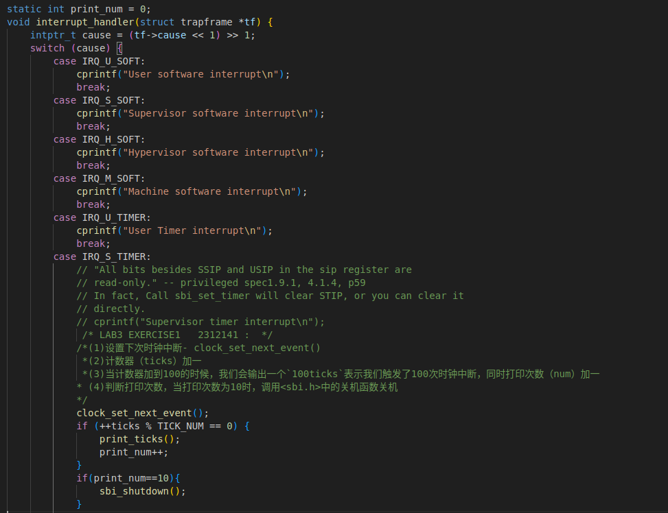
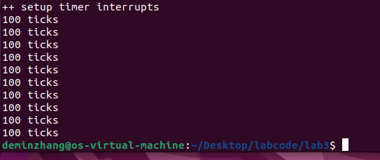

<h1 align="center"> lab3：断,都可以断 </h1>

 

张德民 刘越帅 欧广元

## 实验目的
实验3主要讲解的是中断处理机制。操作系统是计算机系统的监管者，必须能对计算机系统状态的突发变化做出反应，这些系统状态可能是程序执行出现异常，或者是突发的外设请求。当计算机系统遇到突发情况时，不得不停止当前的正常工作，应急响应一下，这是需要操作系统来接管，并跳转到对应处理函数进行处理，处理结束后再回到原来的地方继续执行指令。这个过程就是中断处理过程。

本章你将学到：

riscv 的中断相关知识。

中断前后如何进行上下文环境的保存与恢复。

处理最简单的断点中断和时钟中断。

## 实验内容
实验3主要讲解的是中断处理机制。通过本章的学习，我们了解了 riscv 的中断处理机制、相关寄存器与指令。我们知道在中断前后需要恢复上下文环境，用一个名为中断帧（TrapFrame）的结构体存储了要保存的各寄存器，并用了很大篇幅解释如何通过精巧的汇编代码实现上下文环境保存与恢复机制。最终，我们通过处理断点和时钟中断验证了我们正确实现了中断机制。

## 实验过程

### 练习1：完善中断处理 （需要编程）

请编程完善trap.c中的中断处理函数trap，在对时钟中断进行处理的部分填写kern/trap/trap.c函数中处理时钟中断的部分，使操作系统每遇到100次时钟中断后，调用print_ticks子程序，向屏幕上打印一行文字”100 ticks”，在打印完10行后调用sbi.h中的shut_down()函数关机。

要求完成问题1提出的相关函数实现，提交改进后的源代码包（可以编译执行），并在实验报告中简要说明实现过程和定时器中断中断处理的流程。实现要求的部分代码后，运行整个系统，大约每1秒会输出一次”100 ticks”，输出10行。

#### 解答

首先我开始完善trap.c中的中断处理函数，一共有三处需要完善的，但是两处关于异常的代码我们在挑战三部分进行讲解，这里只看第一处：

  

首先我增加了一句`static int print_num = 0;`，定义了一个整形静态变量print_num，用来存储打印的次数。

然后看case 部分：

首先使用`clock_set_next_event();`设置下一次时钟中断。函数定义如下：

    void clock_set_next_event(void) 
    { 
        sbi_set_timer(get_cycles() + timebase); 
    }

这里又使用了一个函数sbi_set_timer(),可以找到其定义如下：

    void sbi_set_timer(unsigned long long stime_value) {
        sbi_call(SBI_SET_TIMER, stime_value, 0, 0);
    }

这个是RISC-V平台下操作定时器的底层封装函数。这个函数的作用是设置下一次定时器中断触发的时间。参数stime_value表示CPU计时器的目标周期数，当CPU的get_cycles()达到这个值时，会触发一次定时器中断（IRQ）。

函数内部调用了`sbi_call(SBI_SET_TIMER, stime_value, 0, 0);`,其中`sbi_call()`RISC-V 的SBI调用函数,即通过SBI请求硬件做一些底层操作，SBI_SET_TIMER这是一个宏，表示SBI功能号，告诉SBI固件要执行设置定时器的操作，这个值是5。

即我们想设置下一次定时器中断，于是调用`sbi_set_timer(stime_value)`，`sbi_set_timer`再调用底层的`sbi_call`，传递功能号`SBI_SET_TIMER`和目标时间`stime_value`。SBI固件接收到请求后，配置硬件定时器寄存器，在CPU的计时器到达stime_value时发中断给操作系统。

这时我们再看`clock_set_next_event()`就可以理解它的作用了，用get_cycles()获取当前的cpu周期，在加上timebase，即0.01秒的周期数100000，把这个时间设置为下一次触发时钟的时间。也就是1秒触发100次。

接下来是：

    if (++ticks % TICK_NUM == 0) {
                print_ticks();
                print_num++;
            }
            if(print_num==10){
                sbi_shutdown();
            }
这段代码的作用就是当ticks（时钟中断的次数）每满100次，就触发一次print_ticks(),其定义如下：

    tatic void print_ticks() {
    cprintf("%d ticks\n", TICK_NUM);
    }
打印TICK_NUM，即100。

然后统计打印的次数，满十次就调用SBI的函数`sbi_shutdown()`关闭程序。

运行结果如下：

  

可以看见大约每1秒会输出一次”100 ticks”，输出10行，在打印完10行后调用sbi.h中的shut_down()函数关机。

##### 定时器中断处理流程

上边我介绍了代码的编程思路，这里主要解释定时器中断处理流程。

首先我先介绍一些会用到的函数`idt_init()`：

        void idt_init(void) {
            extern void __alltraps(void);
            write_csr(sscratch, 0);
            write_csr(stvec, &__alltraps);
        }

首先外部声明中断异常入口函数__alltraps，然后往sscratch寄存器中写入0，sscratch是一个特殊寄存器，通常用于保存用户态或内核态切换时的临时数据。这里写0表示当前在内核态运行，之后就可以通过sscratch的数值判断是内核态产生的中断还是用户态产生的中断。

`write_csr(stvec, &__alltraps);`中stvec是即异常和中断向量入口寄存器，当CPU检测到中断或异常时，它会自动跳转到stvec所指向的地址执行。这里把stvec设置为 __alltraps的地址，也就是告诉CPU如果发生任何异常或中断，都从__alltraps 开始执行。

__alltraps的具体实现如下：

     .globl __alltraps
    .align(2)
    __alltraps:
    SAVE_ALL

    move  a0, sp
    jal trap
    # sp should be the same as before "jal trap"

即先调用宏SAVE_ALL，保存36个寄存器的值，然后保存sp的值，然后跳入trap中断异常处理函数里。

然后是`clock_init()`,即定时器初始化函数。

    void clock_init(void) {
    set_csr(sie, MIP_STIP);
    clock_set_next_event();
    ticks = 0;
    cprintf("++ setup timer interrupts\n");
            }

`set_csr(sie, MIP_STIP)`这一句的作用是开启时钟中断,在RISC-V中，sie寄存器控制哪类中断可以被响应。MIP_STIP 是一个宏，代表 “Supervisor Timer Interrupt Pending” 的标志位。

然后使用clock_set_next_event()设置下一次时钟中断，用ticks记录中断次数。

最后是`void intr_enable()`函数:

    void intr_enable(void) { 
        set_csr(sstatus, SSTATUS_SIE); 
        }

set_csr(sstatus, SSTATUS_SIE) 的意思是把sstatus的第1位设为1，也就是打开中断开关,当外部设备、定时器或软件触发中断时，CPU被允许打断当前程序，跳到中断处理程序执行。

那么接下来我就可以开始分析定时器中断中断处理的流程了，直接看内核初始化代码：

    int kern_init(void) {
    extern char edata[], end[];
    // 先清零 BSS，再读取并保存 DTB 的内存信息，避免被清零覆盖（为了解释变化 正式上传时我觉得应该删去这句话）
    memset(edata, 0, end - edata);
    dtb_init();
    cons_init();  // init the console
    const char *message = "(THU.CST) os is loading ...\0";
    //cprintf("%s\n\n", message);
    cputs(message);

    print_kerninfo();

    // grade_backtrace();
    idt_init();  // init interrupt descriptor table

    pmm_init();  // init physical memory management

    idt_init();  // init interrupt descriptor table

    clock_init();   // init clock interrupt
    intr_enable();  // enable irq interrupt

    /* do nothing */
    while (1)
        ;
}
从第一个`idt_init();`开始，在这里的作用是初始化中断异常入口，刚刚我介绍过了是设置 stvec 指向统一的入口 __alltraps。

然后调用`pmm_init()`对物理内存管理器进行初始化入口。

然后代码再次调用`idt_init()`，主要是为了避免初始物理内存的时候修改了什么值。

接下来调用`clock_init()`，实现定时器系统的初始化。如之前介绍的，它会开启时钟中断,然后使用clock_set_next_event()设置下一次时钟中断，用ticks记录中断次数。

注意，此时已经设置好了中断的代码。

然后调用`intr_enable()`; 通过设置sstatus寄存器的SIE位打开CPU的全局中断使能位。

到此为止，时钟中断系统已经就绪，硬件定时器到期时CPU会跳转到事先设置的中断入口并执行中断处理流程。

最后是一个无限循环 `while (1)`，内核进入空循环等待中断发生。

当时钟中断发生时，cpu就开始执行__alltraps处的代码，先保存寄存器的值，然后开始执行trap处的代码：

        void trap(struct trapframe *tf) {
        trap_dispatch(tf);
        }

        static inline void trap_dispatch(struct trapframe *tf) {
        if ((intptr_t)tf->cause < 0) {
            // interrupts
            interrupt_handler(tf);
        } else {
            // exceptions
            exception_handler(tf);
        }
    }

trap()接收一个参数tf（类型为 struct trapframe *），表示陷入时CPU的寄存器状态(即我们传入的sp寄存器，里边存的是sstatus寄存器的值)。它直接调用trap_dispatch()，由后者判断这是一个中断还是异常，并转发到相应的处理函数。scause的最高位是1，说明trap是由中断引起的，否则是异常引起的。

这里我们的是时钟中断，所以执行中断执行函数：

    void interrupt_handler(struct trapframe *tf) {
    intptr_t cause = (tf->cause << 1) >> 1;
    ...
    case IRQ_S_TIMER:
    lock_set_next_event();
            if (++ticks % TICK_NUM == 0) {
                print_ticks();
                print_num++;
            }
            if(print_num==10){
                sbi_shutdown();
            }

            break;
    ... 
    }

首先抹掉scause最高位代表“这是中断不是异常”的1，存入cause里，然后根据之前定义的宏，判断是哪一种中断，这里我们的是IRQ_S_TIMER，然后就开始执行相应的函数。

执行完以后跳出，开始执行：
    
    __trapret:
    RESTORE_ALL
    # return from supervisor call
    sret

即回复之前的寄存器的值，然后寄存器sepc中读取返回地址，sepc在trap中断异常发生时被硬件自动保存，保存陷入时的下一条指令地址。即继续执行while(1)。

就这样一直循环执行，最后当打印次数到达10次的时候，就执行SBI的函数sbi_shutdown()关闭程序。

综上，定时器中断中断处理的流程就完成了。

### 扩展练习 Challenge1：描述与理解中断流程
回答：描述ucore中处理中断异常的流程（从异常的产生开始），其中mov a0，sp的目的是什么？SAVE_ALL中寄寄存器保存在栈中的位置是什么确定的？对于任何中断，__alltraps 中都需要保存所有寄存器吗？请说明理由。

### 扩增练习 Challenge2：理解上下文切换机制
回答：在trapentry.S中汇编代码 csrw sscratch, sp；csrrw s0, sscratch, x0实现了什么操作，目的是什么？save all里面保存了stval scause这些csr，而在restore all里面却不还原它们？那这样store的意义何在呢？

### 扩展练习Challenge3：完善异常中断
编程完善在触发一条非法指令异常 mret和，在 kern/trap/trap.c的异常处理函数中捕获，并对其进行处理，简单输出异常类型和异常指令触发地址，即“Illegal instruction caught at 0x(地址)”，“ebreak caught at 0x（地址）”与“Exception type:Illegal instruction"，“Exception type: breakpoint”。

## 列出你认为本实验中重要的知识点，以及与对应的OS原理中的知识点，并简要说明你对二者的含义，关系，差异等方面的理解（也可能出现实验中的知识点没有对应的原理知识点）

## 列出你认为OS原理中很重要，但在实验中没有对应上的知识点
