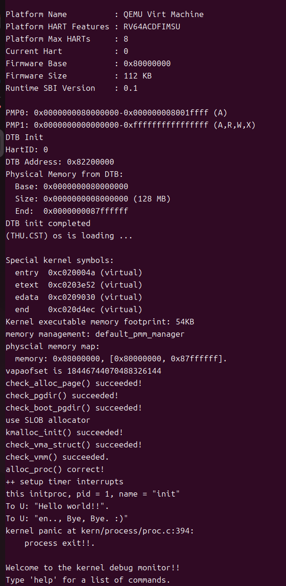

<h1 align="center"> lab4：进程管理 </h1>

张德民 刘越帅 欧广元

## 实验目的

- 了解虚拟内存管理的基本结构，掌握虚拟内存的组织与管理方式
- 了解内核线程创建/执行的管理过程
- 了解内核线程的切换和基本调度过程

## 实验内容

在前面的实验中，我们已经完成了物理内存管理和基础页表机制的实现，使内核具备了对物理内存页的分配与管理能力，并能够建立起虚拟地址到物理地址的基本映射结构。但当前系统仍然只能以单一执行流的方式运行，无法并发执行多个任务，也尚未体现虚拟内存机制在进程或线程隔离中的作用。

本实验将在此基础上进一步扩展，完成以下两方面内容：

首先，**进一步完善虚拟内存管理，实现基本的地址空间结构**。通过引入虚拟内存描述结构，管理进程或线程的虚拟地址空间布局，为每个执行实体提供逻辑上的运行空间。与后续实验中的缺页异常和页面置换不同，本实验中的虚拟内存仍采用**预映射方式**，即在建立地址空间时一次性完成所有需要的页表映射，不涉及按需分配或页面置换。

其次，**引入内核线程机制，实现多执行流并发运行能力**。内核线程是一种特殊形式的“进程”。当一个程序加载到内存中运行时，首先通过ucore OS的内存管理子系统分配合适的空间，然后就需要考虑如何分时使用CPU来“并发”执行多个程序，让每个运行的程序（这里用线程或进程表示）“感到”它们各自拥有“自己”的CPU。本实验将实现线程控制块、上下文切换和调度器等内容，从而实现多线程并发执行，使内核能够调度多个执行实体轮流使用 CPU 运行。

内核线程与用户进程的区别如下：

| 比较项   | 内核线程         | 用户进程                   |
| -------- | ---------------- | -------------------------- |
| 运行模式 | 仅在内核态运行   | 在用户态和内核态之间切换   |
| 地址空间 | 共享内核地址空间 | 拥有独立的用户虚拟地址空间 |

通过本实验，系统将从“单一执行流的内核”发展为“支持多线程调度的内核”，并完成基本的虚拟内存环境框架搭建，为后续实现用户进程、系统调用、缺页异常处理和页面置换等功能奠定基础。

需要注意的是，在ucore的调度和执行管理中，**对线程和进程做了统一的处理**。且由于ucore内核中的所有内核线程共享一个内核地址空间和其他资源，所以这些内核线程从属于同一个唯一的内核进程，即ucore内核本身。

## 实验过程

### 练习0：填写已有实验

相关内容均已按照Lab2，Lab3的实验填写到了Lab4上，运行结果如下(此时还没有填写Lab4的其他练习，因此进程创建失败，这很正常)：


### 练习1：分配并初始化一个进程控制块（需要编码）

我们补全的alloc_proc函数代码如下：

```c
static struct proc_struct *
alloc_proc(void)
{
    struct proc_struct *proc = kmalloc(sizeof(struct proc_struct));
    if (proc != NULL)
    {
        proc->state = PROC_UNINIT;
        proc->pid = -1;
        proc->runs = 0;
        proc->kstack = 0;
        proc->need_resched = 0;
        proc->parent = NULL;
        proc->mm = NULL;
        memset(&proc->context, 0, sizeof(struct context));
        proc->tf = NULL;
        proc->pgdir = boot_pgdir_pa;
        proc->flags = 0;
        memset(&proc->name,0,PROC NAME LEN);
    }
    return proc;
}
```

函数一开始会使用**kmalloc**函数来申请一块结构体**proc_struct**大小的内存块，这块内存块作为进程控制块，需要被正确的初始化才能够使用。接下来是对它每一个字段初始化值的原因：

* **state**：该值有四个枚举值，分别是PROC_UNINIT未初始化态，PROC_SLEEPING非运行态（可能是就绪态或者阻塞态），PROC_RUNNABLE运行态，PROC_ZOMBIE终止态，因为此时该进程刚刚被创建，所有值都还未设，因此它只能是未初始化态，不是PROC_SLEEPING，更不是PROC_RUNNABLE或PROC_ZOMBIE态。
* **pid**：首先，一个进程的PID值会由后续的**get_pid**函数指定，在初始化函数中我们不需要关心，因此问题就变成了初始化为-1还是0的问题。在ucore中，闲逛进程的PID已经被初始化为了0，0是一个真正的存在的进程，因此初始化不应是一个已经存在的进程的PID，所以这里初始化为-1。
* **runs**：这个字段指示的是该进程的运行次数，此时这个进程还在创建过程中，因此该值当然是0.
* **kstack**：该值是一个地址，指向为进程独立分配的内核栈空间，这里是初始化，内核栈空间还没有分配，因此初始化为0即可，后续代码idleproc->kstack == 0也证明了这一点。
* **need_resched**：该值用于指定进程是否需要被调度出CPU，0是不需要1是需要。由初始化的状态PROC_UNINIT可知，这个值显然要设置为0，一个没被创建好的进程不可能需要被调出CPU
* **parent**：该指针指向这个进程的父进程，这里要初始化为NULL，因为后续会有另外的函数来定义这个值，现在我们还一无所知。
* **mm**：内核线程共享内核地址空间，无需独立内存管理结构，如果是用户进程，那么会使用**copy_mm**函数去复制父进程的内存，当然本次实验还不涉及。
* **context**：进程上下文，在进程创建阶段，该进程还没有任何的上下文，因此全部清0即可，避免后续使用因随机值导致异常。
* **tf**：指向中断帧数据结构**trapframe**，用于保存中断或系统调用时的硬件状态，此时新进程处在初始化，未触发中断，因此该值肯定是NULL
* **pgdir**：页表基地址，因为内核线程共享内核页表，因为**boot_pgdir_pa**是启动时初始化的页表物理地址，内核线程直接使用全局页表，无需独立地址空间，因此直接赋值**boot_pgdir_pa**，后续**proc_init**函数检查内核进程控制块的pgdir值是否是**boot_pgdir_pa**也证明了这一点。
* **flags**：进程标志位。这里直接清0即可，后续有需求后续会进行相关设置。
* **name**：进程名。此时还未指定，因此直接初始化为空字符串。

#### 请说明proc_struct中`struct context context`和`struct trapframe *tf`成员变量含义和在本实验中的作用是啥？

* **struct context context**：这个成员变量保存了一个进程的运行上下文。什么是进程的运行上下文？简言之，一个进程在运行到某个状态时，很可能因为主动或被动的原因需要被CPU调出，此时这个进程若想下次调入CPU时还能正确运行，就必须保存当前该进程的运行状态，比如一些关键寄存器的值。

  数据结构context 包含了被调用者保存寄存器s0-s11，还包含了返回地址寄存器ra和栈地址寄存器sp，这些寄存器构成了一个进程运行的上下文。

  因此，context用于进程间的上下文切换，即当调度器决定切换到另一个进程时，保存当前进程的执行状态（主要是ra和sp等关键寄存器和被调用者保存寄存器，并不是所有寄存器），并用于后续恢复目标进程的状态。

* **struct trapframe *tf**：这个数据结构我们并不陌生，在Lab3探索中断和异常机制时我们曾频繁的接触它，这个数据结构保存了中断或系统调用发生时的硬件状态。在一个进程运行时，其不仅要主动或者被动的被调入调出CPU(也就是进程调度)，还可能会产生一些中断和异常行为，此时CPU会暂停当前执行进程手中的活，转而去执行相对应的处理程序，这个时候就需要**tf**来保存硬件状态，以供处理程序完成之后继续进程的执行。

  因此，tf用于处理中断和系统调用（或是触发异常）。当发生中断或系统调用时，硬件会保存部分状态到trapframe，然后进入内核态处理。处理完成后，通过`tf`恢复进程的执行环境。

  

### 练习2：为新创建的内核线程分配资源（需要编码）

创建一个内核线程需要分配和设置好很多资源。kernel_thread函数通过调用do_fork函数完成具体内核线程的创建工作。do_kernel函数会调用alloc_proc函数来分配并初始化一个进程控制块，但alloc_proc只是找到了一小块内存用以记录进程的必要信息，并没有实际分配这些资源。ucore一般通过do_fork实际创建新的内核线程。do_fork的作用是，创建当前内核线程的一个副本，它们的执行上下文、代码、数据都一样，但是存储位置不同。因此，我们实际需要"fork"的东西就是stack和trapframe。在这个过程中，需要给新内核线程分配资源，并且复制原进程的状态。你需要完成在kern/process/proc.c中的do_fork函数中的处理过程。它的大致执行步骤包括：

调用alloc_proc，首先获得一块用户信息块。

为进程分配一个内核栈。
复制原进程的内存管理信息到新进程（但内核线程不必做此事）

复制原进程上下文到新进程

将新进程添加到进程列表

唤醒新进程

返回新进程号

请在实验报告中简要说明你的设计实现过程。请回答如下问题：

请说明ucore是否做到给每个新fork的线程一个唯一的id？请说明你的分析和理由。

#### 解答

我实现的do_fork函数如下:

    int do_fork(uint32_t clone_flags, uintptr_t stack, struct trapframe *tf)
    {
        int ret = -E_NO_FREE_PROC;
        struct proc_struct *proc;
        if (nr_process >= MAX_PROCESS)
        {
            goto fork_out;
        }
        ret = -E_NO_MEM;
        

        //    1.分配并初始化进程控制块
        proc = alloc_proc();
        if (proc == NULL){
            goto fork_out;
        }
        //    2. 分配并初始化内核栈（setup_stack函数）
        if (setup_kstack(proc) != 0){
            goto bad_fork_cleanup_proc;
        }

        //    3. 根据clone_flags决定是复制还是共享内存管理系统（copy_mm函数）
        if (copy_mm(clone_flags, proc) != 0){
            goto bad_fork_cleanup_kstack;
        }


        //    4. 设置进程的中断帧和上下文（copy_thread函数）
        copy_thread(proc, stack, tf);
        //    5.把设置好的进程加入链表
        proc->pid = get_pid();       // 分配唯一 pid
        proc->parent = current;      // 父进程是 current

        list_add(&proc_list, &proc->list_link); // 加入进程链表
        hash_proc(proc);                         // 加入 hash 表

        nr_process++;  // 进程数量 +1

        //    6. 将新建的进程设为就绪态

        proc->state=PROC_RUNNABLE;
        //    7.将返回值设为线程id
        ret = proc->pid;
        
    fork_out:
        return ret;

    bad_fork_cleanup_kstack:
        put_kstack(proc);
    bad_fork_cleanup_proc:
        kfree(proc);
        goto fork_out;
    }

接下来我将解释这个函数的作用。首先可以知道，do_fork函数是在kernel_thread这个函数里被调用的，如下：

    int kernel_thread(int (*fn)(void *), void *arg, uint32_t clone_flags)
    {
        struct trapframe tf;
        memset(&tf, 0, sizeof(struct trapframe));
        tf.gpr.s0 = (uintptr_t)fn;
        tf.gpr.s1 = (uintptr_t)arg;
        tf.status = (read_csr(sstatus) | SSTATUS_SPP | SSTATUS_SPIE) & ~SSTATUS_SIE;
        tf.epc = (uintptr_t)kernel_thread_entry;
        return do_fork(clone_flags | CLONE_VM, 0, &tf);
    }

这个函数的作用是是在操作系统内核层面创建一个新的内核线程，来执行fn(arg)。即传入的第一个参数为函数指针，第二个是函数参数，第三个是标志符号。然后定义一个trapframe用来保存线程上下文。

然后保存函数指针和参数，再读取RISC-V的sstatus寄存器，并且设置上一个特权模式为内核模式，设置上一个状态可以响应中断，屏蔽 SIE，当前状态不响应中断。

然后指定新线程启动时的入口函数，最后调用do_fork创建线程并返回。

接下来开始分析do_fork的实现逻辑，传入了三个参数，第一个是clone_flags标志，并且父子进程共享内存空间，第二个是0，因为内核线程没有用户态栈，它永远只在内核态运行，所以用户态栈地址没有意义，最后是CPU上下文。

然后开始具体的代码部分，首先判断还能不能创建新进程，如果可以，先用alloc_proc()分配并初始化一个进程控制块。第二步，使用setup_kstack函数为新进程分配内核栈，第三步是根据clone_flags决定是复制还是共享内存管理系统，这里使用了copy_mm函数，因为当前进程是内核线程，没有用户态地址空间，所以不需要复制用户态内存。第四步，使用copy_thread函数，拷贝父进程的 trapframe，然后判断，如果 esp 为 0（内核线程），就用trapframe本身地址作为栈指针，如果是用户进程，使用父进程传过来的 esp，然后初始化上下文context，ra（返回地址）设置为 forkret，表示新进程第一次被调度时，会执行forkret函数，sp（上下文栈指针）指向trapframe，让线程从 trapframe中恢复寄存器，正确开始执行。第五步，先用 get_pid()函数为新进程创建一个pid，然后把父进程设置为当前运行的进程，最后把新进程的指针加到链表和哈希表里，并让进程数量加一。第六步，把新进程的状态设置为PROC_RUNNABLE。第七步，也是最后一步，把返回值ret设置为新进程的pid。

这样就完成了do_fork函数的功能。

#### 请说明ucore是否做到给每个新fork的线程一个唯一的id？请说明你的分析和理由。

可以做到给每个新fork的线程一个唯一的id，理由如下：

首先，根据上边的讲解，我可以知道，新fork的线程的id是通过get_pid()函数分配的，而get_pid()函数通过维护静态变量last_pid来记录上一次分配的PID，并在每次调用时递增。如果PID超过上限MAX_PID，则从1开始回绕。

在分配之前，函数会遍历当前的进程链表proc_list，检查PID是否已被占用，如果冲突则跳过，直到找到一个未被占用的PID返回，从而保证每个活着的进程或线程都拥有唯一的 PID。

因此，可以做到给每个新fork的线程一个唯一的id。


### 练习3：编写proc_run 函数（需要编码）
#### proc_run用于将指定的进程切换到CPU上运行。它的大致执行步骤包括：
* 检查要切换的进程是否与当前正在运行的进程相同，如果相同则不需要切换。
* 禁用中断。你可以使用/kern/sync/sync.h中定义好的宏local_intr_save(x)和local_intr_restore(x)来实现关、开中断。
* 切换当前进程为要运行的进程。
* 切换页表，以便使用新进程的地址空间。/libs/riscv.h中提供了lsatp(unsigned int pgdir)函数，可实现修改SATP寄存器值的功能。
* 实现上下文切换。/kern/process中已经预先编写好了switch.S，其中定义了switch_to()函数。可实现两个进程的context切换。
* 允许中断。

#### 请回答如下问题：
##### 在本实验的执行过程中，创建且运行了几个内核线程？
##### 完成代码编写后，编译并运行代码：make qemu

题目中已经给出了我们要进行的具体操作，那么我们来补全proc.c中的proc_run函数。
```c
// proc_run - make process "proc" running on cpu
// NOTE: before call switch_to, should load  base addr of "proc"'s new PDT
void proc_run(struct proc_struct *proc)
{
    if (proc != current)
    {
        // LAB4:EXERCISE3 2313752
        /*
         * Some Useful MACROs, Functions and DEFINEs, you can use them in below implementation.
         * MACROs or Functions:
         *   local_intr_save():        Disable interrupts
         *   local_intr_restore():     Enable Interrupts
         *   lsatp():                   Modify the value of satp register
         *   switch_to():              Context switching between two processes
         */        
        bool intr_flag;
        // 1. 禁用中断，以保证上下文切换的原子性
        local_intr_save(intr_flag);
        // 2. 切换当前进程指针,保存旧进程的引用，以便传递给 switch_to
        struct proc_struct *prev = current;
        current = proc;
        // 3. 切换页表,lsatp 函数会将 proc->pgdir 的值加载到 satp 寄存器中，并刷新 TLB，使新的地址映射生效。
        lsatp(proc->pgdir);
        // 4. 切换上下文,调用 switch_to 汇编函数，保存 prev 进程的上下文，恢复 proc 进程的上下文。这个函数执行后，CPU 的寄存器状态将变为 proc 进程上次被切换出去时的状态。
        switch_to(&(prev->context), &(proc->context));
        // 5. 允许中断,下文切换完成后，重新开启中断。
        local_intr_restore(intr_flag);
    }
}
```
这里我们逐行说明一下：

1. if (proc != current):  
这是原来的代码，是一个优化和防止错误的检查。如果要切换到的进程就是当前正在运行的进程，那么什么都不用做，直接返回即可。
1. bool intr_flag; 和 local_intr_save(intr_flag);:  
local_intr_save 是一个宏，它会禁用当前 CPU 的中断，并将中断禁用前的状态保存到 intr_flag 变量中。这里要禁用中断，是因为进程切换是一个需要原子执行的操作。如果在切换过程中（比如刚保存了旧进程的上下文，还没恢复新进程的上下文时）发生了中断，可能会导致系统状态不一致，引发严重错误。禁用中断可以保证整个切换过程不受干扰。
那么下面我们看一下local_intr_save 宏的实现:(在sync.h中)
```c
static inline bool __intr_save(void) {
    if (read_csr(sstatus) & SSTATUS_SIE) {
        intr_disable();
        return 1;
    }
    return 0;
}

#define local_intr_save(x) \
    do {                   \
        x = __intr_save(); \
    } while (0)
#define local_intr_restore(x) __intr_restore(x);
```
这里先是定义了一个静态内联函数__intr_save，先读取sstatusji值，并判断当前中断是否处于开启状态。如果处于开启状态，则调用 intr_disable() 禁用中断，并返回 1。否则，返回 0。  
那么最后的结果就是禁用了中断，并且保存了禁用前的中断状态。  
后面是定义了一个宏 local_intr_save，这个宏就是调用刚才的_intr_save函数，并把结果（禁用前的状态）保存到 x 中，定义这个宏是为了方便使用的。

3. struct proc_struct *prev = current; current = proc;:  
我们首先将当前进程 current 的指针保存到 prev 变量中，因为接下来我们需要用它来调用 switch_to。  
然后，将全局变量 current 更新为指向即将运行的新进程 proc。这一步非常关键，它告诉操作系统内核，从现在开始，current 就代表这个新进程了。  
4. lsatp(proc->pgdir);:  
这是地址空间切换的核心步骤。lsatp 函数的作用是将参数 proc->pgdir（新进程的页目录表物理地址）写入到 RISC-V 架构的satp寄存器中。  
```c
static inline void
lsatp(unsigned int pgdir)
{
  write_csr(satp, SATP32_MODE | (pgdir >> RISCV_PGSHIFT));
}
```
写入 satp 寄存器后，mmu就会使用新的页目录表来进行虚拟地址到物理地址的转换。这意味着，接下来 CPU 执行的指令和访问的数据，都将在新进程的地址空间中进行。

5. switch_to(&(prev->context), &(proc->context));:  
这是上下文切换的核心。switch_to 是一个用汇编语言实现的函数（在 switch.S 中）。  
switch_to 函数的具体实现如下。  
```asm
#include <riscv.h>

.text
# void switch_to(struct proc_struct* from, struct proc_struct* to)
.globl switch_to
switch_to:
    # save from's registers
    STORE ra, 0*REGBYTES(a0)
    STORE sp, 1*REGBYTES(a0)
    STORE s0, 2*REGBYTES(a0)
    STORE s1, 3*REGBYTES(a0)
    STORE s2, 4*REGBYTES(a0)
    STORE s3, 5*REGBYTES(a0)
    STORE s4, 6*REGBYTES(a0)
    STORE s5, 7*REGBYTES(a0)
    STORE s6, 8*REGBYTES(a0)
    STORE s7, 9*REGBYTES(a0)
    STORE s8, 10*REGBYTES(a0)
    STORE s9, 11*REGBYTES(a0)
    STORE s10, 12*REGBYTES(a0)
    STORE s11, 13*REGBYTES(a0)

    # restore to's registers
    LOAD ra, 0*REGBYTES(a1)
    LOAD sp, 1*REGBYTES(a1)
    LOAD s0, 2*REGBYTES(a1)
    LOAD s1, 3*REGBYTES(a1)
    LOAD s2, 4*REGBYTES(a1)
    LOAD s3, 5*REGBYTES(a1)
    LOAD s4, 6*REGBYTES(a1)
    LOAD s5, 7*REGBYTES(a1)
    LOAD s6, 8*REGBYTES(a1)
    LOAD s7, 9*REGBYTES(a1)
    LOAD s8, 10*REGBYTES(a1)
    LOAD s9, 11*REGBYTES(a1)
    LOAD s10, 12*REGBYTES(a1)
    LOAD s11, 13*REGBYTES(a1)

    ret
```
这段代码就是将需要保存的寄存器进行保存和调换。其中的a0和a1是RISC-V 架构中通用寄存器，a0指向原进程，a1指向目的进程。  
寄存器可以分为调用者保存（caller-saved）寄存器和被调用者保存（callee-saved）寄存器，线程切换在一个函数也就是我们的proc_run中，所以编译器会自动帮助我们生成保存和恢复调用者保存寄存器的代码，在实际的进程切换过程中我们只需要保存被调用者保存寄存器。    
由于我们在初始化时把上下文的ra寄存器设定成了forkret函数的入口，所以这里会返回到forkret函数。forkrets函数很短，位于kern/trap/trapentry.S：
```
    .globl forkrets
forkrets:
    # set stack to this new process's trapframe
    move sp, a0
    j __trapret
```
这里把传进来的参数，也就是进程的中断帧放在了sp，这样在__trapret中就可以直接从中断帧里面恢复所有的寄存器。

6. local_intr_restore(intr_flag);:  
当 switch_to 返回时，意味着上下文切换已经完成。  
local_intr_restore 宏会根据之前保存的 intr_flag 变量的值，来决定是否重新开启中断。如果切换前中断是开启的，那么现在就重新开启；如果切换前就是关闭的，那就保持关闭。这保证了中断状态的正确恢复。  

**总结**  
我们的proc_run 函数体现了进程切换的三个层面：
* 内核视角切换：current = proc;
* 地址空间切换：lsatp(proc->pgdir);
* CPU 执行上下文切换：switch_to(...)  
通过这三个步骤，操作系统成功地将 CPU 的控制权从一个进程交给了另一个进程，实现了多任务并发。

下面回答本练习中所提到的问题：
##### 在本实验的执行过程中，创建且运行了几个内核线程？
本实验中创建并运行了 2 个内核线程，分别是 idleproc和 initproc。
1. idleproc
   是一个占位线程，他是在 proc_init 函数中通过 alloc_proc() 分配并初始化，PID 为 0。状态设为 PROC_RUNNABLE，内核栈使用 bootstack（启动栈），是系统启动后第一个运行的线程，同时也是找不到其他状态为PROC_RUNNABLE的进程时的保底线程。
2. initproc
   是在 proc_init 中通过 kernel_thread(init_main, "Hello world!!", 0) 创建，PID 为 1。由 kernel_thread 封装 do_fork 实现创建，最终通过调度器获得 CPU 执行权，运行 init_main 函数（在本实验中是输出 “Hello world!!” 等信息）。是系统中第一个实际执行任务的内核线程，用于验证线程创建与调度机制的正确性。
##### 完成代码编写后，编译并运行代码：make qemu
运行结果如下：



可以看到正确输出了initproc进程中的 Hello world!! 等内容。说明完成了进程的切换。

### 扩展练习 Challenge：
**1. 说明语句local_intr_save(intr_flag);....local_intr_restore(intr_flag);是如何实现开关中断的？**


    static inline bool __intr_save(void) {
        if (read_csr(sstatus) & SSTATUS_SIE) {
            intr_disable();
            return 1;
        }
        return 0;
    }

    static inline void __intr_restore(bool flag) {
        if (flag) {
            intr_enable();
        }
    }

    #define local_intr_save(x) \
        do {                   \
            x = __intr_save(); \
        } while (0)
    #define local_intr_restore(x) __intr_restore(x);

    void intr_enable(void) { set_csr(sstatus, SSTATUS_SIE); }

    void intr_disable(void) { clear_csr(sstatus, SSTATUS_SIE); }

上边是local_intr_save和local_intr_restore的具体实现。

对于local_intr_save这个宏，他会调用__intr_save()获取中断状态，__intr_save()会读取RISC-V的sstatus寄存器，判断当前中断是否启用，如果可用，就调用intr_disable()，把中断关闭，并返回1，意思是原先启用了中断，否则直接返回0，表示原先没有启用中断。

对于local_intr_restore这个宏，要传入之前通过local_intr_save获取到的之前的中断状态，然后，直接调用__intr_restore(x)，如果x为1，即原来开启了中断，就调用intr_enable()，把sstatus的sie位置1，开启中断，否则不用管，仍然保持关闭状态即可。


**2. 深入理解不同分页模式的工作原理（思考题）**
**get_pte()函数（位于kern/mm/pmm.c）用于在页表中查找或创建页表项，从而实现对指定线性地址对应的物理页的访问和映射操作。这在操作系统中的分页机制下，是实现虚拟内存与物理内存之间映射关系非常重要的内容。**
* get_pte()函数中有两段形式类似的代码， 结合sv32，sv39，sv48的异同，解释这两段代码为什么如此相像。

具体代码如下:
  
          pte_t *get_pte(pde_t *pgdir, uintptr_t la, bool create)
    
        {
            pde_t *pdep1 = &pgdir[PDX1(la)];//提取顶级索引，拿到顶级页目录项（PDE1）指针
            if (!(*pdep1 & PTE_V))//判断 PDE1 是否有效（是否指向合法的中级页目录）
            {
                struct Page *page;
                if (!create || (page = alloc_page()) == NULL)
                {
                    return NULL;//不创建/分配页失败 → 返回 NULL
                }
                set_page_ref(page, 1);//设页表页引用计数为 1（被当前 PDE1 引用）
                uintptr_t pa = page2pa(page);//获取页表页的物理地址（新分配的物理页，用于存中级页目录）
                memset(KADDR(pa), 0, PGSIZE);//清空页表页（避免旧数据导致映射错误）
                *pdep1 = pte_create(page2ppn(page), PTE_U | PTE_V);//创建 PDE1：指向新分配的中级页目录的 PPN，权限为「有效+用户态可访问」
            }
    
            pde_t *pdep0 = &((pte_t *)KADDR(PDE_ADDR(*pdep1)))[PDX0(la)];
            //从 PDE1 中拿到中级页目录的物理地址 → 转内核虚拟地址 → 用 PDX0 提取中级索引 → 拿到 PDE0 指针
            if (!(*pdep0 & PTE_V))//判断 PDE0 是否有效（是否指向合法的页表）
            {
                struct Page *page;
                if (!create || (page = alloc_page()) == NULL)
                {
                    return NULL;
                }
                set_page_ref(page, 1);
                uintptr_t pa = page2pa(page);
                memset(KADDR(pa), 0, PGSIZE);
                *pdep0 = pte_create(page2ppn(page), PTE_U | PTE_V);// 创建 PDE0：指向新分配的页表的 PPN，权限为「有效+用户态可访问」
            }
            return &((pte_t *)KADDR(PDE_ADDR(*pdep0)))[PTX(la)];//从 PDE0 中拿到页表的物理地址 → 转内核虚拟地址 → 用 PTX 提取页表索引 → 返回 PTE 指针
        }

RISC-V的 sv32、sv39和sv48 是三种虚拟内存分页模式，它们都采用多级页表来管理虚拟地址到物理地址的映射，但层级和地址宽度不同：sv32用于32位虚拟地址，采用两级页表（顶级页目录PDE1 → 页表 PDE0），每级索引10位，每页4KB；sv39用于39位虚拟地址，采用三级页表（PDE2 → PDE1 → 页表 PDE0），每级索引9位，页大小仍为4KB；sv48用于48 位虚拟地址，采用四级页表（PDE3 → PDE2 → PDE1 → 页表 PDE0），每级索引9位，页大小仍为4KB。尽管层级和索引宽度不同，它们每一级的处理逻辑相同：通过索引找到目录项，检查有效位，如果不存在可创建页表或页，最终得到页表项（PTE），实现虚拟地址到物理页的映射。

本次实验里我们用到的是sv39，也就是三级页表，代码中相同的两部分是通过顶层页表的项去寻找中层页表的物理页号，以及通过中层页表的项去寻找底层页表的物理页号。

它们之所以相似，是因为多层页表的每一层操作逻辑本质上是一样的，首先根据虚拟地址提取对应层级的索引，然后依次在相应层目录中获取页目录项，检查其有效位，如果无效且需要创建，就分配一页物理内存、清零初始化，并设置目录项指向新页，同时标记有效和权限位。区别仅在于层级不同，第一段处理顶层页目录到中层页目录，第二段处理中层页目录到底层页表，索引宏（PDX1、PDX0）不同，指向的对象也不同。

所以我们完全可以使用相似的逻辑去处理，只要修改层级和宏即可。

* 目前get_pte()函数将页表项的查找和页表项的分配合并在一个函数里，你认为这种写法好吗？有没有必要把两个功能拆开？

这种写法有优点，也有缺点，优点是使用方便、逻辑集中，调用者只需一个函数即可获得页表项，无需关心中间页表是否存在，同时减少了代码重复，对于大多数映射虚拟页的场景非常直观。缺点是功能耦合，查找和分配绑在一起，如果只想查找已有页表项而不创建新的页表，就必须通过create参数控制，灵活性较低，可读性和可维护性略差。

不过目前看来，没有必要拆开，虽然功能耦合，但是通过控制create参数也可以进行区分，足以实现我们的需求。


## 列出你认为本实验中重要的知识点，以及与对应的OS原理中的知识点，并简要说明你对二者的含义，关系，差异等方面的理解（也可能出现实验中的知识点没有对应的原理知识点）
本实验中的重要知识点与对应的OS原理知识点及其关系、差异如下：

1. **进程控制块（proc_struct）与OS原理中的进程控制块（PCB）**
   - 实验中，`proc_struct`是内核中描述进程/线程状态的数据结构，包含进程ID、状态、上下文、栈地址等信息； OS原理中，PCB是操作系统管理进程的核心数据结构，记录进程的所有信息，如进程标识、状态、调度信息、资源信息等。
   - 实验中内核线程的`proc_struct`简化了部分字段，例如`mm`为NULL，因为内核线程共享地址空间，无需独立的内存管理结构。

2. **进程创建（alloc_proc、do_fork）与OS原理中的进程创建与fork系统调用**
   - 本次实验通过`alloc_proc`分配PCB，`do_fork`复制资源（栈、上下文）完成内核线程创建；OS原理中，进程创建通过fork系统调用复制父进程资源，生成子进程，子进程与父进程有独立的地址空间等资源。  
   - `do_fork`模拟了fork的核心逻辑，包括资源复制、PID分配、加入调度队列等，是对原理中进程创建机制的简化实现。

3. **内核栈分配（setup_kstack）与OS原理中的进程栈管理**
   - 为每个内核线程分配独立内核栈，用于保存中断/上下文信息；OS原理中，进程需要独立的栈空间，包括用户栈和内核栈，以隔离不同进程的运行环境。
   - `setup_kstack`是原理中栈隔离机制的简化实现，关注内核态栈的分配，保证了内核线程运行时栈的独立性。
   - 但是实验没有用户栈，因为内核线程不进入用户态；而原理中的进程栈管理需要同时考虑用户栈和内核栈，以支持进程在用户态和内核态之间的切换。

4. **上下文切换（switch_to、proc_run）与OS原理中的进程上下文切换**
   - 实验中，`switch_to`通过汇编保存/恢复寄存器（被调用者保存寄存器），`proc_run`完成页表切换和上下文切换；OS原理中，上下文切换需要保存CPU状态（寄存器、程序计数器等）并切换地址空间，以实现进程之间的切换。
   - 实验实现了原理中上下文切换的核心步骤，包括状态保存、地址空间切换等，是对上下文切换机制的具体实践。

5. **页表切换（lsatp函数）与OS原理中的虚拟地址空间隔离**
   - 实验通过`lsatp`修改`satp`寄存器切换页表，实现地址空间隔离；OS原理中，多进程通过独立的页表实现虚拟地址空间隔离，每个进程拥有自己的虚拟地址范围。
   - `lsatp`是原理中地址空间隔离机制的硬件级实现，通过切换页表保证了不同进程地址空间的独立性。

6. **中断开关（local_intr_save/restore）与OS原理中的临界区保护**
   - 实验中，通过禁用/启用中断保证上下文切换的原子性；OS原理中，临界区需要禁止中断或使用锁等机制防止并发冲突，以保证临界区代码的正确执行。
   - 实验方法是原理中临界区保护的一种实现，确保了上下文切换等关键操作不受中断干扰。
   - 差异：实验仅使用中断屏蔽，未涉及多CPU场景下的锁机制；而原理中临界区保护需要根据系统情况（如单CPU、多CPU）采用不同的机制，锁机制在多CPU场景中更为常用。

总结来说，实验中的知识点是OS原理的具体落地，通过简化场景（如仅内核线程、预映射内存）实现了核心机制。原理是通用的理论框架，实验则结合RISC-V架构和ucore内核特点，聚焦PCB、上下文切换、调度的实现，暂时忽略了复杂细节。
