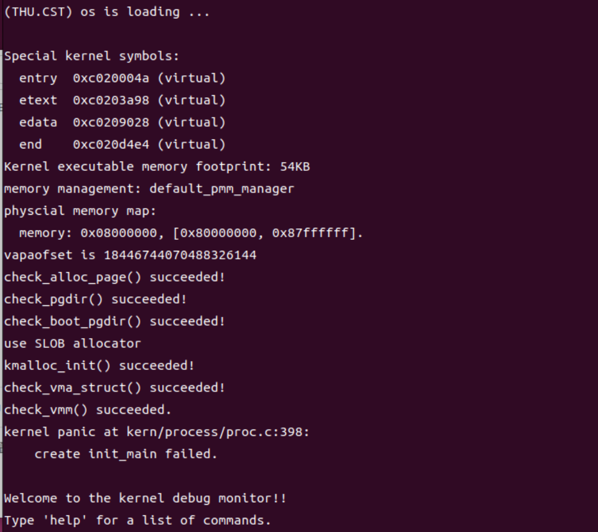

<h1 align="center"> lab4：进程管理 </h1>

张德民 刘越帅 欧广元

## 实验目的

- 了解虚拟内存管理的基本结构，掌握虚拟内存的组织与管理方式
- 了解内核线程创建/执行的管理过程
- 了解内核线程的切换和基本调度过程

## 实验内容

在前面的实验中，我们已经完成了物理内存管理和基础页表机制的实现，使内核具备了对物理内存页的分配与管理能力，并能够建立起虚拟地址到物理地址的基本映射结构。但当前系统仍然只能以单一执行流的方式运行，无法并发执行多个任务，也尚未体现虚拟内存机制在进程或线程隔离中的作用。

本实验将在此基础上进一步扩展，完成以下两方面内容：

首先，**进一步完善虚拟内存管理，实现基本的地址空间结构**。通过引入虚拟内存描述结构，管理进程或线程的虚拟地址空间布局，为每个执行实体提供逻辑上的运行空间。与后续实验中的缺页异常和页面置换不同，本实验中的虚拟内存仍采用**预映射方式**，即在建立地址空间时一次性完成所有需要的页表映射，不涉及按需分配或页面置换。

其次，**引入内核线程机制，实现多执行流并发运行能力**。内核线程是一种特殊形式的“进程”。当一个程序加载到内存中运行时，首先通过ucore OS的内存管理子系统分配合适的空间，然后就需要考虑如何分时使用CPU来“并发”执行多个程序，让每个运行的程序（这里用线程或进程表示）“感到”它们各自拥有“自己”的CPU。本实验将实现线程控制块、上下文切换和调度器等内容，从而实现多线程并发执行，使内核能够调度多个执行实体轮流使用 CPU 运行。

内核线程与用户进程的区别如下：

| 比较项   | 内核线程         | 用户进程                   |
| -------- | ---------------- | -------------------------- |
| 运行模式 | 仅在内核态运行   | 在用户态和内核态之间切换   |
| 地址空间 | 共享内核地址空间 | 拥有独立的用户虚拟地址空间 |

通过本实验，系统将从“单一执行流的内核”发展为“支持多线程调度的内核”，并完成基本的虚拟内存环境框架搭建，为后续实现用户进程、系统调用、缺页异常处理和页面置换等功能奠定基础。

需要注意的是，在ucore的调度和执行管理中，**对线程和进程做了统一的处理**。且由于ucore内核中的所有内核线程共享一个内核地址空间和其他资源，所以这些内核线程从属于同一个唯一的内核进程，即ucore内核本身。

## 实验过程

### 练习0：填写已有实验

相关内容均已按照Lab2，Lab3的实验填写到了Lab4上，运行结果如下(此时还没有填写Lab4的其他练习，因此进程创建失败，这很正常)：

### 练习1：分配并初始化一个进程控制块（需要编码）

### 练习2：为新创建的内核线程分配资源（需要编码）

### 练习3：编写proc_run 函数（需要编码）

### 扩展练习 Challenge：

## 列出你认为本实验中重要的知识点，以及与对应的OS原理中的知识点，并简要说明你对二者的含义，关系，差异等方面的理解（也可能出现实验中的知识点没有对应的原理知识点）

