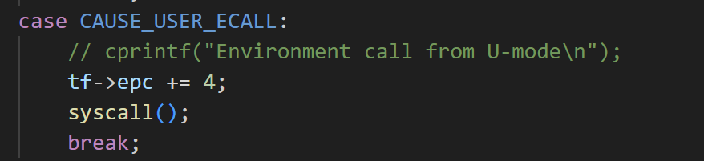
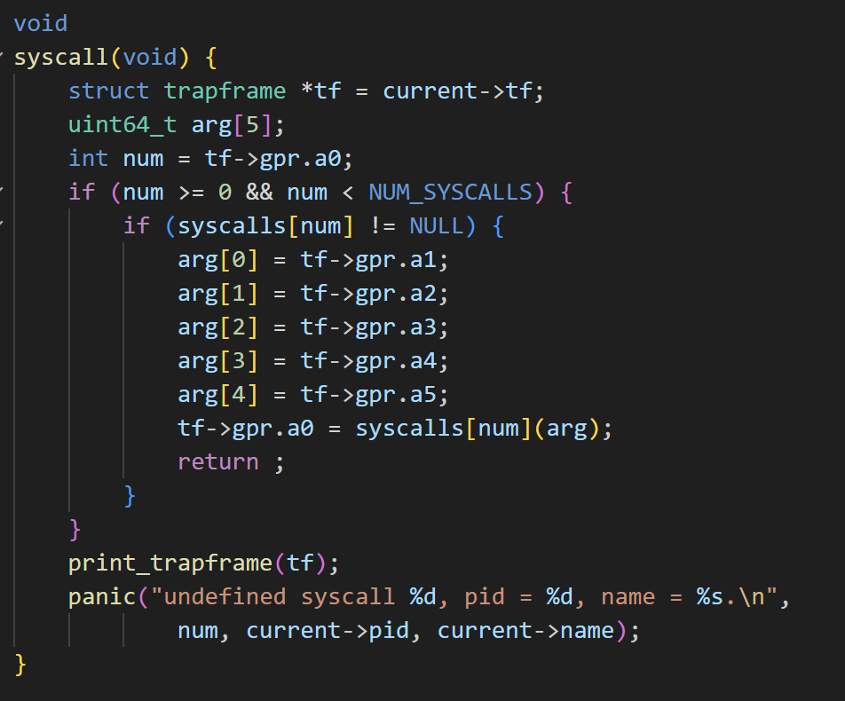
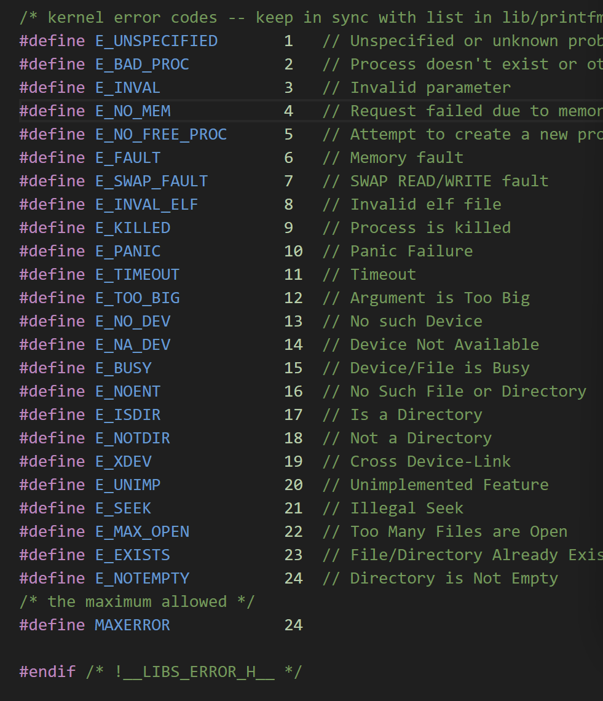
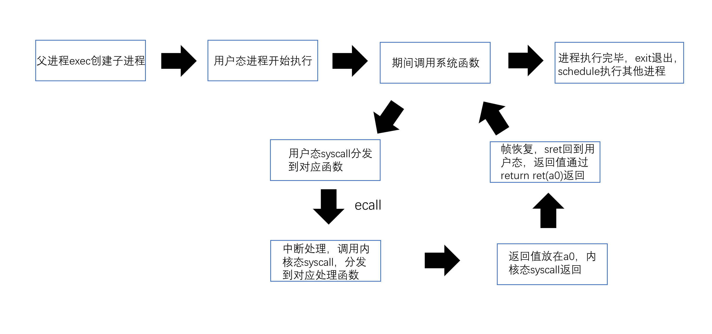
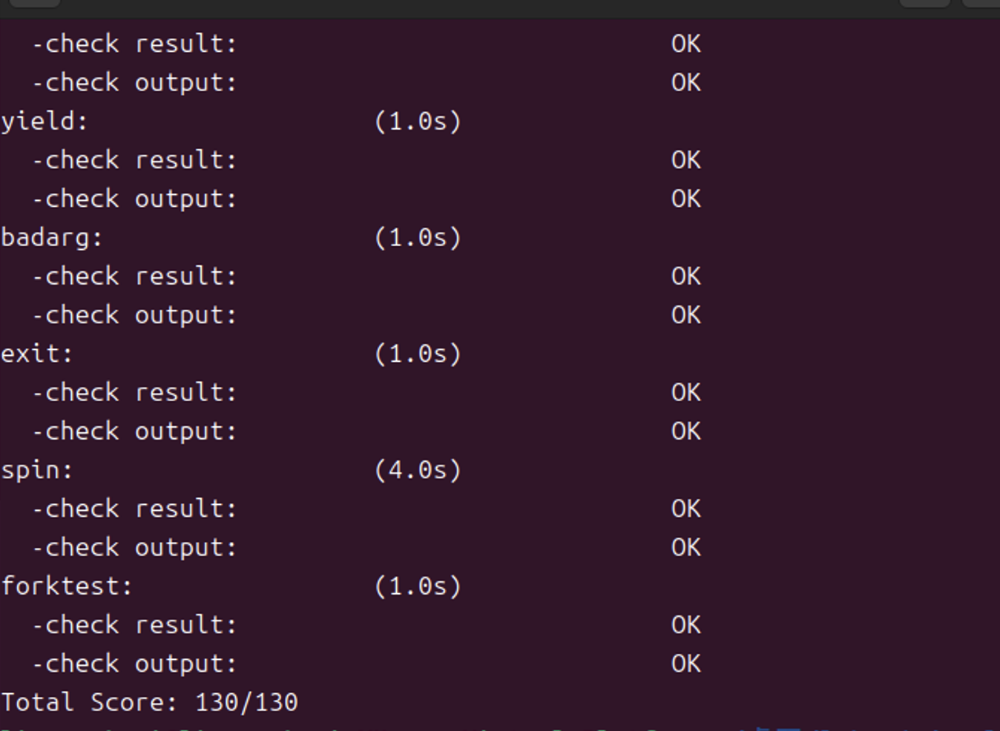
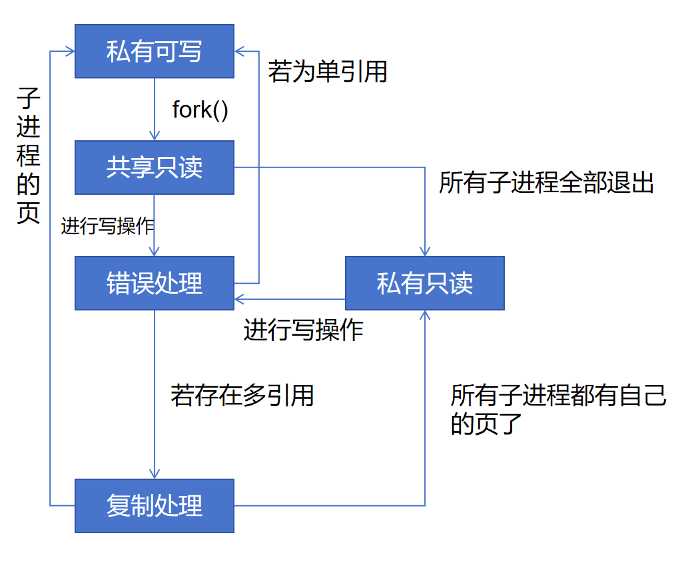
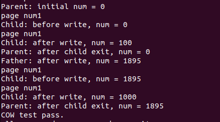
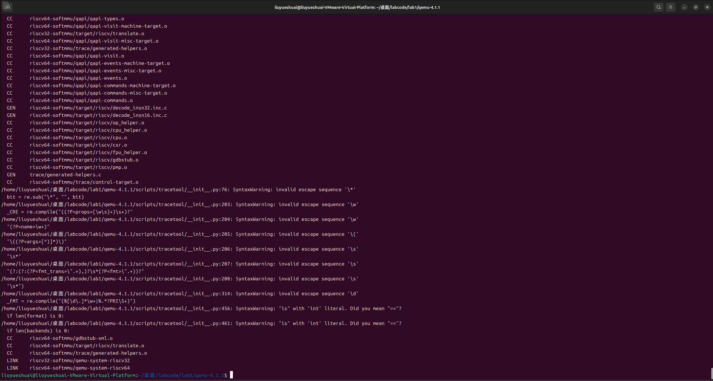

<h1 align="center"> lab5：用户程序 </h1>

 <div align="center">

张德民 刘越帅 欧广元

</div>

## 实验目的

1. 了解第一个用户进程创建过程
2. 了解系统调用框架的实现机制
3. 了解ucore如何实现系统调用sys_fork/sys_exec/sys_exit/sys_wait来进行进程管理

## 实验内容
实验4完成了内核线程，但到目前为止，所有的运行都在内核态执行。实验5将创建用户进程，让用户进程在用户态执行，且在需要ucore支持时，可通过系统调用来让ucore提供服务。为此需要构造出第一个用户进程，并通过系统调用sys_fork/sys_exec/sys_exit/sys_wait来支持运行不同的应用程序，完成对用户进程的执行过程的基本管理。

## 实验过程

### 练习0 填写已有实验

本实验依赖实验2/3/4。请把你做的实验2/3/4的代码填入本实验中代码中有“LAB2”/“LAB3”/“LAB4”的注释相应部分。注意：为了能够正确执行lab5的测试应用程序，可能需对已完成的实验2/3/4的代码进行进一步改进。

### 练习1: 加载应用程序并执行（需要编码）

do_execv函数调用load_icode（位于kern/process/proc.c中）来加载并解析一个处于内存中的ELF执行文件格式的应用程序。你需要补充load_icode的第6步，建立相应的用户内存空间来放置应用程序的代码段、数据段等，且要设置好proc_struct结构中的成员变量trapframe中的内容，确保在执行此进程后，能够从应用程序设定的起始执行地址开始执行。需设置正确的trapframe内容。

#### 请在实验报告中简要说明你的设计实现过程。

    /* 将用户栈指针设置为用户栈顶（USTACKTOP） */
        tf->gpr.sp = USTACKTOP;
    
        /* 从 ELF 头获取程序入口地址并设置 sepc/epc */
        tf->epc = elf->e_entry;
    
        /* 构造返回到用户态时的 sstatus：
        * - 清除 SPP，使 sret 返回到用户态（U-mode）；
        * - 置位 SPIE，使 sret 后中断按 SPIE 的值恢复；
        * - 清除 SIE（在内核中禁用中断，等待 sret 由 SPIE 恢复）；
        * 同时尽量保留原有 sstatus 的其它位（如 SUM），以免破坏访问策略。
        */
        uintptr_t newsstatus = (sstatus & ~SSTATUS_SPP) | SSTATUS_SPIE;
        newsstatus &= ~SSTATUS_SIE;
        tf->status = newsstatus;

如上边的代码，就是我补充的第六步，主要是按照注释进行编写代码。

首先tf->gpr.sp是用户栈指针，应该设置为用户栈顶 所以设置为USTACKTOP，tf->epc是程序入口地址，所以设置为 ELF 头中的 e_entry。

tf->status是进程状态寄存器sstatus，应该设置为适合用户程序运行的值，首先拿用户态原本的 sstatus，然后把SSTATUS_SPP置零，说明这个进程应该去往用户态运行，以后执行sret时，返回到用户态。

然后把SSTATUS_SPIE置1，sret后用户态恢复“中断开启”。

最后SSTATUS_SIE置为0，表明在内核态不希望发生中断。

#### 请简要描述这个用户态进程被ucore选择占用CPU执行（RUNNING态）到具体执行应用程序第一条指令的整个经过。

kern_init 执行完 proc_init 后，会调用 cpu_idle()。在 cpu_idle() 中，有一个 while (1) 循环，由于 idleproc->need_resched = 1，循环会立即调用 schedule()。schedule() 会从就绪队列中选择下一个进程（也就是我们的用户进程user_main），然后通过 proc_run() 切换到它。此时，current变为user_proc，开始执行user_main函数。

在proc_run()中，首先禁用中断，保存当前进程指针，然后切换页表，切换上下文，最后打开中断，但是切换完成后，CPU在新进程的上下文中执行，但仍在内核态。

新进程恢复后，从forkret函数开始执行（这是switch_to恢复的返回地址，由copy_thread设置）。

forkret 调用 forkrets(current->tf)。

    .globl forkrets
    forkrets:
        # set stack to this new process's trapframe
        move sp, a0
        j __trapret


这是一个汇编函数，将栈指针sp设置为当前进程的 trapframe 地址（move sp, a0），然后跳转到 __trapret。

    .globl __trapret
    __trapret:
        RESTORE_ALL
        # return from supervisor call
        sret


__trapret 调用 RESTORE_ALL 宏，从 trapframe 中恢复所有寄存器，包括通用寄存器 (x0-x31)、状态寄存器 (sstatus)、异常程序计数器 (sepc/epc) 等。

user_main函数中，先声明链接时嵌入的用户程序二进制数据的起始地址和大小，然后调用kernel_execve函数，kernel_execve函数参数里a0存系统调用号，a1到a5是参数。然后调用一个ebreak中断，进入中断处理机制。然后保存当前的陷阱帧，调用sys_exec，sys_exec调用 do_execve，执行程序替换，清除旧内存，调用 load_icode 加载用户程序并设置新的用户trapframe等(也就是设置用户栈，epc设置为用户程序开始的地方，更新status寄存器等等)。

然后执行__trapret，先调用RESTORE_ALL宏，从新的用户trapframe恢复所有寄存器（包括 sepc、sstatus 等）。然后执行sret指令，sret 根据 sepc 设置 PC，并根据 sstatus 切换特权级别，返回到第一条用户指令去执行。

### 练习2: 父进程复制自己的内存空间给子进程（需要编码）

创建子进程的函数do_fork在执行中将拷贝当前进程（即父进程）的用户内存地址空间中的合法内容到新进程中（子进程），完成内存资源的复制。具体是通过copy_range函数（位于kern/mm/pmm.c中）实现的，请补充copy_range的实现，确保能够正确执行。

#### 请在实验报告中简要说明你的设计实现过程。

我实现的代码如下：


            /* (1) 找到 src_kvaddr：页（page）对应的内核虚拟地址
            * (2) 找到 dst_kvaddr：新页（npage）对应的内核虚拟地址
            * (3) 将 src_kvaddr 指向的内存内容拷贝到 dst_kvaddr，拷贝长度为 PGSIZE（页大小）
            * (4) 建立新页（npage）的物理地址与起始线性地址（start）之间的映射关系
             */
              /* (1) 源页面的内核虚拟地址 */
            void *src_kvaddr = page2kva(page);
            /* (2) 目标页面的内核虚拟地址 */
            void *dst_kvaddr = page2kva(npage);
    
            /* (3) 拷贝整页内容 */
            memcpy(dst_kvaddr, src_kvaddr, PGSIZE);
    
            /* (4) 在目标页表中建立映射，权限与源页相同 */
            ret = page_insert(to, npage, start, perm);
            if (ret != 0)
            {
                /* 建立映射失败，释放分配的页 */
                free_page(npage);
                return -E_NO_MEM;
            }
            /* 记录该页的虚拟地址映射信息（与 pgdir_alloc_page 一致） */
            npage->pra_vaddr = start;

首先，使用page2kva函数，找到父进程的页的对应内核虚拟地址，然后再用page2kva得到要为子进程分配的页的内核虚拟地址，然后把父进程的数据直接全部拷贝到子进程的页里。最后，在子进程的页目录里建立虚拟地址 start 到物理页面 npage 的映射，并记录这个页的虚拟地址信息。

#### 如何设计实现Copy on Write机制？给出概要设计，鼓励给出详细设计。

    Copy-on-write（简称COW）的基本概念是指如果有多个使用者对一个资源A（比如内存块）进行读操作，则每个使用者只需获得一个指向同一个资源A的指针，就可以该资源了。若某使用者需要对这个资源A进行写操作，系统会对该资源进行拷贝操作，从而使得该“写操作”使用者获得一个该资源A的“私有”拷贝—资源B，可对资源B进行写操作。该“写操作”使用者对资源B的改变对于其他的使用者而言是不可见的，因为其他使用者看到的还是资源A。

##### 概要设计

1. 核心原理：
   - 共享阶段：在fork时，父子进程共享父进程的物理页面，不复制内容。页面映射为只读（去掉写权限PTE_W），防止写操作破坏共享。
   - 写时复制：当某个进程尝试写共享页面时，触发page fault。内核检测到是COW页面（只读但原页面可写），复制页面内容到新物理页面，更新映射为可写。
   - 隔离保证：写操作后，每个进程拥有私有拷贝，修改不可见。

2. 关键组件：
   - 页面管理：利用`Page`结构体的`ref`字段（引用计数）跟踪共享页面。当`ref > 1`时，表示页面被共享。
   - 权限控制：在页表项(PTE)中设置只读权限（去掉PTE_W）。
   - 异常处理：扩展trap处理（`kern/trap/trap.c`），在page fault时检查是否为COW写操作。
   - 内存一致性：确保复制时不影响其他进程。


##### 详细设计

此处的详细修改代码会在下方的挑战题部分给出。

1. **修改copy_range函数（kern/mm/pmm.c）**：
   - 当前实现是直接复制：分配新页面`npage`，`memcpy`内容，然后`page_insert`。
   - **COW版本**：改为共享父进程页面，不复制内容。
     - 获取父进程页面`page`后，不分配`npage`，而是直接使用`page`。
     - 设置权限为只读：`perm &= ~PTE_W;`（去掉写权限）。
     - `page_insert(to, page, start, perm);` 将父页面映射到子进程页表（只读）。
     - 增加引用计数：`page_ref_inc(page);`。
     - 移除`memcpy`和`npage`分配逻辑。

   - **注意**：`npage->pra_vaddr = start;` 可移除，因为共享页面时虚拟地址由各进程页表决定。

2. 扩展Page Fault处理（kern/trap/trap.c）：

   - 添加COW逻辑：在`trap_dispatch`中，检测page fault（异常码为load/store page fault）。
     - 检查fault地址对应的PTE：如果页面只读（无PTE_W）且ref > 1，则触发COW复制。
     - **复制步骤**：
       - 分配新页面`npage`。
       - `memcpy`原页面内容到`npage`。
       - 更新当前进程的页表：`page_insert`新页面为可写（perm | PTE_W）。
       - 减少原页面的ref：`page_ref_dec(page);` 如果ref==0，释放页面。

3. **其他修改**：
   - **权限一致性**：在fork时，确保父进程页面也设为只读（修改`do_fork`或`copy_thread`中父进程的权限）。
   - **退出处理**：在`do_exit`中，正确减少ref计数，避免内存泄漏。

4. **状态转换（有限状态自动机风格）**：
   - **初始状态**：页面未共享，ref=1，可写。
   - **共享状态**：fork后，ref>1，只读（COW标记）。
   - **写触发**：page fault → 复制 → 新页面ref=1，可写；原页面ref--。
   - **释放**：进程退出时，ref--；若ref=0，释放页面。


### 练习3: 阅读分析源代码，理解进程执行 fork/exec/wait/exit 的实现，以及系统调用的实现（不需要编码）

请在实验报告中简要说明你对 fork/exec/wait/exit函数的分析。并回答如下问题：

请分析fork/exec/wait/exit的执行流程。重点关注哪些操作是在用户态完成，哪些是在内核态完成？内核态与用户态程序是如何交错执行的？内核态执行结果是如何返回给用户程序的？

请给出ucore中一个用户态进程的执行状态生命周期图（包执行状态，执行状态之间的变换关系，以及产生变换的事件或函数调用）。（字符方式画即可）

执行：make grade。如果所显示的应用程序检测都输出ok，则基本正确。（使用的是qemu-1.0.1）

#### fork函数：

执行流程如下：

* 在用户态中，函数调用fork（在user\libs\ulib.h中定义），此时会通过``` return sys_fork();```语句调用sys_fork函数。

* sys_fork函数会通过syscall number记录的数字，这里是2，调用**用户态**的syscall()函数。这个函数会调用ecall指令触发中断，此时就由用户态陷到内核态了，等待执行完毕后，使用`sd a0, ret` 把内核返回的 a0 寄存器中的值（此时a0存储着返回值）存到内存返回值变量，最后通过return ret来返回函数调用的结果（函数返回时，ecall已经执行完，意思就是在ecall之后已经从内核态变回为用户态了）。

* 随后会调用内核态的相关函数处理中断，这里就是trap.c中的exception_handler函数来处理：

  

  可以看到，这里是CAUSE_USER_ECALL中断的情况，因此epc+4，这起到下一次执行用户进程下一条指令的作用，避免陷入ecall循环。随后调用syscall函数，注意，这里的syscall和**用户态**中的不一样，这里的syscall是**内核态**的syscall。

  另外值得注意的是，在kern\trap\trapentry.S中，也就是中断所必须执行的汇编代码中（jal trap之前），宏 `SAVE_ALL` 会保存ecall前用户态代码的所有寄存器，且会把用户栈指针保存到 sscratch，加载内核栈到 sp。

* 所以这里就分发到了具体的**内核态**sys_fork函数了！该函数的具体逻辑如下：

  

  我们刚才上文说到了，函数执行的返回值被放在a0寄存器中返回，为什么返回值一定在a0呢？这里就有了答案，syscall在根据系统调用类型决定调用哪个系统函数时，会把返回值直接赋值给a0，完毕后，函数return。在这里，我们要调用的系统函数是sys_fork。该函数的实现如下：

  

  比较简单，也就是为具体的执行函数do_fork提供父进程上下文以复制子进程。我们直接来看do_fork的逻辑。

* 首先要明确的是，具体的执行函数中定义了很多代表不同含义的int型返回值的宏，它们是：

  

  对于do_fork函数，由于上次实验我们已经介绍过该函数的实现了，这里我们聚焦一下关于返回的处理。这里考虑成功的时候返回值为新线程的id，不成功的时候为错误码。那么此时返回值就会经过sys_fork --> syscall --> exception_handler执行完trap代码 --> __trapret处的代码恢复**用户态**进程上下文寄存器，然后再通过sret指令返回用户态（这里就是处理完中断了，也就是处理完ecall了，并且返回值放在a0中，作为ret返回给用户程序。）

#### wait函数：

执行流程如下：

* 在用户态中，函数调用wait（user\libs\ulib.c），此时会通过``` return sys_wait();```语句调用sys_wait函数。
* sys_wait函数会通过syscall number记录的数字，这里是3，调用**用户态**的syscall()函数。这个函数会调用ecall指令触发中断，此时就由用户态陷到内核态了，等待执行完毕后，使用`sd a0, ret` 把内核返回的 a0 寄存器中的值，详情就不再赘述，和上文一致。
* 随后会调用内核态的相关函数处理中断，同样是先执行到__alltraps处，保存所有的ecall前用户态代码的所有寄存器，且会把用户栈指针保存到 sscratch，加载内核栈到 sp。然后就执行trap函数的代码，一样的，调用**内核态**syscall。同样的流程，分发到具体的执行函数do_wait。

* 对于do_wait函数，这里简单介绍一下它的执行逻辑：在参数正确的情况下（参数错误则直接返回错误码）,递归寻找子进程，若有子进程且并不是休眠态，则设置它为休眠态，若是没有子进程，则直接返回。对于每一个子进程的处理，从哈希表和父子链表中移除该子进程，释放子进程资源，返回0，当然我们说idleproc ，idleproc 这两个进程是不允许这么操作的。此时返回值的传递和切换回用户态就不赘述了，和上文一致。

  

#### exit 函数：

执行流程如下：

* 在用户态中，函数调用exit（user\libs\ulib.c），此时会通过``` sys_exit(error_code);```语句调用sys_exit函数。注意：这里并不期待返回，也没有写返回语句，因为一旦返回了，就说明这个进程是exit failed了，需要报错了。
* sys_exit函数会通过syscall number记录的数字，这里是1，调用**用户态**的syscall()函数。这个函数会调用ecall指令触发中断，此时就由用户态陷到内核态了。
* 随后会调用内核态的相关函数处理中断，同样是先执行到__alltraps处，保存所有的ecall前用户态代码的所有寄存器，且会把用户栈指针保存到 sscratch，加载内核栈到 sp。然后就执行trap函数的代码，一样的，调用**内核态**syscall。随后，获取具体的错误码（error_code），然后分发到具体的执行函数do_exit。

* 对于do_exit函数，这里简单介绍一下它的执行逻辑：首先，调用 exit_mmap、put_pgdir 和 mm_destroy 来释放进程的内存空间，随后设置进程状态为PROC_ZOMBIE，唤醒父进程，让它来回收自己。调用schedule函数切换到其他进程继续执行。**注意**：与上两个函数不同的是，这个函数通过schedule来直接执行别的进程了，是绝不希望返回的，也就是说虽然和上两个函数一样经过了一致的用户陷入到内核，还有保存状态和中断执行，但是这个exit是不会返回的，除非遇到了意料之外的错误。

#### exec函数：

该函数和上三个函数的调用并不一致，在用户进程的main执行之前，会先声明链接时嵌入的用户程序二进制数据的起始地址和大小，然后通过调用kernel_execve函数来执行exec创建一个进程的过程，此时还处于内核态。

* kernel_execve函数使用ebreak中断，中断机制还是会照常保存中断帧，然后依然还是调用分发函数syscall，来调用sys_exec做进一步处理。
* sys_exec会调用 do_execve做具体的执行，其逻辑在前面的练习中也有说明，此处不赘述，只是在返回的过程中，我们会执行到__trapret，它执行RESTORE_ALL宏，从新的用户trapframe恢复所有寄存器。然后执行sret指令，sret 根据 sepc 设置 PC，并根据 sstatus 切换特权级别，返回到第一条用户指令去执行。
* 到了sret执行完后，我们user_main终于能执行了，这里才真正到了**用户态**。

请给出ucore中一个用户态进程的执行状态生命周期图（包执行状态，执行状态之间的变换关系，以及产生变换的事件或函数调用）。



**make grade**执行结果如下：




### 扩展练习 Challenge

1. 实现 Copy on Write （COW）机制

给出实现源码,测试用例和设计报告（包括在cow情况下的各种状态转换（类似有限状态自动机）的说明）。

这个扩展练习涉及到本实验和上一个实验“虚拟内存管理”。在ucore操作系统中，当一个用户父进程创建自己的子进程时，父进程会把其申请的用户空间设置为只读，子进程可共享父进程占用的用户内存空间中的页面（这就是一个共享的资源）。当其中任何一个进程修改此用户内存空间中的某页面时，ucore会通过page fault异常获知该操作，并完成拷贝内存页面，使得两个进程都有各自的内存页面。这样一个进程所做的修改不会被另外一个进程可见了。请在ucore中实现这样的COW机制。

由于COW实现比较复杂，容易引入bug，请参考 https://dirtycow.ninja/ 看看能否在ucore的COW实现中模拟这个错误和解决方案。需要有解释。

这是一个big challenge.

#### 实现源码

这一部分我将会介绍我的实现逻辑，主要是修改了pmm.c和trap.c里边的相应逻辑。

首先是pmm.c中的copy_range函数。

    int copy_range(pde_t *to, pde_t *from, uintptr_t start, uintptr_t end,
               bool share)
    {


        assert(start % PGSIZE == 0 && end % PGSIZE == 0);//确保页对齐
        assert(USER_ACCESS(start, end));//确保用户空间访问
        // 通过页为单位复制内容
        do
        {
            // call get_pte to find process A's pte according to the addr start
            pte_t *ptep = get_pte(from, start, 0), *nptep;//获取源进程的页表项，nptep用于存储目标进程的页表项
            
            if (ptep == NULL)
            {
                start = ROUNDDOWN(start + PTSIZE, PTSIZE);
                continue;
            }
    
            // call get_pte to find process B's pte according to the addr start. If
            // pte is NULL, just alloc a PT
            if (*ptep & PTE_V)//如果源页表项有效并且存在映射
            {
    
                if ((nptep = get_pte(to, start, 1)) == NULL)//为目标进程分配页表项
                {
                    
                    return -E_NO_MEM;
                }


                uint32_t perm = (*ptep & PTE_USER);
                // get page from ptep
                struct Page *page = pte2page(*ptep);//得到源进程的物理页


                // alloc a page for process B
                //struct Page *npage = alloc_page();
                assert(page != NULL);
                //assert(npage != NULL);
                int ret = 0;


​                
                *ptep = pte_create(page2ppn(page), perm & ~PTE_W);
                tlb_invalidate(from, start);  // 刷新父进程的TLB
    
                // 确保子进程的页表项是干净的，避免引用计数错误
                page_remove_pte(to, start, nptep);
    
                ret = page_insert(to, page, start, perm & ~PTE_W);
                tlb_invalidate(to, start);


                if (ret != 0)
                {
                    
                    /* 建立映射失败，释放分配的页 */
                    //free_page(npage);
                    return -E_NO_MEM;
                }


​                
                //npage->pra_vaddr = start;
                assert(ret == 0);
            }
    
            start += PGSIZE;
        } while (start != 0 && start < end);


​        
        return 0;
    }

这一段是当父进程创建子进程时候使用的，之前我们使用的方法是直接为子进程复制一个一模一样的页，供子进程使用。

COW机制则不同，我们首先获得父进程的物理页，然后把子进程的虚拟地址也映射到这个页，同时去除写权限。需要注意的是，同时也要检查父进程的权限，父进程的写权限也要去除。

这样就完成了之前复制的任务，实现了子进程和父进程共享资源，可以一起读，但是当出现写的情况的时候，就会触发CAUSE_STORE_PAGE_FAULT的异常，然后就去trap.c里去进行处理。

    case CAUSE_STORE_PAGE_FAULT:
        // COW: Store page fault通常是COW触发，设置COW标记在安全上下文处理
    
        uintptr_t addr = ROUNDDOWN(tf->tval, PGSIZE);  // fault页对齐地址，tval里存放异常地址
        pde_t *pgdir = (pde_t *)current->mm->pgdir;
        // 检查pgdir是否有效
        if (!pgdir) {
            cprintf("ERROR: pgdir is NULL\n");
            current->flags |= PF_EXITING;
            break;
        }


​        
        pte_t *ptep = get_pte(pgdir, addr, 0);
        if (ptep && (*ptep & PTE_V) && !(*ptep & PTE_W)) {//如果页有效且不可写，标记COW
            struct Page *page = pte2page(*ptep);//获取物理页
            if (page&&page_ref(page)>1) {
                struct Page *npage = alloc_page();//分配新页
                if (!npage) {
                        current->flags |= PF_EXITING;
                        break;
                    }
                
                void *src_kvaddr = page2kva(page);
                void *dst_kvaddr = page2kva(npage);
                
                memcpy(dst_kvaddr, src_kvaddr, PGSIZE);//复制
    
                uint32_t perm = (*ptep & PTE_USER) | PTE_W;  // 设为可写
                
                page_remove(pgdir, addr);
                
                if (page_insert(pgdir, npage, addr, perm) != 0) {
                         free_page(npage);
                         current->flags |= PF_EXITING;
                         break;
                     }
                cprintf("page num%d\n",page_ref(page));
                npage->pra_vaddr = addr;
                tlb_invalidate(pgdir, addr);  // 刷新TLB
                return;
            } 
        
        else{
            if (page) {
                    uint32_t perm = (*ptep & PTE_USER) | PTE_W;
                    *ptep = pte_create(page2ppn(page), perm);
                    tlb_invalidate(pgdir, addr);
                    return;
                }
            }
        }
        break;


上边就是对于存储页异常的处理，首先我们从tf中获取出现异常的地址，然后使用ROUNDDOWN实现向下对齐，因为处理页的时候必须对齐处理。

然后我们读取这个页的页表项，进行检查，看看它是不是有效且不可写，这样就符合了COW的要求，继续向下获取物理页，然后检查引用次数是否大于1。

如果大于1，那么就按照COW机制进行处理，处理方法和之前是一样的，即新分配一个页，然后把父进程的信息全部复制上去，然后在子进程的页表里修改这个页表项和页的映射关系即可。注意这时候就具有了写的权限。

当引用次数等于1的时候，我们就没有必要再复制了，直接修改一下写权限就行了，后续如果创建了子进程的话，我们也进行了处理，重新把它设置为不可写的状态。

综上就实现了COW机制。

#### 设计报告（包括COW情况下的各种状态转换说明）

##### COW机制有限状态自动机设计

COW机制可以用有限状态自动机来描述页面的生命周期和状态转换。以下是详细的状态转换设计：

**状态定义：**

1. **私有可写状态**
   - 引用计数 = 1
   - 写权限 = 1（可写）
   - 页面被单一进程独占，可以自由读写

2. **共享只读状态**
   - 引用计数 > 1
   - 写权限 = 0（只读）
   - 页面被多个进程共享，处于COW保护中

3. **私有只读状态**
   - 引用计数 = 1
   - 写权限 = 0（只读）
   - 其他进程已退出，但页面仍为只读状态

4. **页面错误待处理状态**
   - 写操作触发页面错误
   - 临时状态，等待COW处理

5. **页面复制中状态**
   - 正在分配新页面
   - 正在复制页面内容
   - 临时状态

**状态转换图：**

如下图所示。

<p align="center">
  
</p>

**状态转换详细说明：**

**转换1：私有可写 → 共享只读**
- **触发事件**：执行fork()系统调用
- **执行条件**：父进程创建子进程
- **状态变化**：引用计数 1→2，写权限 1→0

**转换2：共享只读 → 页面错误待处理**
- **触发事件**：任一进程尝试写入共享页面
- **执行条件**：写操作 && 写权限=0 && 引用计数>1
- **具体操作**：触发CAUSE_STORE_PAGE_FAULT异常

**转换3：共享只读 → 私有不可写**
- **触发事件**：其他共享进程退出
- **执行条件**：引用计数减少到1，但写权限仍为0
- **状态变化**：引用计数 >1→1，写权限保持0

**转换4：页面错误待处理 → 页面复制中**
- **触发事件**：页面错误处理程序识别为COW
- **执行条件**：页表项有效 && 不可写 && 引用计数>1

**转换4a：页面错误待处理 → 私有可写（直接权限恢复）**
- **触发事件**：页面错误处理程序检测到私有页面
- **执行条件**：页表项有效 && 不可写 && 引用计数=1
- **状态变化**：引用计数保持1，写权限 0→1

**转换5：私有只读 → 页面错误待处理**
- **触发事件**：进程尝试写入私有的只读页面
- **执行条件**：写操作 && 写权限=0 && 引用计数=1
- **具体操作**：触发CAUSE_STORE_PAGE_FAULT异常

**转换6：页面复制中 → 私有可写**
- **触发事件**：COW复制完成
- **执行条件**：新页面分配成功 && 内容复制完成
- **状态变化**：创建新的私有页面，引用计数=1，写权限=1


**并发安全性考虑：**

1. **原子性保证**：
   - 页表项修改使用原子操作
   - TLB刷新确保缓存一致性
   - 引用计数操作受到内存管理锁保护

2. **竞争条件处理**：
   - 多个进程同时写入：第一个触发COW，其他进程等待
   - 页面释放竞争：引用计数为0时才真正释放
   - 进程退出竞争：正确处理引用计数减少

3. **错误处理**：
   - 内存分配失败：设置进程退出标志
   - 页面插入失败：释放已分配页面，返回错误

**性能优化策略：**

1. **延迟复制**：只有真正写入时才复制页面
2. **权限优化**：引用计数=1时直接恢复写权限
3. **TLB管理**：精确刷新相关页面的TLB条目
4. **内存回收**：及时释放不再使用的页面

**状态机设计优势：**

1. **逻辑清晰**：每个状态的职责和转换条件明确
2. **易于维护**：状态转换逻辑集中管理
3. **调试友好**：便于跟踪页面状态变化和问题定位
4. **扩展性强**：易于添加新的状态和转换逻辑
5. **安全性高**：明确的状态约束防止非法操作

#### 测试用例

以下是我的测试用例

    #include <ulib.h>
    #include <stdio.h>
    
    int num = 0;
    
    int
    main(void) {
        int pid;
    
        cprintf("Parent: initial num = %d\n", num);
    
        pid = fork();
        assert(pid >= 0);
    
        if (pid == 0) {
            // 子进程
            cprintf("Child: before write, num = %d\n", num);
            num = 100;
            cprintf("Child: after write, num = %d\n", num);
            exit(0);
        }
    
        wait();  
    
        cprintf("Parent: after child exit, num = %d\n", num);
    
        num=1895;
    
        cprintf("Father: after write, num = %d\n", num);
    
        pid = fork();
        assert(pid >= 0);
    
        if (pid == 0) {
            // 子进程
            cprintf("Child: before write, num = %d\n", num);
            num = 1000;
            cprintf("Child: after write, num = %d\n", num);
            exit(0);
        }
    
        wait();  
    
        cprintf("Parent: after child exit, num = %d\n", num);


        cprintf("COW test pass.\n");
        return 0;
    }

得到的结果如下，可以看见，最初的num值为0，子进程修改后变成了100，但是父进程的值还是0。

然后子进程结束，父进程把值修改为1895，新的子进程获得的num值就是1895，修改后变为1000，但是父进程中的值还是1895。

综上，测试成功。

<p align="center">
  
</p>


2. 说明该用户程序是何时被预先加载到内存中的？与我们常用操作系统的加载有何区别，原因是什么？

#### ucore加载用户程序

根据助教给出的grade.sh文件，我们可以知道uCore中的用户程序并不是在运行时从磁盘加载的，而是在系统启动前就被预先加载到内存中。


##### **编译时嵌入**：
从Makefile可以看到，内核链接命令为：
     ```makefile
     $(kernel): $(KOBJS) $(USER_BINS)
         $(LD) $(LDFLAGS) -T tools/kernel.ld -o $@ $(KOBJS) --format=binary $(USER_BINS) --format=default
     ```
使用`--format=binary`将用户程序作为原始二进制数据直接嵌入内核镜像

##### **符号生成**：

链接器为每个用户程序生成相应的符号：
     // 例如：_binary_obj___user_hello_out_start, _binary_obj___user_hello_out_size
     extern unsigned char _binary_obj___user_hello_out_start[];
     extern unsigned char _binary_obj___user_hello_out_size[];

##### **内核启动时可用**：

   - 当内核加载到内存时，用户程序的二进制数据就已经在内存中了
   - 在`user_main`函数中通过`kernel_execve`直接使用内存中的程序数据，用到的名字就是第二步链接器生成的

#### 与其他的区别

**uCore的加载方式**：
- **静态嵌入**：用户程序在编译时就嵌入内核镜像
- **内存直接访问**：通过链接器符号直接访问程序数据
- **无文件系统依赖**：不需要文件系统来存储和读取程序

**常用操作系统（如Linux/Windows）的加载方式**：
- **动态加载**：程序存储在文件系统中（如硬盘、SSD）
- **按需加载**：只有执行时才从存储设备读取到内存
- **文件系统依赖**：需要完整的文件系统支持
- **虚拟内存**：支持程序部分加载、内存映射等高级特性

#### 设计原因分析

**uCore采用静态嵌入的原因**：

1. **简化设计**：
   - 避免实现复杂的文件系统
   - 减少存储设备驱动的复杂性
   - 简化程序加载逻辑

2. **教学目标**：
   - 专注于进程管理和内存管理核心概念
   - 降低系统复杂度，便于理解
   - 避免I/O和文件系统干扰学习重点

3. **资源限制**：
   - 实验环境相对简单
   - 用户程序数量和大小有限
   - 不需要支持大量动态程序

4. **实现便利**：
   - 编译时确定所有程序位置
   - 避免运行时的文件解析和加载
   - 简化内存布局管理

**这种设计的局限性**：
- **扩展性差**：无法动态添加新程序
- **内存浪费**：所有程序都占用内存，即使不运行
- **灵活性低**：程序修改需要重新编译整个系统
- **实用性限制**：不适合实际生产环境

这种静态嵌入方式虽然限制了系统的实用性，但非常适合操作系统教学实验，让学生能够专注于理解进程管理、内存管理等核心概念，而不被文件系统和动态加载的复杂性分散注意力。


## 列出你认为本实验中重要的知识点，以及与对应的OS原理中的知识点，并简要说明你对二者的含义，关系，差异等方面的理解（也可能出现实验中的知识点没有对应的原理知识点）

### 1. 用户进程创建与执行

**实验知识点**: `do_execve`、`load_icode`、用户内存空间设置、trapframe设置

**原理知识点**: 程序加载、进程执行上下文、ELF格式解析

**理解**: 实验中通过`load_icode`解析ELF文件并设置用户态执行环境，这与OS原理中"进程需要将程序加载到内存并建立执行环境"完全对应。差异在于实验简化了动态链接和共享库的复杂处理。

### 2. 系统调用机制

**实验知识点**: ECALL指令、trap处理、系统调用分发

**原理知识点**: 陷入机制、特权级切换、系统调用接口

**理解**: 实验通过ECALL实现用户态到内核态的切换，完美体现了OS原理中的"系统调用作为用户程序与内核的边界"这一概念。RISC-V的ECALL机制比x86的INT指令更加清晰和现代。

### 3. 用户进程调用系统函数

**实验知识点**: `fork/exec/wait/exit`的实现

**原理知识点**: 进程创建、程序替换、进程同步、资源回收

**理解**: 实验完整实现了Unix风格的进程管理原语，特别是`fork`的写时复制优化，体现了OS原理中"进程是资源分配的基本单位"这一核心思想。

### 4. 写时复制(COW)机制

**实验知识点**: 页面共享、页错误处理、页面复制

**原理知识点**: 内存优化、延迟分配、页面保护

**理解**: COW机制是实验中最重要的优化技术，它体现了OS原理中的"按需分配"和"性能优化"思想。实验实现比原理描述更加具体，展示了状态转换的实际细节。

### 5. 进程状态生命周期

**实验知识点**: 进程状态转换图(PROC_UNINIT→RUNNABLE→RUNNING→ZOMBIE等)

**原理知识点**: 进程状态模型、状态转换条件

**理解**: 实验的状态机实现比理论模型更加具体，特别是加入了SLEEPING状态来处理等待条件，这体现了实际OS中进程调度的复杂性。

### 6. 用户态与内核态交错执行

**实验知识点**: 上下文切换、寄存器保存恢复、特权级切换

**原理知识点**: 保护模式、上下文保存、执行环境切换

**理解**: 实验通过trapframe的保存恢复机制，生动展示了OS原理中"内核作为用户程序的可靠执行环境"这一角色。SRET/ECALL的调试过程让抽象概念变得具体可见。


## lab2分支任务：gdb 调试页表查询过程
本实验核心目标：理解虚拟地址到物理地址的转换过程：通过双重GDB调试，观察CPU访问虚拟地址时，QEMU如何模拟硬件完成地址翻译。
在QEMU中，GDB调试功能主要通过以下关键组件和调用路径实现：

(1)GDB Stub初始化
gdbserver_start() 初始化GDB服务器
gdb_handlesig() 处理来自guest的信号
gdb_read_byte() 读取GDB命令

(2)内存访问相关调用路径
target_memory_rw_debug() 提供调试内存读写接口
cpu_memory_rw_debug() CPU特定的内存读写实现
对于物理内存模式，直接使用 cpu_physical_memory_read() / cpu_physical_memory_write()

(3)地址翻译调用路径
riscv_cpu_get_phys_page_debug() 获取虚拟地址对应的物理地址
get_physical_address() 执行实际的页表遍历和地址翻译     


在地址翻译过程中，有几个关键的分支判断：
特权级别判断：

```c
if (mode == PRV_M) {
    ...
} else {
    ...
}
```
页表项有效性检查：

```c
if (!(pte & PTE_V)) {
    /* Invalid PTE */
    return TRANSLATE_FAIL;
}
```

权限检查：
```c
if (access_type == MMU_DATA_LOAD && !((pte & PTE_R) ||
           ((pte & PTE_X) && mxr))) {
    /* Read access check failed */
    return TRANSLATE_FAIL;
}
```
下面是具体调试：
1. 编译带调试信息的qemu:
```
# 进入QEMU源码目录
cd qemu-4.1.1

# 清理之前的编译结果
make distclean

# 重新配置，这次要带上调试选项
./configure --target-list=riscv32-softmmu,riscv64-softmmu --enable-debug

# 重新编译
make -j$(nproc)
```

2. 修改Makefile指向新编译的调试版QEMU

3. 准备三个终端窗口进行协同调试
终端1：运行make debug启动QEMU
在项目目录下执行：
```
make debug
```
这个命令会启动我们新编译的调试版QEMU，并暂停在初始状态。

终端2：使用普通GDB附加到QEMU进程，调试QEMU源码
首先，我们需要找到QEMU进程的PID：
```
pgrep -f qemu-system-riscv64
```
得到PID：13220
然后启动GDB并附加到这个进程：
```
sudo gdb
(gdb)attach 13220
(gdb) handle SIGPIPE nostop noprint
(gdb) # 你可以在这里执行一些操作，设置一些断点等
(gdb) continue # 之后就启动执行
```
关于handle SIGPIPE nostop noprint
SIGPIPE 是一种 Unix 信号，当进程试图向一个已经被关闭的管道或套接字写入数据时会产生这个信号。在 QEMU 调试过程中，这种情况可能会频繁发生。
这个命令告诉 GDB：
* nostop - 收到 SIGPIPE 时不暂停程序执行
* noprint - 收到 SIGPIPE 时不打印相关信息
如果不处理 SIGPIPE：
（1）GDB 会中断执行
当 QEMU 进程收到 SIGPIPE 信号时，GDB 默认会暂停程序执行
你会看到类似这样的信息：Program received signal SIGPIPE, Broken pipe.

（2）调试过程被打断
每次出现 SIGPIPE 信号，GDB 都会停止并等待你的输入
你需要手动输入 continue 或 signal 13 等命令来继续执行
这会使调试过程变得非常繁琐和低效

（3）影响调试体验
SIGPIPE 信号在 QEMU 正常运行过程中可能会频繁出现
频繁的手动干预会影响你对真正关注的断点的调试


终端3：使用riscv64-unknown-elf-gdb调试运行在QEMU中的ucore内核
在gdb已经设置好断点并启动qemu的执行（即执行了continue）之后，在项目目录下执行：
```
make gdb
```
这个GDB会话会连接到QEMU的GDB stub，就像我们平时调试内核一样。可以在这里控制ucore的执行，比如打断点让它在某个访存指令处暂停、通过指令查看寄存器的值，某个符号的地址等。

**调试过程：**
实验指导书提供了一种思路：既然是访存，哪个指令并不重要，访问的地址很重要，我只需要找到某个一定会被访问的内存地址，然后在你找到的qemu的关键代码处打上一个条件断点，比如，在某个关键函数入口点判断传入的地址参数addr是不是我们要观测的地址（当然你最好知道这个地址是的的确确被访问到的，比如，当我们将要跳转到内核的C入口点的时候，内核C入口点的地址就是我们一定要访存的地址）。那么我们就不用调试ucore代码，只要在一开始就在qemu中打好条件断点，然后启动ucore执行，就自然会在合适的时间停在合适的位置。 
这种思路的核心思想是：我们不需要在ucore代码中设置断点，而是直接在QEMU的地址转换相关函数上设置条件断点，只在访问特定地址时中断。

按照这个思路，我们在QEMU中设置条件断点，针对get_physical_address函数：
```
(gdb) break get_physical_address if addr == 0xffffffffc02000d8

(gdb) continue
```
当QEMU执行到跳转到kern_init函数时，会触发内存访问该地址，进而调用地址转换函数，此时GDB会中断
```
(gdb) info args
env = 0x63692807a140
physical = 0x7ffc453e5a28
prot = 0x7ffc453e5a20
addr = 18446744072637907160
access_type = 0
mmu_idx = 1
(gdb) print mode
$2 = 1
```
这表明CPU正在尝试获取kern_init函数的第一条指令，因此触发了地址转换过程。并且此时的mode是1，代表是S模式。
下面继续进行单步调试：
```
(gdb) step
163	    int mode = mmu_idx;
(gdb) 
165	    if (mode == PRV_M && access_type != MMU_INST_FETCH) {
(gdb) 
171	    if (mode == PRV_M || !riscv_feature(env, RISCV_FEATURE_MMU)) {
(gdb) 
riscv_feature (env=0x63692807a140, feature=0)
    at /home/liuyueshuai/桌面/labcode/lab1/qemu-4.1.1/target/riscv/cpu.h:243
243	    return env->features & (1ULL << feature);
(gdb) info args
env = 0x63692807a140
feature = 0
(gdb) finish
Run till exit from #0  riscv_feature (env=0x63692807a140, feature=0)
    at /home/liuyueshuai/桌面/labcode/lab1/qemu-4.1.1/target/riscv/cpu.h:243
0x00006368ed839044 in get_physical_address (env=0x63692807a140, 
    physical=0x7ffc453e5a28, prot=0x7ffc453e5a20, addr=18446744072637907160, 
    access_type=0, mmu_idx=1)
    at /home/liuyueshuai/桌面/labcode/lab1/qemu-4.1.1/target/riscv/cpu_helper.c:171
171	    if (mode == PRV_M || !riscv_feature(env, RISCV_FEATURE_MMU)) {
Value returned is $1 = true
(gdb) next
177	    *prot = 0;
(gdb) next
181	    int mxr = get_field(env->mstatus, MSTATUS_MXR);
(gdb) next
183	    if (env->priv_ver >= PRIV_VERSION_1_10_0) {

(gdb) print env->priv_ver
$3 = 69888
(gdb) print env->satp
$4 = 9223372036855300613
```
这里`priv_ver = 69888`这个值表示RISC-V特权架构版本。69888远大于PRIV_VERSION_1_10_0（应该是10000左右），所以代码会走新版本的分支，使用SATP寄存器而不是旧的SPTBR寄存器。
`satp = 9223372036855300613`
这个值转换成十六进制是0x8000000000080205。让我们分解这个值：
0x8000000000080205
|| |____________||_|
||      |       |
||      |       └─ ASID (Address Space Identifier): 0x05
||      └────────── PPN (Physical Page Number): 0x80205 (即物理地址 0x80205000)
|└───────────────── Reserved field
└────────────────── Mode: 0x8 (SV39 mode)
说明：
* 页表模式是SV39（64位RISC-V中常用的3级页表）
* 页表基址的物理页号是0x80205，即物理地址0x80205000
* ASID是5（地址空间标识符）

之后继续执行：
```
(gdb) next
184	        base = get_field(env->satp, SATP_PPN) << PGSHIFT;
(gdb) print base
$5 = 1653258350865
(gdb) next
185	        sum = get_field(env->mstatus, MSTATUS_SUM);
(gdb) 
186	        vm = get_field(env->satp, SATP_MODE);
(gdb) 
187	        switch (vm) {
(gdb) 
191	          levels = 3; ptidxbits = 9; ptesize = 8; break;

```
这里得出了基地址base是1653258350865也就是0x80205000，levels=3，ptidxbits=9，ptesize=8。表明访问的是sv39三级页表，每级页表索引位数为9，页表项大小为8字节。

接下来将进入页表遍历阶段，继续执行：
```
(gdb) 
223	    CPUState *cs = env_cpu(env);
(gdb) 
224	    int va_bits = PGSHIFT + levels * ptidxbits;
(gdb) 
225	    target_ulong mask = (1L << (TARGET_LONG_BITS - (va_bits - 1))) - 1;
(gdb) 
226	    target_ulong masked_msbs = (addr >> (va_bits - 1)) & mask;
(gdb) 
227	    if (masked_msbs != 0 && masked_msbs != mask) {
(gdb) 
231	    int ptshift = (levels - 1) * ptidxbits;
(gdb) 
237	    for (i = 0; i < levels; i++, ptshift -= ptidxbits) {
(gdb) print i
$7 = 1161714576
(gdb) print ptshift 
$8 = 18
(gdb) next
238	        target_ulong idx = (addr >> (PGSHIFT + ptshift)) &
(gdb) next
239	                           ((1 << ptidxbits) - 1);
(gdb) next
238	        target_ulong idx = (addr >> (PGSHIFT + ptshift)) &
(gdb) next
242	        target_ulong pte_addr = base + idx * ptesize;
(gdb) print idx 
$14 = 511
(gdb) print pte_addr
$15 = 109302318657809
(gdb) next
244	        if (riscv_feature(env, RISCV_FEATURE_PMP) &&
(gdb) 
245	            !pmp_hart_has_privs(env, pte_addr, sizeof(target_ulong),
(gdb) 
244	        if (riscv_feature(env, RISCV_FEATURE_PMP) &&
(gdb) 
252	        target_ulong pte = ldq_phys(cs->as, pte_addr);
(gdb) 
254	        target_ulong ppn = pte >> PTE_PPN_SHIFT;
(gdb) print pte
$16 = 536871119
```
这里在遍历页表过程中获取到：
（1）i = 1161714576 - 这是一个随机值，因为循环刚开始，变量还未初始化
（2）ptshift = 18 - 对于3级页表，初始值应该是(3-1)*9 = 18，这是正确的
（3）idx = 511 - 这是最高位的索引，因为511是9位全1的值（2^9-1）
（4）pte_addr = 109302318657809 - 这是页表项的物理地址
（5）pte = 536871119 - 这是页表项的内容
pte=0x200000CF=0000 0000 0010 0000 0000 0000 0000 1100 1111
前二十位为页号地址，后十二位是物理块号的地址

之后继续执行：
```
(gdb) 
254	        target_ulong ppn = pte >> PTE_PPN_SHIFT;
(gdb) print pte
$16 = 536871119
(gdb) print ppn
$17 = 109302317670320
(gdb) next
256	        if (!(pte & PTE_V)) {
(gdb) 
259	        } else if (!(pte & (PTE_R | PTE_W | PTE_X))) {
(gdb) 
262	        } else if ((pte & (PTE_R | PTE_W | PTE_X)) == PTE_W) {
(gdb) 
265	        } else if ((pte & (PTE_R | PTE_W | PTE_X)) == (PTE_W | PTE_X)) {
(gdb) 
268	        } else if ((pte & PTE_U) && ((mode != PRV_U) &&
(gdb) 
273	        } else if (!(pte & PTE_U) && (mode != PRV_S)) {
(gdb) 
276	        } else if (ppn & ((1ULL << ptshift) - 1)) {
(gdb) 
279	        } else if (access_type == MMU_DATA_LOAD && !((pte & PTE_R) ||
(gdb) 
283	        } else if (access_type == MMU_DATA_STORE && !(pte & PTE_W)) {
(gdb) 
286	        } else if (access_type == MMU_INST_FETCH && !(pte & PTE_X)) {
(gdb) 
292	                (access_type == MMU_DATA_STORE ? PTE_D : 0);
(gdb) 
291	            target_ulong updated_pte = pte | PTE_A |
(gdb) 
295	            if (updated_pte != pte) {
(gdb) 
333	            target_ulong vpn = addr >> PGSHIFT;
(gdb) 
334	            *physical = (ppn | (vpn & ((1L << ptshift) - 1))) << PGSHIFT;
(gdb) 
337	            if ((pte & PTE_R) || ((pte & PTE_X) && mxr)) {
(gdb) 
338	                *prot |= PAGE_READ;
(gdb) 
340	            if ((pte & PTE_X)) {
(gdb) 
341	                *prot |= PAGE_EXEC;
(gdb) 
345	            if ((pte & PTE_W) &&
(gdb) 
346	                    (access_type == MMU_DATA_STORE || (pte & PTE_D))) {
(gdb) 
347	                *prot |= PAGE_WRITE;
(gdb) 
349	            return TRANSLATE_SUCCESS;
(gdb) print *physical
$18 = 2149580800
(gdb) print *prot
$19 = 7
```
可以看出代码已经成功处理了第一个页表项，并且进入了叶页表项的处理逻辑，因为可以直接看到输出
`*physical = (ppn | (vpn & ((1L << ptshift) - 1))) << PGSHIFT;`
最后还得出了`physical = 2149580800 (0x80200000)`
这是虚拟地址 0xffffffffc02000d8 对应的物理地址。转换成十六进制是 0x80200000，这正好是ucore内核在物理内存中的加载地址。
prot = 7
权限值7表示该页面具有所有访问权限：
PAGE_READ (1) - 可读
PAGE_WRITE (2) - 可写
PAGE_EXEC (4) - 可执行
总和: 1 + 2 + 4 = 7
这符合内核代码段的特征，因为它需要被读取、写入和执行。
整个地址转换过程如下：
1.当CPU尝试访问虚拟地址0xffffffffc02000d8（kern_init函数）时
2.发现TLB中没有缓存该地址的转换结果
3.触发页表查询过程，通过软件模拟硬件页表遍历
4.最终找到物理地址0x80200000并设置适当权限
5.将结果缓存到TLB中以提高后续访问速度


## lab5分支任务：gdb 调试系统调用以及返回
前置的准备工作与lab2的内容一致，这里不再赘述。

**调试过程：**
在终端3中，首先加载用户程序符号表：
```
(gdb)  add-symbol-file obj/__user_exit.out
add symbol table from file "obj/__user_exit.out"
(y or n) y
Reading symbols from obj/__user_exit.out...
```
然后在用户程序的syscall函数中打断点：
```
(gdb)  break user/libs/syscall.c:18
Breakpoint 1 at 0x8000f8: file user/libs/syscall.c, line 19.
```
之后让程序运行到断点处，使用si命令单步执行到ecall命令前：
```
Breakpoint 1, syscall (num=2) at user/libs/syscall.c:19
19	    asm volatile (
(gdb) x/8i $pc
=> 0x8000f8 <syscall+32>:	ld	a0,8(sp)
   0x8000fa <syscall+34>:	ld	a1,40(sp)
   0x8000fc <syscall+36>:	ld	a2,48(sp)
   0x8000fe <syscall+38>:	ld	a3,56(sp)
   0x800100 <syscall+40>:	ld	a4,64(sp)
   0x800102 <syscall+42>:	ld	a5,72(sp)
   0x800104 <syscall+44>:	ecall
   0x800108 <syscall+48>:	sd	a0,28(sp)
(gdb) si
0x00000000008000fa	19	    asm volatile (
(gdb) 
0x00000000008000fc	19	    asm volatile (
(gdb) 
0x00000000008000fe	19	    asm volatile (
(gdb) si
0x0000000000800100	19	    asm volatile (
(gdb) si
0x0000000000800102	19	    asm volatile (
(gdb) 
0x0000000000800104	19	    asm volatile (
(gdb) x/8i $pc
=> 0x800104 <syscall+44>:	ecall
   0x800108 <syscall+48>:	sd	a0,28(sp)
   0x80010c <syscall+52>:	lw	a0,28(sp)
   0x80010e <syscall+54>:	addi	sp,sp,144
   0x800110 <syscall+56>:	ret
   0x800112 <sys_exit>:	mv	a1,a0
   0x800114 <sys_exit+2>:	li	a0,1
   0x800116 <sys_exit+4>:	j	0x8000d8 <syscall>
(gdb) 
```
在终端2中，终端执行然后设置断点：
```
(gdb)  break riscv_cpu_do_interrupt
Breakpoint 1 at 0x5a59237c3e36: file /home/liuyueshuai/桌面/labcode/lab1/qemu-4.1.1/target/riscv/cpu_helper.c, line 507.
(gdb) c
Continuing.
```
回到终端3中，继续执行ecall指令，此时qemu会在`riscv_cpu_do_interrupt`处停下，之后：
```
[Switching to Thread 0x74bc79dff6c0 (LWP 4867)]

Thread 2 "qemu-system-ris" hit Breakpoint 1, riscv_cpu_do_interrupt (
    cs=0x5a593e3fa730)
    at /home/liuyueshuai/桌面/labcode/lab1/qemu-4.1.1/target/riscv/cpu_helper.c:507
507	    RISCVCPU *cpu = RISCV_CPU(cs);
(gdb) info args
cs = 0x5a593e3fa730
(gdb)  print cs->exception_index
$1 = 8
```
这里可以看出系统成功进入中断处理函数中，cs->exception_index = 8，这对应于RISCV_EXCP_U_ECALL（用户态环境调用）。
下面继续执行：
```
(gdb) next
508	    CPURISCVState *env = &cpu->env;
(gdb) print env
$2 = (CPURISCVState *) 0x1f923c7feb3
(gdb) next
513	    bool async = !!(cs->exception_index & RISCV_EXCP_INT_FLAG);
(gdb) 
514	    target_ulong cause = cs->exception_index & RISCV_EXCP_INT_MASK;
(gdb) print async
$3 = false
(gdb) next
515	    target_ulong deleg = async ? env->mideleg : env->medeleg;
(gdb) print cause
$4 = 8

```
async是false说明是异常而不是中断，cause=8对应于RISCV_EXCP_U_ECALL，这是用户态环境调用异常。
后面继续执行：
```
(gdb) next
516	    target_ulong tval = 0;
(gdb) 
525	    if (!async) {
(gdb) 
527	        switch (cause) {
(gdb) 
540	            break;
(gdb) 
543	        if (cause == RISCV_EXCP_U_ECALL) {
(gdb) 
544	            assert(env->priv <= 3);
(gdb) 
545	            cause = ecall_cause_map[env->priv];
(gdb) 
549	    trace_riscv_trap(env->mhartid, async, cause, env->pc, tval, cause < 16 ?
(gdb) print env->priv
$8 = 0
(gdb)  print cause
$9 = 8
```
这里的输出说明：
当前特权级: env->priv = 0 (PRV_U，用户态)
异常类型: cause = 8 (RISCV_EXCP_U_ECALL，用户态环境调用)
ECALL类型转换: 根据ecall_cause_map，PRV_U对应的ECALL类型仍然是8
继续执行，异常处理机制会委托给S-mode：
```
(gdb) next
550	        (async ? riscv_intr_names : riscv_excp_names)[cause] : "(unknown)");
(gdb) 
549	    trace_riscv_trap(env->mhartid, async, cause, env->pc, tval, cause < 16 ?
(gdb) 
552	    if (env->priv <= PRV_S &&
(gdb) 
553	            cause < TARGET_LONG_BITS && ((deleg >> cause) & 1)) {
(gdb) 
555	        target_ulong s = env->mstatus;
(gdb) p env->priv
$12 = 0
(gdb) p cause
$13 = 8
(gdb) p env->medeleg
$14 = 45321
(gdb) p ((env->medeleg >> cause) & 1)
$15 = 1
```
现在我们清楚地看到异常处理将会委托给S-mode。
继续执行：
```
(gdb) next
559	        s = set_field(s, MSTATUS_SIE, 0);
(gdb) 
560	        env->mstatus = s;
(gdb) 
561	        env->scause = cause | ((target_ulong)async << (TARGET_LONG_BITS - 1));
(gdb) 
562	        env->sepc = env->pc;
(gdb) p env->scause
$17 = 8
(gdb) p env->sepc
$18 = 8388640
(gdb) p env->sbadaddr
$19 = 0
(gdb) next
563	        env->sbadaddr = tval;
(gdb) 
564	        env->pc = (env->stvec >> 2 << 2) +
(gdb) 
565	            ((async && (env->stvec & 3) == 1) ? cause * 4 : 0);
(gdb) print env->stvec
$20 = 18446744072637910612
(gdb) print env->pc
$21 = 8388868
(gdb) next
564	        env->pc = (env->stvec >> 2 << 2) +
(gdb) 
566	        riscv_cpu_set_mode(env, PRV_S);
(gdb)  print env->priv
$22 = 0
(gdb) next
553	            cause < TARGET_LONG_BITS && ((deleg >> cause) & 1)) {
(gdb)  print env->priv
$24 = 1
```
到这里，我们已经成功观察了ecall的全过程：
1. 异常识别和类型转换
异常类型: cs->exception_index = 8 (U-ECall)
转换后原因: cause = 8 (保持不变)
2. 异常委托决策
当前特权级: env->priv = 0 (U-mode)
委托设置: ((env->medeleg >> 8) & 1) = 1 (ECALL被委托给S-mode)
3. 状态寄存器保存
scause = 8 (保存异常原因)
sepc = 8388640 (保存返回地址，即用户态ECALL指令的下一条指令)
sbadaddr = 0 (ECALL没有地址错误)
4. 跳转地址计算
stvec = 18446744072637910612
pc = (stvec >> 2 << 2) = 0x... (对齐到4字节边界)
5. 特权级切换
切换前: env->priv = 0 (U-mode)
切换后: env->priv = 1 (S-mode)

下面观察sret指令，在终端2中设置断点`break helper_sret
`，然后在终端3中执行continue，当程序遇到sret指令是，qemu会在helper_sret处停下。
之后可以开始调试：
```
gdb) print env->priv
$25 = 1
(gdb) next
80	    target_ulong retpc = env->sepc;
(gdb) 
81	    if (!riscv_has_ext(env, RVC) && (retpc & 0x3)) {
(gdb) 
85	    if (env->priv_ver >= PRIV_VERSION_1_10_0 &&
(gdb) 
86	        get_field(env->mstatus, MSTATUS_TSR)) {
(gdb) 
85	    if (env->priv_ver >= PRIV_VERSION_1_10_0 &&
(gdb) print env->sepc
$26 = 8388872
(gdb) next
90	    target_ulong mstatus = env->mstatus;
(gdb) 
91	    target_ulong prev_priv = get_field(mstatus, MSTATUS_SPP);
(gdb) next
92	    mstatus = set_field(mstatus,
(gdb) next
96	    mstatus = set_field(mstatus, MSTATUS_SPIE, 0);
(gdb) next
97	    mstatus = set_field(mstatus, MSTATUS_SPP, PRV_U);
(gdb) 
98	    riscv_cpu_set_mode(env, prev_priv);
(gdb) print env->priv
$30 = 1
(gdb) next
99	    env->mstatus = mstatus;
(gdb) print env->priv
$31 = 0
(gdb) next
101	    return retpc;
(gdb) 
102	}
(gdb) print retpc
$32 = 8388872
```
SRET指令处理全过程分析
1. 初始状态
当前特权级: env->priv = 1 (S-mode)
返回地址: env->sepc = 8388872 (用户态地址)
2. 安全检查
检查特权级是否足够执行SRET (必须>= S-mode)
检查返回地址是否对齐
检查TSR位防止非法SRET
3. 状态恢复过程
获取当前状态：
```c
target_ulong mstatus = env->mstatus;     // 获取当前MSTATUS
target_ulong prev_priv = get_field(mstatus, MSTATUS_SPP);  // 获取之前特权级(0-U-mode)
```

恢复中断使能：
```c
mstatus = set_field(mstatus, MSTATUS_SIE, 
    get_field(mstatus, MSTATUS_SPIE));   // 恢复之前的中断使能状态
```

重置SPIE和SPP：
```c
mstatus = set_field(mstatus, MSTATUS_SPIE, 0);  // 清除SPIE
mstatus = set_field(mstatus, MSTATUS_SPP, PRV_U); // 设置SPP为U-mode
```
4. 特权级切换
```c
riscv_cpu_set_mode(env, prev_priv);  // 切换到之前特权级(U-mode)
切换前: env->priv = 1 (S-mode)
切换后: env->priv = 0 (U-mode)
```
5. 返回用户态
```c
return retpc;  // 返回到用户态地址 8388872
```
通过这次完整的调试，可以观察到：

（1）ECALL处理流程：
用户态(U-mode)执行ECALL指令
触发异常，进入riscv_cpu_do_interrupt
保存现场状态到S-mode寄存器(sepc, scause等)
特权级从U-mode切换到S-mode
跳转到中断处理程序(stvec)

（2）SRET处理流程：
S-mode中断处理程序执行完毕，执行SRET指令
进入helper_sret函数
恢复之前保存的现场状态
特权级从S-mode切换回U-mode
返回到用户态地址(sepc)

这完整地展现了RISC-V架构中系统调用的完整生命周期，用户态到内核态的切换，内核态处理系统调用，内核态返回用户态的过程。