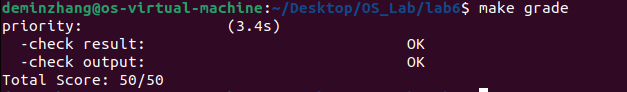

<h1 align="center"> lab6：进程调度 </h1>

 <div align="center">

张德民 刘越帅 欧广元

</div>

## 实验目的

理解操作系统的调度管理机制

熟悉 ucore 的系统调度器框架，实现缺省的Round-Robin 调度算法

基于调度器框架实现一个(Stride Scheduling)调度算法来替换缺省的调度算法

## 实验内容

在前两章中，我们已经分别实现了内核进程和用户进程，并且让他们正确运行了起来。同时我们也实现了一个简单的调度算法，FIFO调度算法，来对我们的进程进行调度,可通过阅读实验五下的 kern/schedule/sched.c 的 schedule 函数的实现来了解其FIFO调度策略。但是，单单如此就够了吗？显然，我们可以让ucore支持更加丰富的调度算法，从而满足各方面的调度需求。与实验五相比，实验六专门需要针对处理器调度框架和各种算法进行设计与实现，为此对ucore的调度部分进行了适当的修改，使得kern/schedule/sched.c 只实现调度器框架，而不再涉及具体的调度算法实现。而调度算法在单独的文件（default_sched.[ch]）中实现。

在本次实验中，我们在init/init.c中加入了对sched_init函数的调用。这个函数主要完成调度器和特定调度算法的绑定。初始化后，我们在调度函数中就可以使用相应的接口，切换你实现的不同的调度算法了。这也是在C语言环境下对于面向对象编程模式的一种模仿。这样之后，我们只需要关注于实现调度类的接口即可，操作系统也同样不关心调度类具体的实现，方便了新调度算法的开发。本次实验，主要是熟悉ucore的系统调度器框架，以及基于此框架实现Round-Robin（RR） 调度算法。然后进一步完成Stride调度算法。

## 实验过程

### 练习0 填写已有实验

本实验依赖实验2/3/4/5。请把你做的实验2/3/4/5的代码填入本实验中代码中有“LAB2”/“LAB3”/“LAB4”“LAB5”的注释相应部分。并确保编译通过。 注意：为了能够正确执行lab6的测试应用程序，可能需对已完成的实验2/3/4/5的代码进行进一步改进。 由于我们在进程控制块中记录了一些和调度有关的信息，例如Stride、优先级、时间片等等，因此我们需要对进程控制块的初始化进行更新，将调度有关的信息初始化。同时，由于时间片轮转的调度算法依赖于时钟中断，你可能也要对时钟中断的处理进行一定的更新。

### 练习1: 理解调度器框架的实现（不需要编码）

请仔细阅读和分析调度器框架的相关代码，特别是以下两个关键部分的实现：

在完成练习0后，请仔细阅读并分析以下调度器框架的实现：

调度类结构体 sched_class 的分析：请详细解释 sched_class 结构体中每个函数指针的作用和调用时机，分析为什么需要将这些函数定义为函数指针，而不是直接实现函数。

**答案：**

`sched_class` 结构体定义在 `kern/schedule/sched.h` 中，它是一个调度类的抽象接口，包含以下函数指针：

- `name`: 调度类的名称，用于标识调度算法。
- `init`: 初始化运行队列 `run_queue`，设置队列的初始状态。
- `enqueue`: 将进程加入运行队列，必须在持有 `rq_lock` 的情况下调用。
- `dequeue`: 从运行队列中移除进程，必须在持有 `rq_lock` 的情况下调用。
- `pick_next`: 从运行队列中选择下一个要运行的进程。
- `proc_tick`: 处理时间片事件，当时间片用完时决定是否需要重新调度。

这些函数定义为函数指针而不是直接实现函数的原因是：调度器框架需要支持多种调度算法（如 Round-Robin、Stride Scheduling），通过函数指针可以实现多态性。不同的调度算法可以实现各自的 `sched_class` 结构体实例（如 `default_sched_class` 和 `stride_sched_class`），框架代码通过调用这些函数指针来执行具体的调度逻辑，而无需关心算法细节。这使得调度器框架与具体算法解耦，便于扩展和维护。

    struct sched_class//调度类
    {
        // the name of sched_class
        const char *name;//调度类名称
        // Init the run queue
        void (*init)(struct run_queue *rq);//初始化运行队列
        // put the proc into runqueue, and this function must be called with rq_lock
        void (*enqueue)(struct run_queue *rq, struct proc_struct *proc);//将进程加入运行队列，调用时必须持有rq_lock
        // get the proc out runqueue, and this function must be called with rq_lock
        void (*dequeue)(struct run_queue *rq, struct proc_struct *proc);//将进程从运行队列中移除，调用时必须持有rq_lock
        // choose the next runnable task
        struct proc_struct *(*pick_next)(struct run_queue *rq);//选择下一个可运行的任务
        // dealer of the time-tick
        void (*proc_tick)(struct run_queue *rq, struct proc_struct *proc);//时间片滴答处理函数
        //对于未来的SMP支持
        //负载均衡
        //void (*load_balance)(struct rq* rq);
        //从此运行队列中获取一些进程，用于负载均衡，
        //返回值是获取的进程数量
        //int (*get_proc)(struct rq* rq, struct proc* procs_moved[]);
    };

运行队列结构体 run_queue 的分析：比较lab5和lab6中 run_queue 结构体的差异，解释为什么lab6的 run_queue 需要支持两种数据结构（链表和斜堆）。

**答案：**

`run_queue` 结构体在 lab6 中新增，用于抽象运行队列，包含：

- `run_list`: 链表，用于存储就绪进程。
- `proc_num`: 队列中的进程数量。
- `max_time_slice`: 最大时间片长度。
- `lab6_run_pool`: 斜堆入口，用于支持优先级队列。

lab5 中没有 `run_queue` 结构体，因为 lab5 实现的是简单的 FIFO 调度，直接在 `schedule()` 函数中管理进程链表，没有抽象的队列结构。lab6 引入 `run_queue` 来支持调度框架，并需要支持两种数据结构的原因是：不同的调度算法对数据结构的需求不同。Round-Robin (RR) 调度算法使用链表（FIFO 队列），适合轮转调度；Stride Scheduling 使用斜堆（优先级队列），因为它需要根据 stride 值快速选择优先级最高的进程。支持两种数据结构使得框架能够灵活适应不同算法的需求，而无需为每种算法重新设计队列结构。

        struct run_queue//运行队列
        {
            list_entry_t run_list;//运行队列链表头
            unsigned int proc_num;//运行队列中的进程数量
            int max_time_slice;//最大时间片
            // For LAB6 ONLY
            skew_heap_entry_t *lab6_run_pool;//LAB6专用的运行池
        };


调度器框架函数分析：分析 sched_init()、wakeup_proc() 和 schedule() 函数在lab6中的实现变化，理解这些函数如何与具体的调度算法解耦。


**答案：**

在 lab6 中，`sched_init()`、`wakeup_proc()` 和 `schedule()` 函数的实现与具体调度算法解耦，通过函数指针调用具体的算法实现。与 lab5 相比，lab5 实现的是简单的 FIFO 调度，调度逻辑直接嵌入在 `schedule()` 函数中，没有抽象的调度框架；而 lab6 引入了调度框架，将算法逻辑分离到独立的 `sched_class` 实现中。

- `sched_init()`: 在 lab6 中，初始化调度器，将 `sched_class` 指向默认调度类（如 `default_sched_class`），初始化运行队列 `rq`，并调用 `sched_class->init(rq)` 来执行算法特定的初始化。

        void sched_init(void)
        {
            list_init(&timer_list);//初始化定时器链表

            sched_class = &default_sched_class;
            //使用默认调度类

            rq = &__rq;//使用静态分配的运行队列
            rq->max_time_slice = MAX_TIME_SLICE;//设置最大时间片
            sched_class->init(rq);//初始化调度类

            cprintf("sched class: %s\n", sched_class->name);
        }

lab5 中没有 `sched_init()`，因为 lab5 实现的是简单的 FIFO 调度，没有抽象的调度框架。调度逻辑直接嵌入在 `schedule()` 函数中，通过遍历全局 `proc_list` 链表选择进程，无需初始化调度类或运行队列。lab6 引入调度框架后，需要 `sched_init()` 来绑定调度类、初始化运行队列，并调用算法特定的初始化函数。

- `wakeup_proc()`: 在 lab6 中，将进程状态设为 `PROC_RUNNABLE`，并通过 `sched_class_enqueue()` 调用 `sched_class->enqueue()` 将进程加入队列（如果不是当前进程）。

        void wakeup_proc(struct proc_struct *proc)
        {
            assert(proc->state != PROC_ZOMBIE);
            bool intr_flag;
            local_intr_save(intr_flag);
            {
                if (proc->state != PROC_RUNNABLE)
                //如果进程不是可运行状态
                {
                    proc->state = PROC_RUNNABLE;//设置进程状态为可运行
                    proc->wait_state = 0;//清除等待状态
                    if (proc != current)
                    {
                        sched_class_enqueue(proc);//将进程加入运行队列
                    }
                }
                else
                {
                    warn("wakeup runnable process.\n");
                }
            }
            local_intr_restore(intr_flag);
        }


lab5 中，`wakeup_proc()` 只改变进程状态为 `PROC_RUNNABLE`，不操作队列，因为调度直接遍历全局 `proc_list` 链表选择进程。

        void wakeup_proc(struct proc_struct *proc)
        {
            assert(proc->state != PROC_ZOMBIE);
            bool intr_flag;
            local_intr_save(intr_flag);
            {
                if (proc->state != PROC_RUNNABLE)
                {
                    proc->state = PROC_RUNNABLE;
                    proc->wait_state = 0;
                }
                else
                {
                    warn("wakeup runnable process.\n");
                }
            }
            local_intr_restore(intr_flag);
        }

- `schedule()`: 在 lab6 中，清除当前进程的 `need_resched` 标志，将当前进程重新加入队列（如果可运行），通过 `sched_class_pick_next()` 选择下一个进程，调用 `sched_class_dequeue()` 移除它，然后切换到该进程。

        void schedule(void)
        {
            bool intr_flag;
            struct proc_struct *next;//下一个要运行的进程
            local_intr_save(intr_flag);
            {
                current->need_resched = 0;//重置当前进程的需要调度标志
                if (current->state == PROC_RUNNABLE)//如果当前进程是可运行状态
                {
                    sched_class_enqueue(current);//将当前进程重新加入运行队列
                }
                if ((next = sched_class_pick_next()) != NULL)//选择下一个要运行的进程
                {
                    sched_class_dequeue(next);//将选中的进程从运行队列中移除
                }
                if (next == NULL)//如果没有选中任何进程
                {
                    next = idleproc;//则选择空闲进程
                }
                next->runs++;//增加选中进程的运行次数
                if (next != current)//如果选中的进程不是当前进程
                {
                    proc_run(next);//切换到选中的进程
                }
            }
            local_intr_restore(intr_flag);
        }


lab5 中，`schedule()` 直接遍历进程链表，选择下一个可运行进程，实现 FIFO 调度，没有使用函数指针。

        void schedule(void)
        {
            bool intr_flag;
            list_entry_t *le, *last;
            struct proc_struct *next = NULL;
            local_intr_save(intr_flag);
            {
                current->need_resched = 0;//重置当前进程的需要调度标志
                last = (current == idleproc) ? &proc_list : &(current->list_link);//获取当前进程在进程链表中的位置
                le = last;//从当前进程的位置开始遍历进程链表
                do
                {
                    if ((le = list_next(le)) != &proc_list)//获取下一个进程链表元素
                    {
                        next = le2proc(le, list_link);
                        if (next->state == PROC_RUNNABLE)//如果找到一个可运行状态的进程
                        {
                            break;//跳出循环
                        }
                    }
                } while (le != last);//继续遍历直到回到起始位置
                if (next == NULL || next->state != PROC_RUNNABLE)//如果没有找到可运行的进程
                {
                    next = idleproc;//则选择空闲进程
                }
                next->runs++;//增加选中进程的运行次数
                if (next != current)//如果选中的进程不是当前进程
                {
                    proc_run(next);//切换到选中的进程
                }
            }
            local_intr_restore(intr_flag);
        }


这些函数在 lab6 中通过函数指针调用具体的调度算法实现，使得框架代码不变，而算法逻辑在各自的实现文件中，与 lab5 的紧耦合设计相比，大大提高了可扩展性和模块化。

对于调度器框架的使用流程，请在实验报告中完成以下分析：

调度类的初始化流程：描述从内核启动到调度器初始化完成的完整流程，分析 default_sched_class 如何与调度器框架关联。

**答案：**

从内核启动到调度器初始化完成的完整流程如下：

1. 在 `kern/init/init.c` 中，`kern_init()` 函数调用 `sched_init()`。

        int kern_init(void)
        {
            ......
            sched_init();//调用 `sched_init()`。
            proc_init(); // init process table

            clock_init();  // init clock interrupt
            intr_enable(); // enable irq interrupt

            cpu_idle(); // run idle process
        }


2. `sched_init()` 执行：
   - 初始化定时器列表 `timer_list`。
   - 将全局 `sched_class` 指针指向 `default_sched_class`（或通过配置指向其他调度类）。
   - 初始化全局运行队列 `rq`，设置 `max_time_slice`。
   - 调用 `sched_class->init(rq)` 执行算法特定的初始化（如 RR 的链表初始化或 Stride 的斜堆初始化）。

            void sched_init(void)
            {
            list_init(&timer_list);//初始化定时器链表

            sched_class = &default_sched_class;
            //使用默认调度类

            rq = &__rq;//使用静态分配的运行队列
            rq->max_time_slice = MAX_TIME_SLICE;//设置最大时间片
            sched_class->init(rq);//初始化调度类

            cprintf("sched class: %s\n", sched_class->name);
            }

3. 最后输出调度类名称，完成初始化。


`default_sched_class` 通过在 `kern/schedule/default_sched.c` 中定义的结构体实例与框架关联，它实现了 RR 算法的函数指针。

    struct sched_class default_sched_class = {
        .name = "RR_scheduler",//轮转调度器
        .init = RR_init,//初始化运行队列
        .enqueue = RR_enqueue,//将进程加入运行队列
        .dequeue = RR_dequeue,//将进程从运行队列中移除
        .pick_next = RR_pick_next,//选择下一个可运行的任务
        .proc_tick = RR_proc_tick,//时间片滴答处理函数
    };//调度类结构体实例


进程调度流程：绘制一个完整的进程调度流程图，包括：时钟中断触发、proc_tick 被调用、schedule() 函数执行、调度类各个函数的调用顺序。并解释 need_resched 标志位在调度过程中的作用

**答案：**

进程调度流程如下（绘制流程图）：

```
时钟中断触发
    ↓
调用 trap_dispatch() → 调用 clock_intr_handler()
    ↓
clock_intr_handler() 调用 sched_class_proc_tick(current)
    ↓
sched_class_proc_tick()中，如果被中断的进程是 idleproc，则直接令current->need_resched = 1，否则调用 sched_class->proc_tick(rq, current)(这里会调用对应架构的函数来处理时间片)
    ↓
对时间片进行处理，如果时间片用完，设置 current->need_resched = 1
    ↓
中断返回，trap() 函数检查（如果是从用户态返回）函数
    ↓
如果 need_resched 为真，调用 schedule()
    ↓
schedule() 执行：
    - current->need_resched = 0
    - 如果 current 可运行，sched_class_enqueue(current)
    - next = sched_class_pick_next()，选一个新的进程去执行
    - sched_class_dequeue(next)
    - proc_run(next)
```

`need_resched` 标志位在调度过程中的作用：它指示当前进程是否需要被重新调度。当时间片用完或有更高优先级进程时，`proc_tick` 设置该标志。在 ucore 中，trap() 函数在从用户态返回时检查该标志并调用 `schedule()`；对于内核进程如 idleproc，也在 `cpu_idle()` 循环中检查。

调度算法的切换机制：分析如果要添加一个新的调度算法（如stride），需要修改哪些代码？并解释为什么当前的设计使得切换调度算法变得容易。

**答案：**

要添加一个新的调度算法（如 Stride），需要修改的代码：

1. 在 `kern/schedule/` 下创建新文件，如 `stride_sched.c`，实现 `stride_sched_class` 结构体，包含 Stride 算法的函数实现。
2. 在 `kern/schedule/sched.h` 中声明新的调度类。
3. 在 `sched_init()` 中，将 `sched_class` 指向新的调度类（如 `#ifdef USE_STRIDE_SCHED`）。

当前设计使得切换调度算法变得容易，因为：
- 框架通过函数指针抽象算法接口，切换只需改变 `sched_class` 指针。
- 运行队列支持多种数据结构，无需修改框架代码。
- 算法实现独立于框架，便于模块化开发和测试。


### 练习2: 实现 Round Robin 调度算法（需要编码）

完成练习0后，建议大家比较一下（可用kdiff3等文件比较软件）个人完成的lab5和练习0完成后的刚修改的lab6之间的区别，分析了解lab6采用RR调度算法后的执行过程。理解调度器框架的工作原理后，请在此框架下实现时间片轮转（Round Robin）调度算法。

注意有“LAB6”的注释，你需要完成 kern/schedule/default_sched.c 文件中的 RR_init、RR_enqueue、RR_dequeue、RR_pick_next 和 RR_proc_tick 函数的实现，使系统能够正确地进行进程调度。代码中所有需要完成的地方都有“LAB6”和“YOUR CODE”的注释，请在提交时特别注意保持注释，将“YOUR CODE”替换为自己的学号，并且将所有标有对应注释的部分填上正确的代码。

提示，请在实现时注意以下细节：

链表操作：list_add_before、list_add_after等。
宏的使用：le2proc(le, member) 宏等。
边界条件处理：空队列的处理、进程时间片耗尽后的处理、空闲进程的处理等。
请在实验报告中完成：

比较一个在lab5和lab6都有, 但是实现不同的函数, 说说为什么要做这个改动, 不做这个改动会出什么问题
提示: 如kern/schedule/sched.c里的函数。你也可以找个其他地方做了改动的函数。

**答案：**

以 `kern/schedule/sched.c` 中的 `schedule` 函数为例。在 lab5 中，`schedule` 函数直接实现 FIFO 调度，通过遍历全局 `proc_list` 链表选择下一个可运行进程，实现简单但硬编码的调度逻辑。在 lab6 中，`schedule` 函数被重构为调度框架，通过 `sched_class` 函数指针调用具体的调度算法（如 RR 或 Stride），将当前进程重新入队，选择下一个进程并切换。

这个改动是为了支持多种调度算法，实现框架与算法的解耦，提高代码的可扩展性和模块化。不做这个改动会导致调度逻辑紧耦合，无法轻松添加新算法（如 Stride），限制了操作系统的调度灵活性，可能导致代码维护困难和功能单一。

另一个例子是 `wakeup_proc` 函数：在 lab5 中，它只改变进程状态，不操作队列；在 lab6 中，它调用 `sched_class_enqueue` 将进程加入运行队列。这个改动是为了适应抽象的运行队列结构，确保唤醒的进程被正确管理。不做改动会使唤醒进程无法进入调度队列，导致调度异常。

描述你实现每个函数的具体思路和方法，解释为什么选择特定的链表操作方法。对每个实现函数的关键代码进行解释说明，并解释如何处理边界情况。

**答案：**

- **RR_init**：思路是初始化运行队列的链表和计数器。方法：调用 `list_init` 初始化 `run_list` 为空链表，设置 `proc_num` 为 0。选择 `list_init` 因为它是标准链表初始化函数，确保链表头正确设置。

        static void
        RR_init(struct run_queue *rq)
        {
            // LAB6: 2312141
            list_init(&rq->run_list);//初始化运行队列链表头
            rq->proc_num = 0;//将运行队列中的进程数量设置为0
        }

- **RR_enqueue**：思路是将进程添加到队列尾部，实现轮转调度。方法：如果进程时间片 <=0，重置为 `rq->max_time_slice`；使用 `list_add_before(&rq->run_list, &proc->run_link)` 将进程添加到链表尾部（因为 `run_list` 是头节点，`list_add_before` 添加到尾部）；增加 `proc_num`。选择 `list_add_before` 而非 `list_add_after` 是因为要添加到尾部，实现 FIFO 入队。

        static void
        RR_enqueue(struct run_queue *rq, struct proc_struct *proc)
        {
            // LAB6: 2312141
            if(proc->time_slice<=0){
                proc->time_slice = rq->max_time_slice;//将进程的时间片设置为运行队列的最大时间片
            }
            list_add_before(&rq->run_list, &proc->run_link);//将进程的run_link节点插入运行队列的尾部
            rq->proc_num++;//将运行队列中的进程数量加1
        }


- **RR_dequeue**：思路是从队列中移除指定进程。方法：调用 `list_del_init` 移除并重新初始化进程的 `run_link`，减少 `proc_num`。选择 `list_del_init` 以确保移除后链表节点干净，避免重复使用问题。

        static void
        RR_dequeue(struct run_queue *rq, struct proc_struct *proc)
        {
            // LAB6: 2312141
            list_del_init(&proc->run_link);//将进程的run_link节点从运行队列中移除并初始化
            rq->proc_num--;//将运行队列中的进程数量减1
        }


- **RR_pick_next**：思路是从队列头部选择下一个进程。方法：检查队列是否为空；如果不为空，取 `run_list.next` 对应的进程。使用 `le2proc` 宏转换链表节点为进程指针。空队列返回 NULL，避免访问无效节点。

        static struct proc_struct *
        RR_pick_next(struct run_queue *rq)
        {
            // LAB6: 2312141
            if (list_empty(&rq->run_list)) {
                return NULL;//如果运行队列为空，返回NULL
            }
            list_entry_t *next_entry = rq->run_list.next;//获取运行队列的第一个节点
            struct proc_struct *next_proc = le2proc(next_entry, run_link);//通过宏le2proc计算进程指针
            return next_proc;//返回下一个要运行的进程
        }

- **RR_proc_tick**：思路是处理时间片递减和调度触发。方法：减少进程时间片；如果 <=0，设置 `need_resched` 标志。时间片为正时正常递减；为 0 时触发调度；负值（理论上不应发生）也会触发。

        static void
        RR_proc_tick(struct run_queue *rq, struct proc_struct *proc)
        {
            // LAB6: 2312141
            proc->time_slice--;//将进程的时间片减1
            if (proc->time_slice <= 0) {
                proc->need_resched = 1;//如果时间片用尽，设置need_resched标志
            }
        }

展示 make grade 的输出结果，并描述在 QEMU 中观察到的调度现象。

**答案：**

`make grade` 的输出结果：

<p align="center">
  
</p>

在 QEMU 中观察到的调度现象：

    deminzhang@os-virtual-machine:~/Desktop/OS_Lab/lab6$ make qemu

    OpenSBI v0.4 (Jul  2 2019 11:53:53)
    ____                    _____ ____ _____
    / __ \                  / ____|  _ \_   _|
    | |  | |_ __   ___ _ __ | (___ | |_) || |
    | |  | | '_ \ / _ \ '_ \ \___ \|  _ < | |
    | |__| | |_) |  __/ | | |____) | |_) || |_
    \____/| .__/ \___|_| |_|_____/|____/_____|
            | |
            |_|

    Platform Name          : QEMU Virt Machine
    Platform HART Features : RV64ACDFIMSU
    Platform Max HARTs     : 8
    Current Hart           : 0
    Firmware Base          : 0x80000000
    Firmware Size          : 112 KB
    Runtime SBI Version    : 0.1

    PMP0: 0x0000000080000000-0x000000008001ffff (A)
    PMP1: 0x0000000000000000-0xffffffffffffffff (A,R,W,X)
    (THU.CST) os is loading ...

    Special kernel symbols:
    entry  0xc020004a (virtual)
    etext  0xc02058f4 (virtual)
    edata  0xc02b12d8 (virtual)
    end    0xc02b57c0 (virtual)
    Kernel executable memory footprint: 726KB
    DTB Init
    HartID: 0
    DTB Address: 0x82200000
    Physical Memory from DTB:
    Base: 0x0000000080000000
    Size: 0x0000000008000000 (128 MB)
    End:  0x0000000087ffffff
    DTB init completed
    memory management: default_pmm_manager
    physcial memory map:
    memory: 0x08000000, [0x80000000, 0x87ffffff].
    vapaofset is 18446744070488326144
    check_alloc_page() succeeded!
    check_pgdir() succeeded!
    check_boot_pgdir() succeeded!
    use SLOB allocator
    kmalloc_init() succeeded!
    check_vma_struct() succeeded!
    check_vmm() succeeded.
    sched class: RR_scheduler
    ++ setup timer interrupts
    kernel_execve: pid = 2, name = "priority".
    set priority to 6
    main: fork ok,now need to wait pids.
    set priority to 1
    set priority to 2
    set priority to 3
    set priority to 4
    set priority to 5
    child pid 3, acc 444000, time 2010
    child pid 4, acc 460000, time 2010
    child pid 5, acc 456000, time 2010
    child pid 6, acc 460000, time 2020
    child pid 7, acc 456000, time 2020
    main: pid 0, acc 444000, time 2030
    main: pid 4, acc 460000, time 2030
    main: pid 5, acc 456000, time 2030
    main: pid 6, acc 460000, time 2030
    main: pid 7, acc 456000, time 2030
    main: wait pids over
    sched result: 1 1 1 1 1
    all user-mode processes have quit.
    init check memory pass.
    kernel panic at kern/process/proc.c:545:
        initproc exit.

从输出中可以看到，调度器显示为 "sched class: RR_scheduler"，表明使用了 Round Robin 调度算法。运行的 "priority" 程序创建了多个子进程，并设置了不同的优先级（1-6），但最终的调度结果 "sched result: 1 1 1 1 1" 显示所有进程的调度权重相同，这体现了 RR 算法的公平性：每个进程获得相等的时间片，忽略优先级设置。进程运行时间（time 字段）大致相等（2010-2030），表明进程按时间片轮转执行，每个时间片结束后切换到下一个进程。主进程和子进程交替运行，体现了轮转调度的特点。


分析 Round Robin 调度算法的优缺点，讨论如何调整时间片大小来优化系统性能，并解释为什么需要在 RR_proc_tick 中设置 need_resched 标志。

**答案：**

Round Robin (RR) 调度算法的优点：公平性高，每个进程获得平等的 CPU 时间，避免饥饿；简单实现，易于理解。缺点：上下文切换开销大，尤其当时间片很小时；不考虑进程优先级，可能不适合实时系统。

调整时间片大小：时间片太大（如几秒）会导致响应延迟增加，不适合交互式应用；太小（如几毫秒）会增加切换开销，降低吞吐量。优化时，应根据系统负载和应用类型平衡，如交互式系统设为 10-100ms。

在 `RR_proc_tick` 中设置 `need_resched` 标志的原因：当进程时间片用尽时，需要触发调度器切换到下一个进程。该标志通知系统在适当时候调用 `schedule()` 函数，实现时间片轮转。

拓展思考：如果要实现优先级 RR 调度，你的代码需要如何修改？当前的实现是否支持多核调度？如果不支持，需要如何改进？

**答案：**

实现优先级 RR 调度：修改 `RR_enqueue` 使用优先级排序（如基于 `proc->priority` 插入合适位置，而非尾部）；可能需要改为优先级队列而非简单链表。`RR_pick_next` 选择最高优先级进程。

当前实现不支持多核调度：每个 CPU 共享全局 `rq`，无锁竞争问题，但无负载均衡。改进：为每个 CPU 维护独立 `rq`，添加负载均衡函数（如 `load_balance`），在调度时迁移进程；使用 per-CPU 锁减少竞争。


### 扩展练习 Challenge 1: 实现 Stride Scheduling 调度算法（需要编码）

首先需要换掉RR调度器的实现，在sched_init中切换调度方法。然后根据此文件和后续文档对Stride度器的相关描述，完成Stride调度算法的实现。 注意有“LAB6”的注释，主要是修改default_sched_stride_c中的内容。代码中所有需要完成的地方都有“LAB6”和“YOUR CODE”的注释，请在提交时特别注意保持注释，将“YOUR CODE”替换为自己的学号，并且将所有标有对应注释的部分填上正确的代码。


简要说明如何设计实现”多级反馈队列调度算法“，给出概要设计，鼓励给出详细设计

**答案：**

多级反馈队列调度算法（Multi-Level Feedback Queue, MLFQ）的概要设计：

- **队列结构**：设置多个优先级队列（通常3-5个），优先级从高到低递减。每个队列有不同的时间片长度，高优先级队列时间片短，低优先级队列时间片长。
- **进程调度**：新进程进入最高优先级队列。调度时总是选择最高优先级非空队列的队头进程运行。
- **队列间移动**：进程在时间片内未完成，降到下一级队列；若在低级队列完成，保持当前级别。
- **防止饥饿**：定期提升低优先级进程到高优先级队列。

详细设计：
- 使用数组或链表实现队列，每个队列有最大时间片（例如：队列0: 8ms, 队列1: 16ms, 队列2: 32ms）。
- 进程控制块添加当前队列级别字段。
- 调度函数：遍历队列，从高到低选择进程；运行后检查是否用完时间片，若是则降级并重新入队。
- 定时器：每隔一定时间（如1秒）提升所有进程一级，以防饥饿。

简要证明/说明（不必特别严谨，但应当能够”说服你自己“），为什么Stride算法中，经过足够多的时间片之后，每个进程分配到的时间片数目和优先级成正比。

**答案：**

Stride算法中，每个进程的stride初始为0，每次被选中运行后，stride += BIG_STRIDE / priority。优先级高的进程（priority大），stride增加慢（增量小），因此被选中的频率高，分配的时间片多。反之，优先级低的进程stride增加快，被选中少。

经过足够多的调度周期，所有进程的stride值会趋于相等。此时根据公式，很容易可以看出来，被选中的次数为n*priority,与优先级成正比。

请在实验报告中简要说明你的设计实现过程。

**答案：**

设计实现过程：

1. **切换调度器**：在 `kern/schedule/sched.c` 的 `sched_init()` 中，将 `sched_class = &stride_sched_class;` 以使用 Stride 调度器。

2. **实现 Stride 算法**：
   1.定义 BIG_STRIDE 常量。

        //定义大步长常量
        #define BIG_STRIDE (1U << 31)
   2.使用斜堆（skew_heap）作为优先级队列，比较函数基于 stride 值。

   3.`stride_init`：初始化 run_list 和 lab6_run_pool 为 NULL，proc_num=0。

            static void
                stride_init(struct run_queue *rq)
                {
                    /* LAB6 CHALLENGE 1: 2312141
                    * (1) init the ready process list: rq->run_list
                    * (2) init the run pool: rq->lab6_run_pool
                    * (3) set number of process: rq->proc_num to 0
                    */
                    list_init(&rq->run_list);
                    rq->lab6_run_pool = NULL;
                    rq->proc_num = 0;
                }

   4.`stride_enqueue`：插入进程到斜堆，设置 time_slice 和 rq 指针，更新 proc_num。

                static void
                stride_enqueue(struct run_queue *rq, struct proc_struct *proc)
                {
                    /* LAB6 CHALLENGE 1: 2312141
                    * (1) insert the proc into rq correctly
                    * NOTICE: you can use skew_heap or list. Important functions
                    *         skew_heap_insert: insert a entry into skew_heap
                    *         list_add_before: insert  a entry into the last of list
                    * 1.把proc插入到rq中正确的位置,注意可以使用skew_heap或者list
                    * 2.重要的函数有skew_heap_insert:把一个节点插入到skew_heap中
                    *   list_add_before:把一个节点插入到list
                    * (2) recalculate proc->time_slice
                    * (3) set proc->rq pointer to rq
                    * (4) increase rq->proc_num
                    */
                    //把proc插入到运行队列中
                    //设置proc的时间片为最大时间片
                    //设置proc的运行队列指针为rq
                    //增加运行队列中的进程数量
                    
                    rq->lab6_run_pool = skew_heap_insert(rq->lab6_run_pool, &proc->lab6_run_pool, proc_stride_comp_f);
                    if(proc->time_slice==0){
                        proc->time_slice = rq->max_time_slice;
                    }
                    proc->rq = rq;
                    rq->proc_num++;
                }

   5.`stride_dequeue`：从斜堆移除进程，更新 proc_num。

            static void
        stride_dequeue(struct run_queue *rq, struct proc_struct *proc)
        {
            /* LAB6 CHALLENGE 1: 2312141
            * (1) remove the proc from rq correctly
            * NOTICE: you can use skew_heap or list. Important functions
            *         skew_heap_remove: remove a entry from skew_heap
            *         list_del_init: remove a entry from the  list
            */
            //从运行队列中移除proc
            //更新运行队列中的进程数量
            rq->lab6_run_pool = skew_heap_remove(rq->lab6_run_pool, &proc->lab6_run_pool, proc_stride_comp_f);
            rq->proc_num--;
        }

   6.`stride_pick_next`：选择 stride 最小的进程，更新其 stride 值（stride += BIG_STRIDE / priority），返回进程。

            static struct proc_struct *
        stride_pick_next(struct run_queue *rq)
        {
            /* LAB6 CHALLENGE 1: 2312141
            * (1) get a  proc_struct pointer p  with the minimum value of stride
                    (1.1) If using skew_heap, we can use le2proc get the p from rq->lab6_run_pol
                    (1.2) If using list, we have to search list to find the p with minimum stride value
            * (2) update p;s stride value: p->lab6_stride
            * (3) return p
            */
            //如果运行队列为空，返回NULL
            //获取stride值最小的进程
            //更新该进程的stride值
            //返回该进程指针
            if (rq->lab6_run_pool == NULL){
                return NULL;
            }
            struct proc_struct *p = le2proc(rq->lab6_run_pool, lab6_run_pool);
            p->lab6_stride += BIG_STRIDE / p->lab6_priority;
            return p;
        }

   7.`stride_proc_tick`：递减 time_slice，若为0设置 need_resched。

        static void
        stride_proc_tick(struct run_queue *rq, struct proc_struct *proc)
        {
            /* LAB6 CHALLENGE 1: 2312141 */
            //如果进程的时间片大于0，减少时间片
            //如果时间片耗尽，设置需要调度标志
            if(proc->time_slice > 0){ 
                proc->time_slice --;
            }
            if (proc->time_slice == 0){
                proc->need_resched = 1;
            }
        }


## 列出你认为本实验中重要的知识点，以及与对应的OS原理中的知识点，并简要说明你对二者的含义，关系，差异等方面的理解（也可能出现实验中的知识点没有对应的原理知识点）


