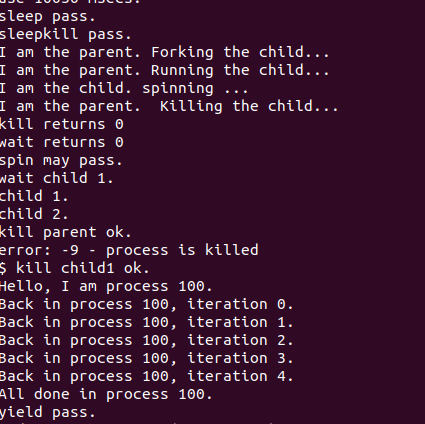

<h1 align="center"> Lab 8文件系统 </h1>

 <div align="center">

张德民 刘越帅 欧广元

</div>

## 实验目的

通过完成本次实验，希望能够达到以下目标

了解文件系统抽象层-VFS的设计与实现

了解基于索引节点组织方式的Simple FS文件系统与操作的设计与实现

了解“一切皆为文件”思想的设备文件设计

了解简单系统终端的实现

## 实验内容

实验七完成了在内核中的同步互斥实验。本次实验涉及的是文件系统，通过分析了解ucore文件系统的总体架构设计，完善读写文件操作(即实现sfs_io_nolock()函数)，重新实现基于文件系统的执行程序机制（即实现load_icode()函数），从而实现执行存储在磁盘上的文件以及文件读写等功能。

与实验七相比，实验八增加了文件系统，并因此实现了通过文件系统来加载可执行文件到内存中运行的功能，导致对进程管理相关的实现比较大的调整。

## 实验过程

### 练习0 填写已有实验

本实验依赖实验2/3/4/5/6/7。请把你做的实验2/3/4/5/6/7的代码填入本实验中代码中有“LAB2”/“LAB3”/“LAB4”/“LAB5”/“LAB6” /“LAB7”的注释相应部分。并确保编译通过。注意：为了能够正确执行lab8的测试应用程序，可能需对已完成的实验2/3/4/5/6/7的代码进行进一步改进。

### 练习1: 完成读文件操作的实现（需要编码）

首先了解打开文件的处理流程，然后参考本实验后续的文件读写操作的过程分析，填写在 kern/fs/sfs/sfs_inode.c中 的sfs_io_nolock()函数，实现读文件中数据的代码。

#### 1. 打开文件的处理流程

当应用程序调用 `open()` 系统调用打开一个文件时,整个处理流程如下:

首先是通用文件系统层：

应用程序调用open()后，继续调用sys_open()，然后sys_open会调用syscall，进入了内核态。在内核态里执行sys_open函数，这里继续调用了sysfile_open函数。

    int
    open(const char *path, uint32_t open_flags) {
        return sys_open(path, open_flags);
    }

    int
    sys_open(const char *path, uint64_t open_flags) {
        return syscall(SYS_open, path, open_flags);
    }

    static int
    sys_open(uint64_t arg[])
    {
        const char *path = (const char *)arg[0];
        uint32_t open_flags = (uint32_t)arg[1];
        return sysfile_open(path, open_flags);
    }


sysfile_open函数首先把位于用户空间的字符串__path拷贝到内核空间中的字符串path中，然后调用了file_open， file_open中调用了vfs_open， 使用了VFS的接口,这样就进入了下一层的文件系统抽象层的处理流程。file_open函数会在VFS层部分详细解释。

    int
    sysfile_open(const char *__path, uint32_t open_flags) {
        int ret;
        char *path;
        if ((ret = copy_path(&path, __path)) != 0) {
            return ret;
        }
        ret = file_open(path, open_flags);
        kfree(path);
        return ret;
    }


接下来进入到VFS层处理：

file_open函数首先会检查文件的权限，这里不多解释。

然后给这个即将打开的文件分配一个file数据结构的变量，这个变量是当前进程的打开文件数组current->fs_struct->filemap[]中的一个空闲元素（即还没用于一个打开的文件），而这个元素的索引值就是最终要返回到用户进程并赋值给变量fd。到了这一步还仅仅是给当前用户进程分配了一个file数据结构的变量，还没有找到对应的文件索引节点。

    int ret;
        struct file *file;
        if ((ret = fd_array_alloc(NO_FD, &file)) != 0) { //在当前进程分配file descriptor
            return ret; 
        }

然后进一步调用vfs_open函数来找到path指出的文件所对应的VFS索引节点node。vfs_open函数需要完成两件事情：通过vfs_lookup找到path对应文件的inode；调用vop_open函数打开文件。

如下的vfs_lookup函数，它首先调用get_device函数，这个函数的作用是把一个“可能带设备前缀/绝对或相对”的路径拆分，得到真正要在该目录下解析的子路径subpath，即真正需要逐级查找的那一段。

通过调用vop_lookup函数来查找到根目录“/”下对应文件sfs_filetest1的索引节点，如果找到就返回此索引节点。

    int
    vfs_lookup(char *path, struct inode **node_store) {
        int ret;
        struct inode *node;
        if ((ret = get_device(path, &path, &node)) != 0) {
            return ret;
        }
        if (*path != '\0') {
            ret = vop_lookup(node, path, node_store);
            vop_ref_dec(node);
            return ret;
        }
        *node_store = node;
        return 0;
    }


vop开头的函数，它们都通过一些宏和函数的转发，最后变成对inode结构体里的inode_ops结构体的“成员函数”（实际上是函数指针）的调用。对于SFS文件系统的inode来说，会变成对sfs文件系统的具体操作。所以接下来就是SFS层的处理。

接下来进入到SFS层处理：

在sfs_inode.c中的sfs_node_dirops变量定义了“.vop_lookup = sfs_lookup”，所以我们重点分析sfs_lookup的实现。

    static int
    sfs_lookup(struct inode *node, char *path, struct inode **node_store) {
        struct sfs_fs *sfs = fsop_info(vop_fs(node), sfs);
        assert(*path != '\0' && *path != '/');
        vop_ref_inc(node);
        struct sfs_inode *sin = vop_info(node, sfs_inode);
        if (sin->din->type != SFS_TYPE_DIR) {
            vop_ref_dec(node);
            return -E_NOTDIR;
        }
        struct inode *subnode;
        int ret = sfs_lookup_once(sfs, sin, path, &subnode, NULL);

        vop_ref_dec(node);
        if (ret != 0) {
            return ret;
        }
        *node_store = subnode;
        return 0;
    }

它传入三个参数，node是根目录“/”所对应的inode节点；path是文件sfs_filetest1的子路径，node_store是经过查找获得的sfs_filetest1所对应的inode节点。

首先从抽象 inode node 拿到它所属的文件系统对象 vop_fs(node)，再取出 SFS 的私有信息结构 struct sfs_fs（后续读盘/加载 inode 都要用到）。

然后调用sfs_lookup_once查找以根目录下的文件sfs_filetest1所对应的inode节点。当无法分解path后，就意味着找到了sfs_filetest1对应的inode节点，就可顺利返回了。

    static int
    sfs_lookup_once(struct sfs_fs *sfs, struct sfs_inode *sin, const char *name, struct inode **node_store, int *slot) {
        int ret;
        uint32_t ino;
        lock_sin(sin);
        {   // find the NO. of disk block and logical index of file entry
            ret = sfs_dirent_search_nolock(sfs, sin, name, &ino, slot, NULL);
        }
        unlock_sin(sin);
        if (ret == 0) {
            // load the content of inode with the the NO. of disk block
            ret = sfs_load_inode(sfs, node_store, ino);
        }
        return ret;
    }

sfs_lookup_once函数先调用sfs_dirent_search_nolock函数来查找与路径名匹配的目录项，如果找到了，就调用sfs_load_inode，根据目录项中记录的inode所处的数据块索引值找到路径名对应的SFS磁盘inode，并读入SFS磁盘inode对的内容，创建SFS内存inode。

#### 2. `sfs_io_nolock()` 函数实现

这个函数的实现比较简单。首先计算第一个要读写的块是否对齐。

    blkoff = offset % SFS_BLKSIZE; // 第一个块的偏移
        char *buffer = (char*)buf;

//如果第一个块没有对齐，要特殊处理。计算具体的读写字节。

        // (1) 处理非对齐的第一个块
        if (blkoff != 0) {//如果offset没有与第一个块对齐
            size = (nblks > 0) ? (SFS_BLKSIZE - blkoff) : (endpos - offset);//计算读写大小
            if (size > endpos - offset) {//如果读写大小超过endpos-offset
                size = endpos - offset;
            }
            if ((ret = sfs_bmap_load_nolock(sfs, sin, blkno, &ino)) != 0) {//加载块
                goto out;
            }
            if ((ret = sfs_buf_op(sfs, buffer, size, ino, blkoff)) != 0) {
                goto out;
            }
            alen += size;
            buffer += size;
            blkno++;
            nblks--;
        }

然后中间的肯定都是对齐的，所以直接用sfs_block_op进行写就行了。

        // (2) 处理中间完整对齐的块
        while (nblks > 1) {
            if ((ret = sfs_bmap_load_nolock(sfs, sin, blkno, &ino)) != 0) {
                goto out;
            }
            // 这里使用 sfs_block_op 只处理“整块”I/O
            size = SFS_BLKSIZE;
            if ((ret = sfs_block_op(sfs, buffer, ino, 1)) != 0) {
                goto out;
            }
            alen += size;
            buffer += size;
            blkno++;
            nblks--;
        }

最后和第一个块一样，处理一下最后的一个块，这里也不需要区分是否对齐，全按照没有对齐算就行了。

        // (3) 处理非对齐的最后一个块
        if (nblks == 1) {
            size = endpos - (offset + alen); // 计算最后一个块需要读写的大小
            if ((ret = sfs_bmap_load_nolock(sfs, sin, blkno, &ino)) != 0) {
                goto out;
            }           
            if ((ret = sfs_buf_op(sfs, buffer, size, ino, 0)) != 0) {
                goto out;
            }
            alen += size;
            buffer += size;
            blkno++;
            nblks--;
        }


### 练习2: 完成基于文件系统的执行程序机制的实现（需要编码）

改写proc.c中的load_icode函数和其他相关函数，实现基于文件系统的执行程序机制。执行：make qemu。如果能看看到sh用户程序的执行界面，则基本成功了。如果在sh用户界面上可以执行exit, hello（更多用户程序放在user目录下）等其他放置在sfs文件系统中的其他执行程序，则可以认为本实验基本成功。

#### 首先是第一步，用mm_create()为当前进程创建一个新的 mm。

    //(1) 为当前进程创建一个新的 mm
        if (current->mm != NULL)
        {
            panic("load_icode: current->mm must be empty.\n");
        }
        int ret = -E_NO_MEM;
        struct mm_struct *mm;
        if ((mm = mm_create()) == NULL)
        {
            goto bad_mm;
        }

#### 然后是第二步，创建新的页目录表（PDT），并让 mm->pgdir 指向该 PDT 的内核虚拟地址。

        //(2) 创建新的页目录表（PDT），并让 mm->pgdir 指向该 PDT 的内核虚拟地址
        if (setup_pgdir(mm) != 0)
        {
            goto bad_pgdir_cleanup_mm;
        }

#### 然后第三步，读取文件中的原始数据并解析 elfhdr（ELF 头）。

    struct elfhdr elf;// ELF 头

在栈上定义一个 elfhdr 结构体变量 elf，用来存放 ELF 文件头（ELF Header）。ELF 头里会有：魔数 e_magic、程序头表位置 e_phoff、程序头数量 e_phnum、入口地址 e_entry 等关键信息。

        if ((ret = load_icode_read(fd, &elf, sizeof(struct elfhdr), 0)) != 0)
        {
            goto bad_load_cleanup_pgdir;
        }// 读取 ELF 头

然后调用封装的 load_icode_read，从 fd 对应的文件里 从偏移 0 开始读 sizeof(struct elfhdr)字节到elf。这里就是读取ELF 文件头。

        if (elf.e_magic != ELF_MAGIC)
        {
            ret = -E_INVAL_ELF;
            goto bad_elf_cleanup_pgdir;
        }// 检查 ELF 魔数
然后校验 ELF 魔数。

        // 获取文件大小
        struct stat stat;

定义一个 stat 结构体变量，用来存文件的元信息（大小、类型等）。

        if (sysfile_fstat(fd, &stat) != 0)// 获取文件状态
        {
            ret = -E_INVAL;
            goto bad_stat_cleanup_pgdir;
        }
        size_t file_size = stat.st_size;// 文件大小

取出文件大小（字节数）保存到 file_size。


#### 接下来开始读取文件中的原始数据并根据 elfhdr 信息解析 proghdr（程序头）。

    struct proghdr *ph = NULL;

ph 用来指向“程序头数组”的内存。每个 proghdr 描述一个段（segment），例如要加载到内存的 TEXT/DATA/BSS。

    size_t ph_size = elf.e_phnum * sizeof(struct proghdr);// 程序头大小
    if (elf.e_phoff + ph_size > file_size)// 检查程序头是否超出文件大小
    {
        ret = -E_INVAL_ELF;
        goto bad_ph_size_cleanup_pgdir;
    }

elf.e_phnum 是 ELF 头里写的“程序头数量”。所以程序头表总字节数 = 数量 × 每个 proghdr 的大小。

    
    if ((ph = kmalloc(ph_size)) == NULL)// 分配内存存储程序头
    {
        ret = -E_NO_MEM;
        goto bad_ph_cleanup_pgdir;
    }

在内核里申请一块内存，用来装下整个程序头表（一个 proghdr 数组）

    if ((ret = load_icode_read(fd, ph, ph_size, elf.e_phoff)) != 0)
    {// 读取程序头
        goto bad_ph_cleanup_pgdir;
    }

从文件 fd 的 elf.e_phoff 位置开始，读 ph_size 字节到 ph。即把所有程序头表读进来。

    struct proghdr *ph_end = ph + elf.e_phnum;// 程序头结束位置
    for (struct proghdr *ph_iter = ph; ph_iter < ph_end; ph_iter++)
    {

遍历每一个程序头 ph_iter。

        if (ph_iter->p_type != ELF_PT_LOAD)
        {
            continue;
        }
不可加载的不处理。

        if (ph_iter->p_filesz > ph_iter->p_memsz)
        {
            ret = -E_INVAL_ELF;
            goto bad_cleanup_mmap;
        }

检查同一个“可加载段”（PT_LOAD）里，文件里能提供的数据量，不能比内存里给它预留的空间还大。简单来说，硬盘里读的字节数，不能比内存提供的空间还要大。

        if (ph_iter->p_offset + ph_iter->p_filesz > file_size)
        {
            ret = -E_INVAL_ELF;
            goto bad_cleanup_mmap;
        }

检查这个段在文件中的数据区间是否越界了。

#### 接下来是调用 mm_map 建立与 TEXT/DATA 相关的 vma。

        uint32_t vm_flags = 0, perm = PTE_U | PTE_V;
        if (ph_iter->p_flags & ELF_PF_X)
            vm_flags |= VM_EXEC;
        if (ph_iter->p_flags & ELF_PF_W)
            vm_flags |= VM_WRITE;
        if (ph_iter->p_flags & ELF_PF_R)
            vm_flags |= VM_READ;
        if (vm_flags & VM_READ)
            perm |= PTE_R;
        if (vm_flags & VM_WRITE)
            perm |= (PTE_W | PTE_R);
        if (vm_flags & VM_EXEC)
            perm |= PTE_X;
首先把 ELF 段的权限（R/W/X）转换成 VMA 的 vm_flags，再把这些权限转换成页表项权限 perm。

        if ((ret = mm_map(mm, ph_iter->p_va, ph_iter->p_memsz, vm_flags, NULL)) != 0)
        {
            goto bad_cleanup_mmap;
        }

然后用 mm_map 在进程的 mm 里建立一段虚拟内存区域（VMA），起始地址是ph_iter->p_va，长度是ph_iter->p_memsz。

#### 接下来分配页面：先清零整页，再按需拷贝文件部分（剩余即 BSS/填充区保持 0）/

        uintptr_t seg_start = ph_iter->p_va;

这个段在进程虚拟地址空间的起始地址

        uintptr_t seg_end = ph_iter->p_va + ph_iter->p_memsz;

这个段在内存中需要的结束地址（含 BSS）。

        uintptr_t file_end = ph_iter->p_va + ph_iter->p_filesz;

这个段中“文件里实际有数据”的结束地址

        uintptr_t la = ROUNDDOWN(seg_start, PGSIZE);

把 seg_start 向下取整到页边界，得到第一张要处理的页的起始虚拟地址

        while (la < seg_end)

逐页处理，从 la 开始，每次加一页，直到覆盖到 seg_end

        {
            struct Page *page;
            if ((page = pgdir_alloc_page(mm->pgdir, la, perm)) == NULL)
            {
                goto bad_cleanup_mmap;
            }

在页表 mm->pgdir 里，给虚拟地址 la 分配并映射一个物理页，并设置权限 perm

            void *kva = page2kva(page);
            memset(kva, 0, PGSIZE);

得到这个新分配物理页在内核中的映射地址，先把整页清零。

            uintptr_t page_start = la;
            uintptr_t page_end = la + PGSIZE;

获取当前这一页在用户虚拟地址空间覆盖的区间。

            uintptr_t copy_start = (page_start < seg_start) ? seg_start : page_start;
            uintptr_t copy_end = (page_end > file_end) ? file_end : page_end;

然后获取这一页里真正属于“该段”的起点和终点，要做到对齐。

            if (copy_start < copy_end)
            {
                size_t off_in_page = copy_start - page_start;
                size_t size = copy_end - copy_start;
                off_t file_off = ph_iter->p_offset + (copy_start - seg_start);
                if ((ret = load_icode_read(fd, (char *)kva + off_in_page, size, file_off)) != 0)
                {
                    goto bad_cleanup_mmap;
                }
            }

            la += PGSIZE;
        }
    }
    kfree(ph);
    ph = NULL;

把文件内容读到这一页对应的位置，并不断循环读取。

#### 调用 mm_map 设置用户栈，并将参数放入用户栈

    uint32_t vm_flags = VM_READ | VM_WRITE | VM_STACK;
    if ((ret = mm_map(mm, USTACKTOP - USTACKSIZE, USTACKSIZE, vm_flags, NULL)) != 0)
    {
        goto bad_cleanup_mmap;
    }

设置这段 VMA 的属性：可读、可写，并标记为“栈”，然后在VMA里预留用户栈的虚拟地址空间。

    for (size_t i = 1; i <= 256; i++)
    {
        if (pgdir_alloc_page(mm->pgdir, USTACKTOP - i * PGSIZE, PTE_USER) == NULL)
        {
            goto bad_cleanup_mmap;
        }
    }

然后分配栈空间，大小为256个页，即1MB。

    lsatp(PADDR(mm->pgdir));

把 CPU 的 satp（页表基址寄存器）切换到新建的用户页表 mm->pgdir

    // 设置用户栈参数（用户态通过 a0/a1 获取 argc/argv）
    uintptr_t stacktop = USTACKTOP;
    uintptr_t argv_array[EXEC_MAX_ARG_NUM + 1];

在内核栈上开一个临时数组，用来记录每个参数字符串在“用户栈里”的地址。

    for (int i = argc - 1; i >= 0; i--)
    {
        size_t len = strlen(kargv[i]) + 1;
        stacktop -= len;
        argv_array[i] = stacktop;
        memcpy((void *)stacktop, kargv[i], len);
    }

从最后一个参数开始往栈里放

    argv_array[argc] = 0;

    stacktop = ROUNDDOWN(stacktop, sizeof(uintptr_t));
    stacktop -= (argc + 1) * sizeof(uintptr_t);

把 stacktop 向下对齐到指针大小，再在栈上为 argv 指针数组本体腾出空间。

    for (int i = 0; i <= argc; i++)
    {
        ((uintptr_t *)stacktop)[i] = argv_array[i];
    }

把刚才记录的每个字符串地址写进用户栈里的 argv[] 数组。

    uintptr_t argv_ptr = stacktop;

保存 argv 数组在用户栈中的地址；后面会把它放到用户态寄存器 a1

    // RISC-V ABI 要求 sp 16 字节对齐
    stacktop = ROUNDDOWN(stacktop, 16);

#### 设置当前进程的 mm、cr3，重置页目录（使用 lsatp 宏）
    current->mm = mm;
    current->pgdir = PADDR(mm->pgdir);

#### 在用户栈中设置 uargc 和 uargv
    current->tf->gpr.sp = stacktop;
    current->tf->gpr.a0 = argc;
    current->tf->gpr.a1 = argv_ptr;

#### 为用户环境设置 trapframe（中断帧）
    current->tf->epc = elf.e_entry;
    current->tf->status = (read_csr(sstatus) & ~(SSTATUS_SPP | SSTATUS_SIE)) | SSTATUS_SPIE;
    ret = 0;

后续是一些异常处理，就不多介绍。

至此，就完成了load_icode函数修改。如下图所示，是一部分的运行示例。

<p align="center">
  
</p>

### 扩展练习 Challenge 1: 完成基于“UNIX的PIPE机制”的设计方案

如果要在ucore里加入UNIX的管道（Pipe）机制，至少需要定义哪些数据结构和接口？（接口给出语义即可，不必具体实现。数据结构的设计应当给出一个（或多个）具体的C语言struct定义。在网络上查找相关的Linux资料和实现，请在实验报告中给出设计实现”UNIX的PIPE机制“的概要设方案，你的设计应当体现出对可能出现的同步互斥问题的处理。）

PIPE（管道）是 UNIX 提供的一种进程间通信（IPC）机制，用于在具有亲缘关系的进程之间，以字节流的方式进行单向通信。

目标：在 ucore 中加入匿名管道 `pipe()`，实现“一个内核缓冲区 + 两端文件描述符”的半双工通信。

#### 1. 需要新增/扩展的数据结构

把 pipe 作为一种新的 inode 类型，让其复用现有的 `sysfile_read/sysfile_write` 路径。

可以新增：

```c
// pipe 的核心状态
typedef struct pipe {
    // 环形缓冲区
    char *buf;
    size_t cap;
    size_t rpos;
    size_t wpos;
    size_t used;

    // 端点引用计数：用于 close 语义
    int readers;
    int writers;

    // 并发控制
    semaphore_t mutex;        // 保护 used/rpos/wpos/readers/writers
    semaphore_t can_read;     // 用于阻塞读：used==0 且 writers>0
    semaphore_t can_write;    // 用于阻塞写：used==cap 且 readers>0
} pipe_t;

// inode 的具体信息
struct pipe_inode {
    pipe_t *pipe;
    bool is_read_end;
    bool is_write_end;
};
```

同步互斥要点：
- **互斥**：对环形队列的读写位置与计数更新必须在 `mutex` 保护下完成。
- **同步**：
  - 读：若 `used==0` 且仍存在写端（`writers>0`），读者应睡眠/阻塞等待 `can_read`；若 `writers==0`，读返回 0（EOF）。
  - 写：若 `used==cap` 且仍存在读端（`readers>0`），写者应阻塞等待 `can_write`；若 `readers==0`，写返回错误（类 UNIX 的 EPIPE）。

#### 2. 需要提供的接口

**系统调用层**
- `int sys_pipe(int pipefd[2]);`
  - 创建 pipe，返回两个 fd：`pipefd[0]` 只读，`pipefd[1]` 只写

**VFS/文件层对接**
为了复用现有 `sysfile_read/sysfile_write/sysfile_close`，pipe 需要提供类似 inode 的操作：
- `pipe_open/pipe_close/pipe_read/pipe_write`
  - `pipe_read`/`pipe_write` 语义如上（阻塞与EOF/EPIPE）
  - `pipe_close`：减少对应端点计数（readers/writers），并唤醒对端（防止永久睡眠）

#### 3. 与现有代码结构的结合点

- `do_execve()`/`load_icode()` 已经通过 `sysfile_open/read/seek` 走通了“fd -> 文件系统 -> vop_read”路径。
- pipe 机制可以复用同一条路径，只需让 `sysfile_read/sysfile_write` 能识别并调用到 pipe 对应的 inode_ops（或设备 ops）。


### 扩展练习 Challenge 2: 完成基于“UNIX的软连接和硬连接机制”的设计方案

如果要在ucore里加入UNIX的软连接和硬连接机制，至少需要定义哪些数据结构和接口？（接口给出语义即可，不必具体实现。数据结构的设计应当给出一个（或多个）具体的C语言struct定义。在网络上查找相关的Linux资料和实现，请在实验报告中给出设计实现”UNIX的软连接和硬连接机制“的概要设方案，你的设计应当体现出对可能出现的同步互斥问题的处理。）

本实验的 SFS 已经具备实现链接机制的“数据基础”：
- `struct sfs_disk_inode` 含 `nlinks` 字段（硬链接计数）
- `struct sfs_disk_entry` 目录项里存放 `ino`（多个目录项可指向同一 inode）
- `sfs.h` 已定义 `SFS_TYPE_LINK`（为软链接预留）
- VFS 层接口 `vfs_link/vfs_unlink/vfs_symlink/vfs_readlink` 已声明，但在你的 `vfsfile.c` 中目前大多返回 `-E_UNIMP`

#### 1. 硬链接（hard link）设计

**语义**
- `link(old, new)`：在 `new` 的父目录中新建一个目录项，目录项的 `ino` 指向 `old` 对应的 inode，并将 inode 的 `nlinks++`
- `unlink(path)`：删除目录项并将 inode 的 `nlinks--`；当 `nlinks==0` 且 inode 没有被打开（可结合 VFS 的 open_count/ref_count）时回收数据块与 inode

**需要的接口**
- VFS：
  - `int vfs_link(char *old_path, char *new_path);`
  - `int vfs_unlink(char *path);`
- SFS（文件系统内部拆分为若干原子步骤，均需要加锁保护目录 inode）：
  - 查找 `old_path` 得到目标 inode（需 `vfs_lookup`）
  - `vfs_lookup_parent(new_path, &dir, &name)` 找到新目录与文件名
  - 在 `dir` 中分配空目录项。
  - 写入目录项（name、ino）并 `nlinks++`

**同步互斥要点**
- 目录内容更新必须串行化：对目录 inode 加锁。
- 防止并发 `link/unlink` 造成 `nlinks` 不一致：更新 inode 的 `nlinks` 与目录项写入应被视为一个事务（失败回滚）。

#### 2. 软链接（symbolic link）设计

**语义**
- `symlink(target, linkpath)`：创建一个类型为 `SFS_TYPE_LINK` 的“链接文件”，其内容存放目标路径字符串 `target`
- `readlink(linkpath, buf)`：读取软链接文件内容（即 target 路径）
- 路径解析时：若遇到 `SFS_TYPE_LINK`，可选择“自动跟随”（像 `open`/`exec`）或“不跟随”（像 `lstat`），这需要在 VFS 的 lookup/open 语义中区分

**需要的数据结构/接口**

```c
// 关键是 inode->type == SFS_TYPE_LINK

int vfs_symlink(char *target, char *linkpath);
int vfs_readlink(char *linkpath, struct iobuf *iob);
```

实现方式要点：
- `vfs_symlink`：
  - 通过 `vfs_lookup_parent` 找到父目录
  - 创建一个 inode（类型 `SFS_TYPE_LINK`，`size=strlen(target)`）
  - 调用文件写入路径，把 target 字符串写入数据块
- `vfs_readlink`：
  - 查找 linkpath 对应 inode
  - 读出 inode 内容到用户缓冲

同步互斥：
- 创建软链接需要对父目录与新 inode 的元数据更新加锁
- 读链接内容属于读操作，但仍需遵守 inode 级别的读写互斥。


## 列出你认为本实验中重要的知识点，以及与对应的OS原理中的知识点，并简要说明你对二者的含义，关系，差异等方面的理解（也可能出现实验中的知识点没有对应的原理知识点）

1. **VFS 分层抽象（OS 原理：文件系统抽象层 / 接口与实现分离）**
- 实验中 `vfs_open()` 统一处理路径解析与 O_CREAT/O_TRUNC/O_EXCL 等语义，然后通过 `vop_*` 下发到具体文件系统（SFS/设备）。
- 原理上体现了“对上提供统一接口、对下支持多种实现”的思想，类似 Linux 的 VFS。

2. **inode/目录项/链接计数（OS 原理：索引节点、目录组织、引用计数回收）**
- SFS 用 `sfs_disk_inode` 描述文件元数据（size/type/nlinks/blocks + direct/indirect），目录项 `sfs_disk_entry` 维护 name->ino 映射。
- `nlinks` 是硬链接机制的基础：多个目录项可指向同一 inode。

3. **文件 I/O 的“块映射 + 缓冲区”模型（OS 原理：文件偏移、磁盘块、缓存/缓冲 I/O）**
- `sfs_io_nolock()` 以 `offset` 为核心，把“字节级 I/O”拆成对磁盘块的读写，并通过 `sfs_bmap_load_nolock` 完成逻辑块到物理块映射。
- 这对应原理里的“文件偏移->逻辑块->物理块”的典型实现链路。

4. **`exec` 装载与地址空间重建（OS 原理：进程地址空间、ELF 装载、用户栈 ABI）**
-  `load_icode()` 使用 `mm_create/setup_pgdir/mm_map/pgdir_alloc_page` 建立新的用户地址空间，并把 ELF 段与 BSS 装入内存。
- 通过构造用户栈并设置 `a0/a1/sp/epc`，让用户程序从入口点开始运行。

5. **时间片轮转 RR 调度（OS 原理：抢占式调度、就绪队列、时钟中断驱动）**
- `RR_proc_tick()` 每 tick 递减 `time_slice`，耗尽后设置 `need_resched`。
- `schedule()` 将当前可运行进程入队，并从就绪队列取出下一个运行进程，体现了抢占式、FIFO 的 RR 特征。

6. **并发与同步（OS 原理：临界区保护、信号量/锁）**
- 代码中大量使用信号量（如 SFS inode 的 `sem`、VFS 设备列表的 `vdev_list_sem`）保护共享数据结构。
- 这与原理中“对共享资源访问必须互斥、对事件必须同步”的要求一致。


